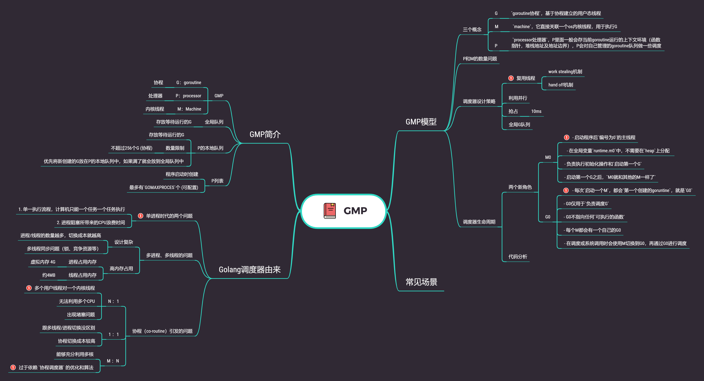
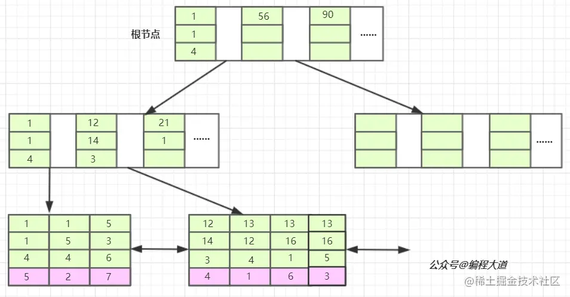

[toc]

# 面试记录
## 前海汇流
### 一面
#### 1.浏览器输入网址后，会发生什么
1. URL解析（是否合法、解析协议、域名等）
2. DNS解析（本地dns缓存、根域名服务器、顶级域名服务器、权威域名服务器）
3. TCP连接（三次握手，为什么不能两次握手）
4. HTTP请求（http和https的区别）
5. 响应请求
6. 解析渲染数据

#### 2.写sql
广告表
表名：ad
字段：id, title, create_time

订单表
表名：order
字段：id, ad_id, cost, create_time

请写一条 SQL，查询订单数量前十的广告，并返回以下信息：广告ID、广告名称、订单数量总和、订单费用总和。

```sql
select b.ad_id,c.title,b.ad_num,b.cost_num from (
select ad_id,ad_num,cost_num from (
select ad_id,count(*) ad_num, sum(cost) cost_num from order group by ad_id order by ad_num limit 10
) b left join ad c on c.id = ad_id
```


#### 3.补充代码
函数 reverse (char *s, int len) 的功能是用递归的方式逆置长度为len的字符串s。例如：若s的内容为“abcd”，则逆置后其内容变为“dcba”，请补充完整下面的代码。

```c++
void reverse (char *s, int len)
{
    char ch;
    if (____1____)
    {
        ch = *s;
        *s = * (s + len - 1);
        * (s + len - 1) = ch;
        reverse (____2____, ____3____);
    }
}
```


## 富途
### 一面
#### 1、梯度计费
1. if、else 暴力解法
2. 使用数组存储数据，然后遍历数组求解
3. 二分法
#### 2、问项目
简历都问一遍，有什么亮点，遇到啥难点咋解决的
#### 3、浏览器输入网址（https）后，会发生什么
#### 4、GMP模型
p没有协程后会干什么
#### 5、逻辑题
一个四分钟的沙漏，一个七分钟的沙漏，如何用这两个沙漏测试出九分钟的时间?
#### 6、Mysql
1. 隔离级别
2. 每种隔离级别都解决啥问题
3. MVCC
4. 回滚机制是咋样的
5. B树和B+树的区别
6. 同一份数据存储在B和B+树上，查找效率有什么不同
#### 7、缓存跟数据库 数据一致性问题

### 二面
#### 介绍项目
让你最深刻的项目是什么、具体是怎么样的，你负责什么东西、架构是如何设计的（包括具体技术层面）
#### 表结构设计
分库分表设计需要考虑什么东西、优缺点这些，实施的时候会遇到什么问题、进行数据库运维的时候遇到什么问题
#### 设计一个对外接口需要考虑什么东西
#### 算法题
给你两个字符串 s1 和 s2 ，写一个函数来判断 s2 是否包含 s1 的排列。如果是，返回 true ；否则，返回 false 。
例如，
输入s1=abc,s2=abcd, 输出True;
输入s1=abc,s2=acbd, 输出True;
输入s1=abc,s2=ambnc, 输出False;


## 腾讯文档
### 一面
#### 1、问项目
消息顺序如何保证、长链接流程是咋样的、高并发突增大流量怎么应对
#### 2、Redis主从日志同步
如果有网络波动的情况下该如何处理
#### 3、MySQL主从日志同步是怎么样的
#### 4、实现快排
#### 5、实现dfs
使用递归和循环遍历这两种方式
```go
package main

import "fmt"

type TreeNode struct {
    Value int
    Left  *TreeNode
    Right *TreeNode
}

// 递归实现DFS
func dfsRecursive(node *TreeNode) {
    if node == nil {
        return
    }

    fmt.Println(node.Value)
    dfsRecursive(node.Left)
    dfsRecursive(node.Right)
}

// 非递归实现DFS
func dfsIterative(root *TreeNode) {
    if root == nil {
        return
    }

    stack := []*TreeNode{root}

    for len(stack) > 0 {
        node := stack[len(stack)-1]
        stack = stack[:len(stack)-1]

        fmt.Println(node.Value)

        if node.Right != nil {
            stack = append(stack, node.Right)
        }
        if node.Left != nil {
            stack = append(stack, node.Left)
        }
    }
}
```


## 小红书
### 一面
#### 1、项目
im流程、架构、如何保证消息不丢失、红点问题
#### 2、kafka高可用
副本选主流程、
#### 3、Redis bigKey和热点key问题
#### 算法题
数字 n 代表生成括号的对数，请你设计一个函数，用于能够生成所有可能的并且 有效的 括号组合。
```go
package main

import "fmt"

func generateParenthesis(n int) []string {
	var result []string
	generate("", n, n, &result)
	return result
}

func generate(p string, left int, right int, parens *[]string) {
	if left > 0 {
		generate(p+"(", left-1, right, parens)
	}
	if right > left {
		generate(p+")", left, right-1, parens)
	}
	if right == 0 {
		*parens = append(*parens, p)
	}
}

func main() {
	n := 3
	result := generateParenthesis(n)
	fmt.Println(result)
}
```

我的代码
```go
func gen(n int) []string {
	if n <= 0 {
		return nil
	}
	path := make([]byte, 0)
	res := make([]string, 0)

	var dfs func(leftIndex, rightIndex int)
	dfs = func(leftIndex, rightIndex int) {
		if len(path) == 2*n && valid(path) {
			tmp := make([]byte, 2*n)
			copy(tmp, path)
			res = append(res, string(tmp))
			return
		}

		for i := leftIndex; i < n; i++ {
			path = append(path, '(')
			dfs(i+1, rightIndex)
			path = path[:len(path)-1]
		}

		for j := rightIndex; j < n; j++ {
			path = append(path, ')')
			dfs(leftIndex, j+1)
			path = path[:len(path)-1]
		}
	}

	dfs(0, 0)
	return res
}

func valid(byteArr []byte) bool {
	if len(byteArr)%2 == 1 {
		return false
	}

	stack := make([]byte, 0)
	for i := 0; i < len(byteArr); i++ {
		if byteArr[i] == '(' {
			stack = append(stack, '(')
		} else {
			if len(stack) > 0 {
				stack = stack[:len(stack)-1]
			} else {
				return false
			}
		}
	}

	return len(stack) == 0
}
```


## 金山
### 一面
#### 1、context
- 父类context关闭的时候，怎么保证子context已经关闭
- context的value是并发安全的吗
#### 2、map
- 扩容机制
- 扩容的时候读写会怎么样
- 如何创建并发安全的map
- sync.map是怎样的
#### GMP模型
#### mysql
- buffer pool是怎么管理内存的
- buffer pool里面都有啥
- 什么时候回刷新写磁盘
#### redis
- 缓存与数据一致性问题
- 缓存击穿问题
#### 项目
- 应用架构
- 长链接在中台是如何维护的
- 服务发现是怎么处理的
- 机房之间是否可以直接调用
- 切机房之后旧数据是否可以查看

### 二面
#### 问项目
容灾怎么实现、底层数据是同步的吗
#### 树、图的区别
如何遍历，使用bfs、dfs，分别适用于什么场景
如何实现树的存储，我怎么能实现快速获取一个子数
图是如何存储的
#### 协作编辑如何实现
#### 缓存使用场景
#### CDN
cdn分两种，一种是预加载，一种是请求后台后再加载，这两种方式有什么区别，什么场景下使用

### 三面
#### fork函数在什么时候调用
- 创建子进程
- 并发服务器： 使用 fork 来处理多个客户端请求
- 并行处理任务：使用 fork 来创建多个子进程，每个子进程处理不同的子任务
#### 父子进程之间的通信方式
#### 共享内存跟socket有什么区别
**共享内存跟Socket的区别**

共享内存和套接字（Socket）是两种不同的进程间通信机制，它们有一些区别，包括通信方式、性能、适用场景等。

1. **通信方式：**
   - **共享内存：** 共享内存是一种通过在不同进程之间映射相同物理内存来实现进程间通信的方式。多个进程可以直接读写共享内存，而无需通过中间的通信介质。
   - **套接字：** 套接字是一种基于网络协议的进程间通信方式。它通过在网络上建立连接，实现了在不同主机上的进程之间的通信。

2. **性能：**
   - **共享内存：** 由于共享内存是直接访问内存，因此在性能上通常较高。它适用于高性能、低延迟的进程间通信。
   - **套接字：** 套接字通信涉及网络协议的处理，可能引入一些额外的开销，因此相对于共享内存而言，性能可能较低。

3. **适用场景：**
   - **共享内存：** 适用于在同一台计算机上运行的进程之间进行高效的数据共享，例如多进程协同处理任务，需要频繁交换大量数据的场景。
   - **套接字：** 适用于跨网络的进程通信，例如客户端和服务器之间的通信，或者分布在不同计算机上的进程之间的通信。

4. **安全性：**
   - **共享内存：** 共享内存的访问是直接的，因此需要额外的同步机制来保证多个进程对共享资源的安全访问。
   - **套接字：** 套接字通信通过网络传输数据，可以通过安全套接字层（SSL/TLS）等机制来加密通信，提高数据传输的安全性。

5. **跨平台性：**
   - **共享内存：** 共享内存通常更容易在同一台计算机上实现，因为共享内存的机制可能依赖于特定的操作系统或硬件。
   - **套接字：** 套接字通信是一种跨平台的通信方式，可以在不同操作系统之间实现。

总体而言，选择共享内存还是套接字取决于具体的应用需求。如果进程在同一台计算机上，并且需要高效地共享数据，共享内存可能是更合适的选择。如果进程在不同主机上，或者需要通过网络进行通信，套接字可能是更合适的选择。

#### unix socket 跟普通socket有什么区别
Unix域套接字（Unix domain socket）是一种在同一台计算机上的进程之间进行通信的机制。与网络套接字不同，Unix域套接字使用文件系统路径来标识套接字，而不是IP地址和端口号。这种类型的套接字提供了一种高效的本地通信方式。

以下是Unix域套接字的一些特点和使用方式：
- 文件系统路径标识： Unix域套接字使用文件系统路径来标识套接字。套接字文件可以在文件系统中的任何位置，进程通过文件路径来连接到套接字。
- 权限控制： 由于套接字是文件系统中的文件，因此可以通过文件权限控制来限制对套接字的访问。这增加了安全性。
- 性能： 与网络套接字相比，Unix域套接字通常具有更低的延迟和更高的吞吐量，因为通信在内核中直接进行，而无需通过网络协议栈。
- 通信方式： 通过Unix域套接字，进程可以通过传递文件描述符实现高效的文件描述符传递。这对于实现进程间的高性能通信非常有用。
- 进程间通信： Unix域套接字常用于实现同一计算机上不同进程之间的通信，例如在客户端和服务器之间进行IPC。

**区别：**
Unix域套接字（Unix domain socket）和普通套接字（通常指网络套接字）是两种不同的套接字类型，它们有一些关键区别：

通信方式：
- Unix域套接字： 用于在同一台计算机上的进程之间进行本地通信。通信通过文件系统路径进行标识，进程通过文件路径连接到套接字。
- 普通套接字： 用于在网络上的不同主机上的进程进行通信。通信通过IP地址和端口号进行标识，进程通过连接到特定的IP地址和端口号实现通信。

标识方式：
- Unix域套接字： 通过文件系统路径来标识套接字。套接字文件可以在文件系统中的任何位置。
- 普通套接字： 通过IP地址和端口号来标识套接字。IP地址用于标识主机，端口号用于标识主机上的具体进程。

性能：
- Unix域套接字： 通常具有更低的延迟和更高的吞吐量，因为通信在内核中直接进行，无需通过网络协议栈。
- 普通套接字： 由于涉及网络协议的处理，通信可能具有一些额外的开销，因此相对于Unix域套接字而言，性能可能较低。

文件描述符传递：
- Unix域套接字： 提供了高效的文件描述符传递机制，可以在进程间传递文件描述符。
- 普通套接字： 在传统的网络套接字中，文件描述符传递通常涉及使用特殊技术，如SCM_RIGHTS控制消息。

权限控制：
- Unix域套接字： 由于套接字是文件系统中的文件，可以通过文件权限控制来限制对套接字的访问，增加了安全性。
- 普通套接字： 通常通过网络防火墙等机制进行安全控制。

适用场景：
- Unix域套接字： 适用于同一计算机上的进程之间进行高效的本地通信，如客户端和服务器在同一主机上运行的情况。
- 普通套接字： 适用于不同主机上的进程之间通过网络进行通信的情况，如客户端和服务器在不同主机上运行的情况。


#### nginx的press是干啥用的，怎么去优化它（配置和架构层面）
press" 这个术语通常指的是使用 gzip 压缩算法对 HTTP 响应进行压缩。压缩能够减小传输过程中的数据量，从而提高网站性能，减少页面加载时间，

优化 Nginx 的性能通常涉及多个方面，包括配置调优、负载均衡、缓存设置等。
**优化 Nginx 性能的常见方法**

1. **启用 Gzip 压缩：** 使用 `gzip` 压缩可以减小传输的数据量，提高页面加载速度。确保在 Nginx 配置中启用了 gzip 压缩。

    ```nginx
    http {
        gzip on;
        gzip_types text/plain text/css application/json application/javascript text/xml application/xml application/xml+rss text/javascript;
        gzip_comp_level 6;
        gzip_min_length 1000;
        gzip_proxied any;
        gzip_vary on;
        gzip_disable "MSIE [1-6]\.";
    }
    ```

2. **调整工作进程数：** 根据服务器的硬件配置和负载情况，调整 Nginx 的工作进程数。可以通过修改配置文件中的 `worker_processes` 参数来实现。

    ```nginx
    worker_processes auto;  # 使用服务器上可用的核心数
    ```

3. **使用反向代理缓存：** 针对频繁请求的静态内容，可以使用 Nginx 作为反向代理并设置缓存，减轻后端服务器的负载。

    ```nginx
    location / {
        proxy_pass http://backend_server;
        proxy_cache my_cache;
        proxy_cache_valid 200 304 1h;
        proxy_cache_use_stale updating;
    }
    ```

4. **使用负载均衡：** 在高流量环境中，可以使用 Nginx 的负载均衡功能，将请求分发到多个后端服务器，提高系统的整体性能和可用性。

    ```nginx
    http {
        upstream backend {
            server backend1;
            server backend2;
            # ... 可以添加更多后端服务器
        }

        server {
            location / {
                proxy_pass http://backend;
            }
        }
    }
    ```

5. **调整连接超时和缓冲区大小：** 根据具体情况，调整连接超时时间和缓冲区大小，以适应网络环境和响应速度。

    ```nginx
    http {
        client_body_timeout 10s;  # 客户端请求体的超时时间
        client_header_timeout 10s;  # 客户端请求头的超时时间
        send_timeout 10s;  # 发送响应的超时时间

        client_max_body_size 10M;  # 允许客户端上传的最大请求体大小
    }
    ```

6. **使用 HTTP/2：** 如果服务器和客户端支持，可以启用 HTTP/2 协议，它可以提高多路复用、头部压缩等方面的性能。

    ```nginx
    server {
        listen 443 ssl http2;
        # ...
    }
    ```

这些是一些常见的 Nginx 性能优化方法，实际优化需要根据具体情况进行调整。在修改配置之前，建议备份现有配置文件，并在修改后进行测试以确保性能的提升。


四层网关、七层网关是什么
接触过哪些网络组件
#### 对于实现高并发接口，java和go有什么区别
#### 在go编程的过程中，对go的技术方面有什么深刻的印象
#### 职业规划


## 迅雷
### 一面
面试官迟到15分钟，差评
#### 1、CPU暴涨怎么排查
#### 2、如何根据ddd思想进行架构设计拆分
#### 3、问我是哪里人、笑死
#### 吧啦吧啦一堆假设问题

差评


## bybit
### 一面
#### 问项目
#### GMP
调度模型、goroutine阻塞的时候怎么处理，g0、m0在其中发挥了什么作用

#### mysql
插入一条数据的时候数据结构是怎么变化的
#### redis
持久化，RDB持久化方式会阻塞吗？RDB文件生成过程中会阻塞吗
大key有什么现象，有什么危害，怎么解决
#### kafka高性能和高可用是怎么实现的
#### 算法
- 买卖股票
- 快乐数
  ```go
	package main

	import (
		"fmt"
	)

	func isHappy(n int) bool {
		seen := make(map[int]bool)
		for n != 1 && !seen[n] {
			seen[n] = true
			n = calculateNext(n)
		}
		return n == 1
	}

	func calculateNext(n int) int {
		result := 0
		for n > 0 {
			digit := n % 10
			result += digit * digit
			n /= 10
		}
		return result
	}
  ```

  ```go
	func isHappy(n int) bool {
		seen := make(map[int]bool)
		for n != 1 && !seen[n] {
			seen[n] = true
			n = calculateNext(n)
		}
		return n == 1
	}

	func calculateNext(n int) int {
		result := 0
		for n > 0 {
			digit := n % 10
			result += digit * digit
			n /= 10
		}
		return result
	}
  ```


## 字节剪映
### 一面
#### 问项目
#### go如何判断两个类型是否一致
```go
package main

import (
	"fmt"
	"reflect"
)

func main() {
	var x int
	var y float64

	// 获取变量的类型
	typeOfX := reflect.TypeOf(x)
	typeOfY := reflect.TypeOf(y)

	// 判断两个类型是否相同
	if typeOfX == typeOfY {
		fmt.Println("x和y的类型相同")
	} else {
		fmt.Println("x和y的类型不同")
	}

	// 获取变量的种类（Kind）
	kindOfX := typeOfX.Kind()
	kindOfY := typeOfY.Kind()

	// 判断两个类型的种类是否相同
	if kindOfX == kindOfY {
		fmt.Println("x和y的种类相同")
	} else {
		fmt.Println("x和y的种类不同")
	}
}
```
#### go的interface、map是怎么实现的
#### mysql有哪些索引，联合索引是怎么存储的
参考：https://juejin.cn/post/6844904073955639304

#### 分布式锁是怎么做的，多机房的分布式锁怎么处理
#### 设计个批处理框架，M个数据，N个并发处理，得到M个结果

### 二面
#### IM
- 收发消息的流程
- 大规模发送消息怎么处理、比如群发
- 撤回消息是怎么设计、如果有时间限制的情况下怎么处理、前后端时钟不一致情况下怎么处理
- 群规模扩大之后怎么处理
- 消息怎么存储
- levelDB有什么优点，为什么写速度很快、LSM日志结构有什么优势
  - https://wingsxdu.com/posts/database/leveldb/#%E6%96%87%E4%BB%B6%E6%A0%BC%E5%BC%8F
  - https://cloud.tencent.com/developer/article/1441835
#### 算法题
给你一个整数数组 coins ，表示不同面额的硬币；以及一个整数 amount ，表示总金额。​

计算并返回可以凑成总金额所需的 最少的硬币个数 。如果没有任何一种硬币组合能组成总金额，返回 -1 。​

你可以认为每种硬币的数量是无限的。​

可以使用 动态规划

### 三面
#### 离职原因
#### 职业规划
#### 如何学习
#### LFU


## 虾皮
### 一面
#### 问项目
#### kafka消息堆积怎么处理
https://juejin.cn/post/7125390146207219719
#### Redis
有几种集群模式，各个优缺点是咋样的
批量写入，有哪些方案
- pipeline
- lua脚本
codis有没了解过
```
Codis 是一个开源的分布式 Redis 解决方案，旨在提供对 Redis 集群的水平扩展和管理支持。它通过在多个 Redis 实例之上构建代理层来实现水平分片，从而允许数据分布在多个 Redis 节点上。

Codis 的主要特性和组件包括：

Proxy（代理层）： Codis 使用代理层作为客户端与 Redis 服务器之间的中间层。代理负责将客户端的请求路由到正确的 Redis 分片上，实现了对 Redis 集群的透明访问。

Coordinator（协调器）： Codis 使用协调器来管理分片信息、监控 Redis 实例的健康状态、以及执行一些全局操作。协调器负责协调整个 Codis 集群的工作。

Dashboard（仪表板）： Codis 提供了一个 Web 页面的仪表板，用于监控和管理 Codis 集群。通过仪表板，你可以查看集群的状态、进行分片管理、查看节点信息等。

HAProxy： Codis 常常与 HAProxy 搭配使用，以实现负载均衡和高可用性。HAProxy 负责将客户端请求分发到 Codis Proxy，并在必要时进行故障转移。

总体而言，Codis 通过将 Redis 分片和代理层结合在一起，提供了一个水平可扩展的 Redis 解决方案。它可以用于处理大规模的数据集，提高读写性能，并提供一些集群管理的功能。需要注意的是，由于 Codis 的一些设计限制，它可能并不适用于所有场景，具体选择需要根据项目的需求和特点进行评估。
```
#### 实时统计请求的p99
#### 算法题
给你一个数组 arr ，请你将每个元素用它右边最大的元素替换，如果是最后一个元素，用 -1 替换。

完成所有替换操作后，请你返回这个数组。

示例 1：

输入：arr = [17,18,5,4,6,1]

输出：[18,6,6,6,1,-1]

解决方案：
- 单调栈方式
- 从右往左遍历，保存最大值的数据
  ```go
  func replaceElements(arr []int) []int {
	n := len(arr)
	if n == 0 {
		return arr
	}

	maxRight := -1 // 初始化最后一个元素的右边最大值为-1

	for i := n - 1; i >= 0; i-- {
		current := arr[i] // 当前元素的值
		arr[i] = maxRight // 将当前元素替换为右边最大值
		if current > maxRight {
			maxRight = current // 更新最大值
		}
	}

	return arr
	}
  ```


## 美团
### 一面
#### map底层数据有序需要怎么搞
#### 红黑树跟跳表的区别
#### JVM
#### 使用redis做黑名单怎么处理，需要百分百判断
#### mysql
- 事务隔离级别
- 什么时候会加间隙锁
- 分库分表怎么处理
#### 容灾介绍
#### 链表对折
- 找到链表的中间节点： 使用快慢指针法找到链表的中间节点。快指针每次移动两步，慢指针每次移动一步，当快指针到达链表尾部时，慢指针指向的就是中间节点。
- 反转后半部分链表： 将中间节点之后的部分链表进行反转操作。
- 合并两个链表： 将原始链表的前半部分和反转后的链表合并在一起。

