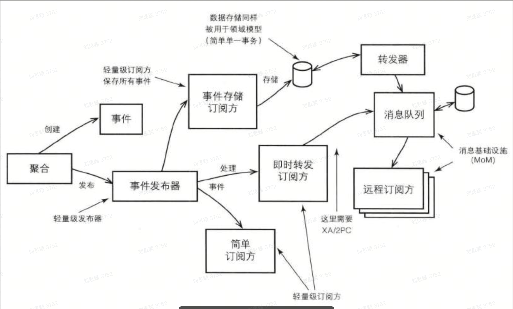

# 领域驱动设计（DDD）
领域驱动是一种面向复杂业务系统的软件设计思想。首先，它是面向复杂业务系统的，如果只是一些简单的业务，如简单脚本等就没必要使用领域驱动设计；其次，它是一种软件设计思想，且没有统一的落地方案，因此在实际使用中要借鉴领域驱动设计的思想，但也要注意防止过度设计。
个人觉得领域驱动设计中最值得借鉴的思想是：业务与技术的深度结合。在传统的软件开发方法中，业务是业务、技术是技术，两者没有什么强的关联。技术代码在大多数场景表示的仅仅是可以运行的代码，并没有解释业务是什么、要做什么。领域驱动设计强调技术代码应该最大程度地解释业务是怎样的（战术设计），同时以文档的形式来说明业务的整体设计（战略设计）。


领域驱动设计总共有两大块，分别是战略设计和战术设计。

## 战略设计
战略设计简单来说就是在业务边界内对业务逻辑（尤其是核心逻辑）进行讨论并落地文档的过程。其实在传统的软件开发方法中也是这个流程，领域驱动设计的不同之处在于在战略设计阶段引入了核心的几个概念：通用语言、领域（子域、支撑子域、通用子域、核心域）、限界上下文等；同时引入了领域专家的角色，使得领域专家和技术人员基于白板的形式探讨出上述几个核心概念和业务逻辑，并最终形成文档。

### 通用语言
通用语言是领域驱动设计中第一个也是最重要的概念，它使得领域专家、技术人员等能够使用同一种语言进行沟通。
通用语言的主要词汇包括类和主要操作的名称。比如在交易领域，主要的类包括拍下单（ComboOrder）、主单（MainOrder）和子单（OrderLine）；主要的操作包括下单（CreateOrder）、支付（Pay）等。
最后在落地的文档和代码中需要将通用语言显式地表现出来。

### 领域
领域是一个相对比较抽象的概念，大到可以说互联网领域，小一点可以说电商领域，再小点可以说交易领域，因此可以看到领域是一个相对的概念，最重要的是当前关注的是哪个层面的。领域就是一个组织做所的事情以及其中所包含的一切。
跟领域相关的有很多其他的概念：子域、通用子域、支撑子域、核心域。这些也都是一个相对的概念，在互联网领域下，电商领域是一个子域；在电商领域下，交易是一个子域；在交易领域下，订单是一个子域，而支付则是支撑子域，商品则是通用子域，又因为订单是交易领域中最重要的，因此它也是交易的核心域。


### 限界上下文
同一个词在不同的背景下可能代表着不同的含义。比如我在公司是工程师，下班打车回家扮演的是乘客，到家之后扮演的是父亲。同样，商品在售卖阶段叫商品，在物流运输环节称为包裹；
因此，同一个词在一个特定的背景下才会有其特殊的含义。限界上线文的出现则是来定义显式的边界，领域模型便存在于这个边界之内，它的属性及操作也在这个边界内才具体特殊的含义。
一般来说，每个领域有自己独有的限界上下文，即限界上下文存在于领域内。在具体表现时，一个独立的IDL则代表了一个限界上下文，因此在定义IDL时需要着重考虑当前的模型放置到当前的IDL文件中是否是合理的，否则会出现一个限界上下文包含多个领域等场景，造成沟通和理解成本的增加。
另外，限界上下文也在一定程度上对团队组织进行了约束，最好是一个团队负责一个限界上下文，如果多个团队共同负责一个限界上下文，会导致通用语言的不统一，而出现同一逻辑多种表达的情形。

### 上下文映射图
一个复杂业务系统需要组合多个限界上下文来完成，这就需要对多个限界上下文进行集成，而集成则需要使用到上下文映射图。在Evans《领域驱动设计》一书中提供了多种集成模式：
- **共享内核（Shared Kernel）**：多个上下文共用同一套模型和代码，这套模型和代码需要多个双下文团队共同维护，因此在改变时，需要多个团队共同协商敲定，因此共享内核最好保持小型化，否则后期维护会非常困难
- 客户方-供应方开发（Customer-Supplier Development）：两个上下文处于上游-下游的关系，上游的开发需要兼顾到对下游的影响
- 遵奉者（Conformist）：两个上下文处于上游-下游的关系，但是上游已经无力支持下游团队了
- 另谋他路（SeparateWay）：如果两套功能没有显著的关系，就完全解耦，两个上下文之间不做任何的关联
- 大泥球（Big Ball of Mud）：系统内的模型混杂一起，无法拆分，此时将其划分到一个单独的上下文中（个人称之为“杂物间”），同时防止向其他系统蔓延
- **防腐层（Anticorruption Layer，ACL）**：在集成两个设计良好的限界上下文时，增加防腐层，在防腐层内部对自己的模型和他方模型进行翻译转换
- **开放主机服务（Open Host Service，OHS）**：可以简单理解为Http/Rpc/MQ等调用
- **发布语言（Published Language，PL）**：可以简单理解为Json/IDL。

### 初稿
可先各方一起先讨论，梳理出大致方向，可提高效率。

## 战术设计
战略设计是面向业务层面的设计，在战略阶段需要形成领域通用语言，并对领域进行划分，形成领域模型和限界上下文，并界定各上下文之间的集成关系，之后则进入到战术设计环节。战术设计在战略设计的基础上，对领域模型和逻辑进一步深入讨论，将领域模型和逻辑通过实体、值对象、模块、领域服务、领域事件等进行表示，而实体和值对象的创建则通过工厂来实现，并通过聚合对实体进行关联，最后通过资源库对实体和值对象进行保存。当领域对完提供服务时，则通过应用服务将各领域关联起来，实现业务的编排和事务的处理。


### 实体
实体表示了一个唯一的东西，并且可以在相当长的一段时间内持续地变化，实体最重要的特征是拥有一个身份标识。如交易域的主订单MainOrder则是一个实体，它拥有唯一的身份标识mainOrderId，并且它的其他属性可以持续地变化，例如订单的状态等。
在战术设计阶段，最重要的一步则是识别出战略阶段讨论出的限界上下文中的领域模型中的实体，这里以交易域的订单上线文和购物车上下文为例，列出其中的实体如下：


#### 唯一标识
实体最重要的特征是其拥有一个唯一标识，且这个唯一标识是不可变的。而唯一标识可以通过UUID、数据库自增等方式生成，也可以有单独的组件生成。因此，我们扩充实体为其加上唯一标识。


#### 实体属性
在战略设计阶段通过通用语言对领域模型进行了业务描述，此时将通过这些描述和通用语言，转化为实体的属性和行为。
业务描述诸如：
- 用户加购商品（属性：user_id、app_id、sku_id，行为：AddCart）


#### 实体行为
实体行为标识当前领域模型所具有的业务能力，这些能力需要领域专家和研发人员一同确认。比如主单有支付成功（PaySuccess）、子单有准备发货（ReadyToShip）等行为。


#### 实体创建
实体的创建可以通过构造方法或工厂的形式来创建，工厂适合创建复杂的实体对象，稍后单独介绍。在通过构造方法创建时，则需要注意对于实体不变的属性，尽可能在创建时统一提供或通过计算得到。

#### 实体验证
实体的验证可在实体创建时校验，也可在实体创建之后统一验证。在Java语言中一般是在Setter方法中对实体进行验证，而统一验证则是提供独立的验证方法。
```go
type MainOrderModel struct {
   MainOrderId int64 `json:"main_order_id"`
   UserId      int64 `json:"user_id"`
   AppId       int64 `json:"app_id"`
}

func NewMainOrder(mainOrderId, userId, appId int64) *MainOrderModel {
   if mainOrderId == 0 || userId == 0 || appId == 0 {
      return nil
   }
   return &MainOrderModel{
      MainOrderId: mainOrderId,
      UserId:      userId,
      AppId:       appId,
   }
}
```

### 值对象
值对象可以简单理解为一旦创建之后它的属性就不再变化了，如果需要变化则需要将整个对象替换掉。常见的值对象包括数字（1,2,3）、字符串、日期等。值对象与实体最重要的区别是它没有唯一标识，且是不可变的。如上，主单的MainOrderId是一个值对象，直接通过int64的数字表示。
例如在战略建模阶段我们可以知道子单维度需要包含商品信息，而对于一个子单来讲商品信息是不可变的，因此需要建立一个商品的值对象，同时关联到子单。

值对象的特点（简单列下，具体参考：《实现领域驱动设计》）：
- 度量或描述：度量或描述了领域中的一件东西；
- 不变性：可以作为不变量
- 概念整体：将不同的相关的属性组合成一个概念整体
- 可替换性：当度量或描述改变时，可以用另一个值对象予以替换
- 相等性：可以和其他值对象进行相等性比较
- 无副作用：不会对协作对象造成副作用，即不会破坏值对象的可变性。
在战术设计时需要不断发掘实体中的值对象并进行抽象，因为值对象可以很简单地进行抽象，并且对其操作无副作用，因此可以很放心的将其作为参数传递给函数或方法，而不用传递实体，以免造成不必要的影响。
如上，在购物车和订单实体中均存在user_id和app_id属性，其实可以考虑将其抽象为User值对象：


### 领域服务
在实际应用中，有些业务逻辑需要多个实体或值对象参与才能完成，而这段逻辑无论放到哪个实体或值对象都是不太合理的，因此引入了领域服务的概念。
如上：在主单MainOrder实体有PaySuccess()的行为，业务需要在主单支付成功后，更新所有子单的状态为成功状态，具体如下：
```go
**package model**

func (mainOrder *MainOrderModel) PaySuccess(ctx context.Context) (*MainOrderStatus, error) {
   mainOrder.Status = mainOrder.Status.PaySuccess()
   orderLines, err := order_line_dal.QueryOrderLinesByIds(ctx, mainOrder.OrderLineIds)
   if err != nil {
      return nil, nil
   }
   for _, orderLine := range orderLines {
      _, err := orderLine.PaySuccess()
      if err != nil {
         return nil, err
      }
   }
   return nil, nil
}
```
如上在MainOrder实体中使用OrderLine资源库是不太建议这么做的，此时可以通过将如上逻辑迁移到领域服务中，我们建立一个main_order_service的领域服务。

```go
**package main_order_service**
func PaySuccess(ctx context.Context, mainOrder *model.MainOrderModel) (*model.MainOrderStatus, error) {
   mainOrder.Status = mainOrder.Status.PaySuccess()
   orderLines, err := order_line_dal.QueryOrderLinesByIds(ctx, mainOrder.OrderLineIds)
   if err != nil {
      return nil, nil
   }
   for _, orderLine := range orderLines {
      _, err := orderLine.PaySuccess()
      if err != nil {
         return nil, err
      }
   }
   return nil, nil
}
```

#### 贫血模型
在实际使用领域服务时，很难将领域模型、领域服务和应用服务区分开。如上述示例，有的同学觉得放到领域模型中也没问题，因此在实际应用时会导致不同的同学有不同的判断标准，从而导致代码混乱。
这里先简单介绍领域模型与领域服务之间的关系和实践，领域服务和应用服务的区别则会在应用服务部分介绍。那么在什么情况下需要使用领域服务，而不是将业务逻辑放到实体或值对象呢？在《实现领域驱动》一书中提供了如下三个依据：
- 执行一个显著的业务操作过程
- 对领域对象进行转换
- 以多个领域对象作为输入进行计算，结果产生一个值对象
但是，这三个依据依然是晦涩的，我个人的理解是：领域模型仅做基础的属性逻辑（如属性值合法性校验、属性逻辑判断等），而详细的业务逻辑均放到对应的领域服务中。当然，这势必违背了领域模型的规范，也会导致贫血模型，但不会导致因贫血模型而出现的失忆症，即代码依然清晰地体现着业务逻辑，仅仅是从领域模型中换到了领域服务中了。
这种做法在实际使用时是非常有用的，在明确业务逻辑的同时，也降低了团队同学对领域服务和领域模型的理解。因此，在领域驱动设计中有非常多的设计和规范，但在实际应用时团队需要根据实际情况进行取舍和调整，前提是在吸收领域驱动设计的思想上，即业务与技术的深度结合。
如果依据上述原则还是无法确定某段逻辑放在哪里，这时你就需要与领域专家和其他技术同学一起讨论了，有可能是此时的业务逻辑未完全明确，也有可能是当前代码需要做些重构，不管怎样，经过讨论会找到大家都认可的能体现业务逻辑的方案。

### 领域事件
领域事件是领域专家所关心的发生在领域中的一些事件，如订单领域下单事件、支付事件、发货事件等等均属于领域事件。


领域事件由领域模型或领域服务发出，订阅方可以是本地系统也可以是外部系统，领域事件的出现在很大程度上对系统逻辑进行了解耦，如下是使用领域事件来实现子单发货更新主单状态的场景：
```go
package order_line_service

func ReadyToShip(ctx context.Context, orderLine *model.OrderLineModel) error {
   orderLine.Status = orderLine.Status.ReadyToShip()
   orderLineShippedEvent := event.OrderLineShipped{
      OrderLineId: orderLine.OrderLineId,
      MainOrderId: orderLine.MainOrderId,
   }
   producer.AsyncSendMsgWithDelay(ctx, json_util.Json(orderLineShippedEvent), 100)
   return nil
}
```
后续，在本地系统中接收当前消息，并处理主单状态：
```go
func EventHandler(ctx context.Context, event *eventbus.ConsumerEvent) error {
   switch event.Headers.GetTag() {
   case "ORDER_LINE_SHIPPED":
      main_order_service.OrderLineShipped(mainOrderId, orderLineId)
   }
   return nil
}

func OrderLineShipped(mainOrderId, orderLineId int64) {

}
```
在如上场景下，主单的状态和子单的状态之间可能会存在一段时间的延时，而这段延时在业务上是否可接受，则需要领域专家和研发人员来一起讨论。若可以接受，则采用领域事件来处理上述业务是没问题的，但若不可接受，则需要研发人员采用其他的技术方案，比如强事务。
关于领域事件还有很多其他更高级的用法，如CQRS、事件源等等，具体可通过《实现领域驱动设计》等书籍学习

### 模块
模块可以简单理解为包，它是领域上下文的一种体现方式，在同一模块内的领域模型应该是高内聚的，在不同模块间的领域应该是低耦合的。
模块的前缀通常是公司的域名，如com.bytedance，在Java语言中会直接体现在包上，在Go语言中一般是体现在Git仓库上；
如下两个模块的命名体现的是订单和购物车两个上下文。
```go
com.xxx.xxx.trade // 订单上下文
com.xxx.xxx.cart  // 购物车上下文
```
如下三个模块的命名体现的是订单上线文中领域模型、领域服务和应用服务的划分。
```go
com.xxx.xxx.trade.application     // 应用服务
com.xxx.xxx.trade.domain.model    // 领域模型
com.xxx.xxx.trade.domain.service  // 领域服务
```

### 聚合
在战术设计前期我们已经基于战略设计找出了实体和值对象，实体带有业务属性和业务行为，值对象则是属性的集合，对实体的状态和特征进行描述，但实体和值对象只是个体化的对象，他们的行为表现出来的都是个体的能力。
此时就需要聚合来将单个实体聚合在一起，可以简单地将聚合理解为如何对实体和值对象进行组合，尤其是如何对实体和实体进行组合。聚合将业务和逻辑紧密关联的实体和对象组合在一起，聚合是数据修改和持久化的基本单位，每一个聚合对应一个仓储，实现数据的持久化。因此，聚合的一个很重要的功能是保证数据的一致性，避免因为复杂的数据模型缺少统一的业务规则控制，而导致聚合、实体之间的数据不一致问题。
在一个聚合内会有一个聚合根，可以理解为它是这个聚合的负责人。首先，聚合根本身也是实体，拥有实体的属性和业务行为；其次，聚合根也是聚合的管理者，在聚合内部负责协调实体和值对象按照固定的业务规则协同完成共同的业务逻辑。
最后，在聚合之间，聚合根还是对外的接口人，聚合之间通过聚合根ID关联引用，如果需要访问其他聚合的实体，需要先查询到聚合根，再导航到聚合内部其他的实体，外部的聚合是不能直接访问聚合内实体的。
那么，在设计聚合时需要遵循哪些原则呢？在《实现领域驱动设计》一书中介绍了如下原则：
- 在一致性边界之内建模真正的不变条件：这里提到的不变条件指的是业务规则，这个规则应该总是保持一致的，其中就包括事务一致性。在聚合边界之内的所有内容组成了一套不变的业务规则，任何的操作都不能违背这些规则，比如子单的物流状态与主状态是有一套不变的业务规则的，并且是不能违背的。因此，聚合表达了与事务一致性边界相同的意思，对于一个设计良好的聚合来说，无论由于何种业务需求而发生改变，在单个事务中，聚合中的所有不变条件都是一致的；
同时，对于一个设计良好的限界上下文来说，无论在哪种情况下，它都能保证在一个事务中只修改一个聚合实例。因此，这个规则的核心含义是每次客户的请求应该只在一个聚合实例上执行，且在一个事务中执行，从而最终保证事务一致性和业务的不变性。
- 设计小聚合：如果一个聚合包含了庞大的实体，那么在一次事务中就需要保证这些实体间的一致性和业务不变性，而这可能出现并发冲突或者数据库锁，从而限制了系统的性能和可伸缩性。而小的聚合则可以让领域模型更适应业务的变化，同时能够提高系统的性能。思考：拍下单、主单、子单设计成一个聚合，还是设计成三个聚合？
- 通过唯一标识引用其他聚合：聚合之间应该采用聚合根ID的方式互相引用，而不是采用直接对象引用的方式，这样可以最大程度地降低聚合之间的耦合度，同时也能为未来服务拆分打下基础。
- 在边界之外使用最终一致性：聚合内采用数据强一致性，而聚合之间数据最终一致性。如在订单域与物流域交互中，物流域发货是在物流的聚合内采用强一致性，而物流到订单则采用最终一致性；同理，若主单和子单是两个聚合，那么在子单发货后，采用强一致性更新子单状态，而采用最终一致性来更新主单状态。即，在一次事务中，最多只能修改一个聚合的状态，如果一次业务操作涉及了多个聚合状态的更改，应该采用领域事件的方式来实现最终一致性，实现聚合间的解耦，也提供系统的整体性能。
基于上述原则，我们对购物车上下文和订单上下文进一步设计，发现其中的聚合和聚合根。


### 工厂
工厂主要用来创建复杂对象和聚合，它不承担领域模型中的任何职责，但依然是领域设计的一部分。工厂一般由聚合根和领域服务承担。工厂的具体使用参考《设计模式》中抽象工厂、工厂方法、创建者等模式。
资源库
资源库为持久化存储，通常将聚合实例存放在资源库中，通常，聚合和资源库之间存在着一对一的关系。关于资源库的使用模式可以参考《企业应用架构模式》一书。
应用服务
应用服务处于用户界面与领域模型或领域服务之间，向上为用户界面提供其所需要的数据，向下依赖领域层和基础设施层完成诸如权限、业务用例的协调，还负责控制事务以确保对模型的修改的原子提交。

通常，用户界面不会仅显示某一聚合的数据，而是会综合多个聚合的数据，此时应用服务就需要查询多个聚合数据，并转换为用户界面所需要的数据，而转换的方案有多种。
- 数据传输对象（Data Transfer Object，DTO）：应用服务读取到聚合数据后，通过一个DTO组装器将用户界面需要的属性映射到DTO中。
- 领域负载对象（Domain Payload Object，DPO）：DPO与DTO类似，但其核心点是不对聚合数据进行映射，而是直接引用聚合数据并返回给用户界面，用户界面根据自己的需要从聚合中获取数据。此种方式的优点是简化了DTO中的属性映射过程，缺点是会造成用户界面与领域之间的耦合，尤其是需要展示一些聚合状态的时候，就需要用户界面自己来基于领域模型计算，从而导致反模式Smart UI的出现。
其次，应用服务负责对多个聚合进行操作来完成业务用例的协调。如前例子所示，将拍下单、主单、子单定义为三个聚合，此时在用户下单时就需要在应用服务层协调拍下单、主单、子单的创建和持久化，而拍下单、主单、子单在创建时的具体业务逻辑则在对应的领域模型和领域服务中完成。
同时，应用服务还需要控制整体事务，以保证数据的一致性。以下为在应用服务显示开启事务，在Java语言中一般直接使用@Transactional来管理事务。
最后，若当前操作需要鉴权，通常也是在应用服务层完成。

## 基于领域驱动的架构设计
### 微服务
领域驱动设计其中一个非常重要的作用是指导微服务的拆分。在战略设计阶段完成了领域的划分，抽象出了核心域、支撑子域、通用子域等子域，然后进一步在这些子域中划分限界上下文并建立领域模型，在战术设计阶段基于领域模型识别出其中的实体和聚合根，从而完成了自上而下的建模，也完成了微服务的拆分，微服务可以直接基于限界上下文或聚合来完成搭建。


### 架构选型
#### 分层架构
在《领域驱动设计》一书中，作者通过分层架构将业务逻辑都封装到了领域层，使得业务逻辑得以与基础设施、用户界面等分离，保证了业务的清晰性。


#### 六边形架构
六边形架构（也称“端口适配器架构”）本质上也是一种分层架构，只不过把上下层转成了内外层。在内层则为业务核心逻辑，包括领域层和应用层；外层左侧则表示直接与系统交互的地方，也称为“前端”，而前端请求则需要通过适配器来与应用层进行交互，并且会存在多个类型的适配器。如图中适配器A对应的C可以表示HTTP请求，适配器B对应的C可以表示RPC请求，适配器C对应的C可以表示MQ消息，适配器D对应的C则表示定时任务请求等。外层右侧表示与存储持久化或三方开放主机服务交互的地方，也称为“后端”。


### 架构设计
#### 整体设计
基于领域驱动设计思想以及公司业务特点设计系统架构分层如下，主要包含四层：
- 应用接口层：负责接收http/rpc请求、MQ消息消费以及定时任务回调（公司基建不支持定时任务的进程内调用，具体策略还需要再调研）等，此层的主要工作是接收外部请求，并做基础的参数校验（不包含业务校验），同时通过适配器将req转为DTO给到应用服务层；
- 应用服务层：此层主要负责业务的编排和校验，并基于DTO中的数据获取到各领域层模型给到领域层；
- 领域层：业务的核心逻辑所在，包括领域模型和领域服务；建议领域模型仅做简单的属性校验和判断，而领域服务用于做复杂的业务逻辑。
- 基础设施层：主要包含工具包（Common）、资源库（Dal）、三方服务（Sal）
  - 资源库（Dal）：此层对聚合进行持久化操作，并控制事务（由于gorm使用不便事务未放到应用服务层）；
  - 三方服务（Sal）：对外部聚合的调用，需要在此层建立防腐层（ACL）；
  - 工具包（Common）：包含基础的util和constant等。
  

#### 模块设计
有了整体的架构分层，那么如何把分层转换为模块，尤其是如何设计领域层的模块，是非常重要的，这部分有利于团队代码模块的统一，进而有利于团队同学认知的统一。
这里主要介绍两种模块设计的方案，第一种方式是完全按照领域驱动的思想来设计的，第二种方式则是基于领域驱动思想并结合过往的经验给出的个人认为不错的模块设计。
基于领域驱动思想的模块设计
如下是基于领域驱动思想设计的模块，核心是将model（领域模型）、service（领域服务）、repos（资源库）放到了domain（领域层）
```go
handlers
    - rpc
        - order_rpc
            order_rpc.go
    - consumer
        - order_consumer
            order_consumer.go
        - fullfilment_consumer
            fullfilment_consumer.go
    - task
        - order_task
            order_task.go
biz
    - order_biz
        order_biz.go
        order_biz_test.go
domain
    - model
        - combo_order_model
            combo_order_model.go
            combo_order_model_test.go
        - main_order_model
            main_order_model.go
        - order_line_model
            order_line_model.go
    - service
        - combo_order_service
            combo_order_service.go
        - main_order_service
            main_order_service.go
            main_order_service_test.go
    - dal
        - combo_order_dal
            combo_order_dal.go
    - repos
        - combo_order_repos
            combo_order_repos.go
    - dto
    - po
infras
    - sal
        - product_sal
            product_sal.go
            product_sal_test.go
    - constant
        - error_constant
            error_constant.go
    - utils
        - json_util
            json_util.go
        - redis_util
            redis_util.go
            redis_util_test.go
    - mq
        - eventbus_producer
              eventbus_producer.go
main.go
handler.go
router.go
```

推荐的模块设计
在领域服务部分曾介绍到在实际使用中model（领域模型）与service（领域服务）的功能有时很难界定，因此这里将service（领域服务）单独作为一层，domain（领域层）同层，并且弱化领域层的概念，将领域层的业务逻辑放到领域服务中，而领域模型中的逻辑仅做简单的属性校验、属性逻辑判断等操作。
同时将领域层的repos（资源库）下沉到infras（基础设施层）。repos专注负责与底层持久化资源交互，使用的是PO模型，dal层对repos聚合，体现领域驱动中聚合的概念，并将PO转为Model。
```go
handlers
    - rpc
        - order_rpc
            order_rpc.go
    - consumer
        - order_consumer
            order_consumer.go
        - fullfilment_consumer
            fullfilment_consumer.go
    - task
        - order_task
            order_task.go
biz
    - order_biz
        order_biz.go
        order_biz_test.go
service
    - combo_order_service
        combo_order_service.go
    - main_order_service
        main_order_service.go
        main_order_service_test.go
domain
    - model
        combo_order_model.go
        main_order_model.go
        order_line_model.go
    - dto
    - po
infras
    - dal
        - combo_order_dal
            combo_order_dal.go
    - repos
        - combo_order_repos
            combo_order_repos.go
    - sal
        - product_sal
            product_sal.go
            product_sal_test.go
    - constant
        - error_constant
            error_constant.go
    - utils
        - json_util
            json_util.go
        - redis_util
            redis_util.go
            redis_util_test.go
    - mq
        - eventbus_producer
              eventbus_producer.go
main.go
handler.go
router.go
```

### 应用接口层
在六边形架构中，应用接口层处于六边形的左边，也就是“前端”。它的主要作用是接收外部请求，并做基础的参数校验，然后将请求转换为DTO（适配器）传递给Biz层。
命名规范：应用接口层以领域或用例+(rpc/comsumer/task)命名，并建立独立的包，如order_rpc包下的order_rpc.go。后续可在此包下增加其他代码，如order_rpc_test.go、order_rpc_validate.go等。

### 应用服务层
应用服务层在六边形架构中处于内层，也就是核心层，主要负责业务流程的编排。

命名规范：应用服务层以领域或用例+biz命名，并建立独立的包，如order_biz包下的order_biz.go。后续可在此包下增加其他代码，如order_biz_test.go、order_biz_util.go等。

### 领域层
领域层分为两部分：领域模型和领域服务。
#### 领域模型
领域模型在实际使用中做了简化，仅用来做属性的校验和逻辑处理，如下IsPayed()仅根据主单模型的状态属性进行状态判断，不做额外的业务逻辑。

命名规范：领域模型统一放置到domain层的model包下，采用领域模型+Model的命名方法。

#### 领域服务
领域服务用来处理具体的业务逻辑，其中每一个方法一般是一个原子的业务逻辑，如下为子单领域服务提供的发货接口，主要处理子单状态的更新和领域事件的发送。


命名规范：领域服务以领域名+service命名，并建立独立的包，如order_line_service下的order_line_service.go，后续可在独立包中增加其他内容，如order_line_service_test.go等。
### 基础设施层
基础设施层主要为领域层和应用服务层提供基建能力，包括资源库、三方服务、常量、工具类等。基础设施层的核心作用是对上层屏蔽基础设施的复杂操作，做到让上层业务仅关注业务逻辑。
#### 资源库
这里提到的资源库主要为DB的持久化存储，对缓存、消息等操作单独处理。资源库的核心作用是将聚合（包括实体和值对象）保存到DB，因此就会牵涉到实体或值对象与持久化对象的映射关系。实体或值对象对应的是model，持久化对象采用PO，因此从领域层到持久化存储时需要将model转换为PO，同理，从持久化存储查询到PO时需要转化为model返回给领域层，这部分逻辑由资源库的dal层处理。
如下为dal层逻辑：从repos查询到po，转为model返回：

repos层主要负责底层资源库的操作，简单理解就是SQL语句：

命名规范：
- dal层以实体+dal命名，并建立独立的包，如order_line_dal包下的order_line_dal.go，后续可增加其他内容如order_line_dal_test.go
- repos层以实体+repos命名，并建立独立的包，如order_line_repos包下的order_line_repos.go，后续可增加其他内容如order_line_repos_test.go

##### 聚合
资源库一个非常重要的作用是对聚合的操作，而此操作则在dal层体现。
如下示例，聚合根OrderLine维度引用了User，假设在存储时User进行了单独存储，并在聚合根的持久化对象OrderLinePO中存储了对User的引用。
```go
type OrderLineModel struct {
   OrderLineId int64            `json:"order_line_id"`
   MainOrderId int64            `json:"main_order_id"`
   User        *User            `json:"user"`
   Product     *ProductModel    `json:"product"`
   Status      *OrderLineStatus `json:"status"`
}

type OrderLinePO struct {
   OrderLineId int64 `json:"order_line_id"`
   MainOrderId int64 `json:"main_order_id"`
   UserId      int64 `json:"user_id"`
}
```
之后在查询聚合根OrderLine时就可以同步查询User信息，如下是order_line_dal层代码，不仅查询聚合根OrderLine，也会加载User信息。
```go
package order_line_dal

func QueryByOrderLineId(ctx context.Context, orderLineId int64) (*model.OrderLineModel, error) {
   orderLinePO, err := order_line_repos.QueryOrderLinesById(ctx, orderLineId)
   if err != nil {
      return nil, err
   }
   userModel, err := user_dal.QueryByUserId(ctx, orderLinePO.UserId)
   if err != nil {
      return nil, err
   }
   orderLineModel := dal_convert.ConvertToOrderLineModel(orderLinePO)
   orderLineModel.User = userModel
   return orderLineModel, nil
}
```
当然业务可以根据自己的情况采用延迟加载，即在dal层不做数据的聚合，而是在使用时实时获取，具体根据业务情况灵活调整。
事务
如上可以看到在dal层和repos提供的都是原子化的操作，比如上述例子聚合根OrderLine和User分别存储在两张表，而又分别通过order_line_dal和user_dal分别操作。在战略设计聚合部分提到，聚合的操作均要放到同一个事务中，保证同一个聚合的数据一致性，因此需要做到对聚合根OrderLine以及其引用的User操作的修改均要放到一个事务中。
如下示例，在order_line_dal层保存聚合根OrderLine时，首先开启事务，然后操作聚合根OrderLine和实体User的存储，如果发生异常则回滚，无异常提交，从而保证聚合根OrderLine及其相关实体的数据一致性。
```go
package order_line_dal

func Create(ctx context.Context, orderLine *model.OrderLineModel) error {
   tx := repository.GetOrderWriteDataSource(ctx).Begin()

   if err := order_line_repos.Create(ctx, dal_convert.ConvertToOrderLinePO(orderLine), tx); err != nil {
      tx.Rollback()
   }

   if err := user_dal.Create(ctx, orderLine.User, tx); err != nil {
      tx.Rollback()
   }

   tx.Commit()
   return nil
}
```

#### 三方服务
三方服务是对其他聚合的调用，如商品查询、物流单创建等，三方服务的主要作用是将三方聚合所需要的数据进行组合（DTO，一般是作为方法的参数从领域层传到基础设施层），并构建三方数据（即req），同时对三方返回的数据进行转换（防腐层），并将结果返回到领域层（模型或值对象）。
如下示例是根据id查询三方数据并转为系统内部使用的模型。防腐层主要体现在Convert方法上，核心作用是不让其他聚合的数据泄露到系统的领域层，同时过滤领域层使用的数据，而不是全部返回。

注：在实际使用中，由于上游的模型非常复杂（大泥球），此时是非常有必要建立防腐层并对上游模型进行转换的，而此时可能会存在非常复杂的转换逻辑，但在实际运维过程中这点牺牲是值得的。当然，在项目快速发展阶段也可以根据情况将上游模型透出到领域层，但不建议这么做。
同时，防腐层另一个非常重要的作用是对上游错误信息的屏蔽，简单来说是对上游错误码的屏蔽，将上游错误信息转换为当前服务需要的错误信息，而不是直接将上游的错误信息透出到领域层，甚至是其他下游服务。
关于防腐层可以参考《实现领域驱动设计》一书的第13章《集成限界上下文》，里面有详细的介绍。
命名规范：以外部聚合名+sal命名，并建立的独立的包。如product_sal下的product_sal.go，后续可增加其他内容，如product_sal_test.go、product_sal_translator.go（转换器）等。
#### 常量
常量保存了系统中使用到的各种常量信息，如错误码、metric key等全局不变信息。
命名规范：以常量类型+constant命名，并建立独立的包，如metric_constant/metric_constant.go、error_constant/error_constant.go等。
#### 工具类
工具类下放置了系统全局使用各种重要的工具，如json、rpc、redis、date等工具。
命名规范：以工具类型+util命名，并建立独立的包，如json_util/json_util.go、rpc_util/rpc_util.go、redis_util/redis_util.go、date_util/date_util.go
工具类的代码是全局无关的代码，可以拷贝到任何项目中使用，如下redis_util.go举例：只用来初始化redis客户端和redis的基础功能，无任何的业务逻辑，具体的业务逻辑应该是在领域服务层驱动redis_util来完成的。
强调这点是因为目前系统内存在不少代码都是基础设施和业务逻辑掺杂在一起，导致对基础设施和业务逻辑的维护和监控都非常困难。如下做了拆分，可以对基础设施的各个方法进行针对性的打点监控、降级等措施，而跟具体的业务无关。