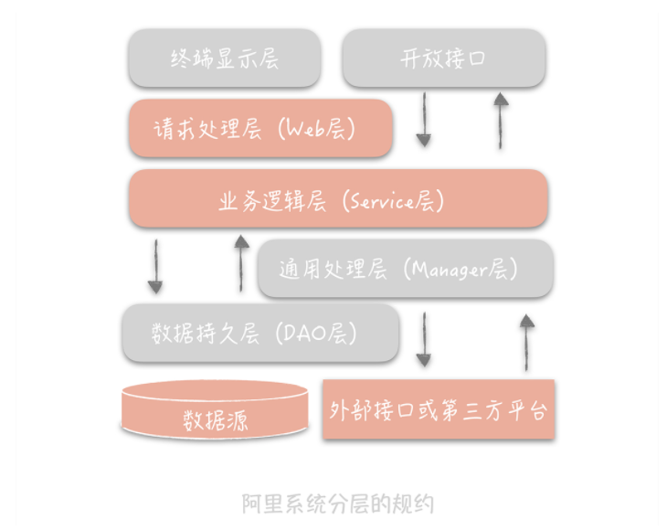
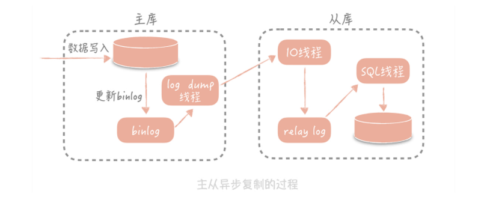
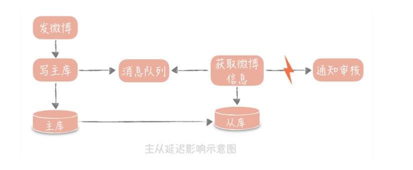
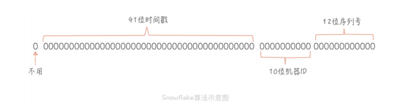

[toc]

# 高并发系统设计

## 一、基础

### 1、高并发系统：通用设计方法

在应对高并发大流量时会采用三种方法：

- Scale-out（横向扩展）： 分而治之是一种常见的高并发系统设计方法，采用分布式部署方式将流量分流，让多个服务器共同承担并发和流量
- 缓存： 使用缓存来提高系统性能
- 异步： 在某些场景下，未处理完成之前，可让请求先返回，在数据准备好之后在通知请求方

#### （1） Scale-out

Scale-up： 通过性能更好的硬件来提升系统并发处理能力

Scale-out： 通过将多个一般性能的机器组成一个分布式集群来提升系统并发处理能力

#### （2）缓存

数据存储在磁盘中，读取时间相比于内存要慢几个数量级

例如：使用redis

#### （3）异步

调用方不需要等待方法逻辑执行完成就可以返回执行其他逻辑，在被调用方法执行完毕后再通过回调、事件通知等方式将结果反馈给调用方。

例如：使用消息队列

#### （4）总结

高并发系统的演进应该是循序渐进，以解决系统中存在的问题为目的和驱动力的。

### 2、分层架构

软件架构分层是一种常见的设计方式，是将整体系统拆分成N个层次，每个层次有独立的职责，多个层次协同提供完整的功能。

#### （1）分层好处

分层设计可简化系统设计，让不同的人专注做某一层次的事情。

分层之后可做到高复用：具有通用性的模块可独立出来复用

分层架构更容易做横向扩展

#### （2）如何做系统分层

- 终端显示层： 各端模板渲染并执行显示
- 开放接口层： 将Service层方法封装成开放接口，同时进行网关安全控制和流量控制等。
- Web层： 主要是对访问控制进行转发，各类基本参数校验，或者不复用的业务简单处理等。
- Service层： 业务逻辑层
- Manager层： 通用业务处理层。有两个作用：一是可将原先Service层的一些通用能力下沉到这一层，比如与缓存和存储交互策略、中间件介入；二是也可在这一层封装对第三方接口的调用，比如调用支付服务，调用审核服务等。
- DAO层： 数据访问层，与底层mysql、hbase等进行数据交互
- 外部接口或第三方凭条： 包括其他部门RPC开放接口，基础平台，其他公司的HTTP接口

Manager层与Service层的关系是：Manager层提供原子的服务接口，Service层负责依据业务逻辑来编排原子接口。

分层架构需要考虑的另一个因素：是层次之间一定是相邻层互相依赖，数据的流转也只能在相邻的两层之间流转。

### 3、如何提升系统性能

高并发系统设计的三大目标：高性能、高可用、可扩展

#### （1）性能优化原则

- 性能优化是问题导向
- 遵循二八原则
- 需要数据支撑：时刻了解优化效果
- 过程是持续的

#### （2）性能优化度量指标

- 平均值
- 最大值
- 分位值

#### （3）高并发下的性能优化

- 提高系统的处理核心数
- 减少单词任务响应时间

### 4、高可用系统设计

#### （1）系统设计

- failover（故障转移）

    同级节点或主备节点之间进行

- 超时控制

    通过收集系统之间的调用日志，统计比如说 99% 的响应时间是怎样的，然后依据这个时间来指定超时时间
    
- 降级

    为了保证核心服务的稳定而牺牲非核心服务的做法

- 限流

    通过丢并发的请求进行限速来保护系统，服务端进行降QPS

#### （2）系统运维

- 灰度发布
- 故障演练

## 二、数据库篇

### 1、如何减少频繁创建数据库连接的性能损耗

在系统初期时，访问数据库都需要先进行数据库连接、数据库查询、连接释放等步骤，那么查询的损耗一般非常小，连接耗时占比很大，
此时在高并发情况下会导致系统变慢甚至宕机的情况

此时池化技术应运而生，他的核心思想是空间换时间，期望使用预先创建好的对象来减少频繁创建对象的性能开销，同事还可以对对象进行统一的管理，降低了对象的使用成本。

数据库连接池有两个最重要的配置：最小连接数和最大连接数，它们控制着从连接池中获取连接的流程：

- 如果当前连接数小于最小连接数，则创建新的连接处理数据库请求；
- 如果连接池中有空闲连接则复用空闲连接；
- 如果空闲池中没有连接并且当前连接数小于最大连接数，则创建新的连接处理请求；
- 如果当前连接数已经大于等于最大连接数，则按照配置中设定的时间（C3P0 的连接池配置是 checkoutTimeout）等待旧的连接可用；
- 如果等待超过了这个设定时间则向用户抛出错误。

流程类似于JDK中的线程池技术

**如何保证线程池的线程一定可用？**

1. 启动一个线程来定期检测连接池中的连接是否可用，比如使用连接发送“select 1”的命令给数据库看是否会抛出异常，
如果抛出异常则将这个连接从连接池中移除，并且尝试关闭。目前 C3P0 连接池可以采用这种方式来检测连接是否可用

2. 在获取到连接之后，先校验连接是否可用，如果可用才会执行 SQL 语句。比如 DBCP 连接池的 testOnBorrow 配置项，
就是控制是否开启这个验证。这种方式在获取连接时会引入多余的开销，在线上系统中还是尽量不要开启，在测试服务上可以使用。

#### 总结

- 池子的最大最小值设置很重要，初期可通过经验设置，后期需要根据实际情况调整
- 池子中的对象需要在使用之前预先初始化完成，这叫池子的预热。比方说使用线程池时就需要预先初始化所有的核心线程。如果池子未经过预热可能会导致系统重启后产生比较多的慢请求。
- 池化技术核心是一种空间换时间优化方法的实践，所以要关注空间占用情况，避免出现空间过度使用出现内存泄露或者频繁垃圾回收等问题。

### 2、主从读写分离

主库负责数据的写入，从库负责数据查询

关键技术点：
- 主动复制
- 主从分离情况下，如何屏蔽主动分离带来的访问数据库方式变化，让开发像使用单一数据库一样

#### （1）主从复制

MySQL为例：

MySQL主从复制依赖binlog，记录数据库所有变化并以二进制形式保存在磁盘上的二进制日志文件。

主从复制就是将binlog中的数据从主库传输到从库上，这个过程是异步的。

流程：
- 从库在连接到主节点时会创建一个IO线程，用以请求主库更新的binlog，并且吧接收到的binlog信息写入一个叫做relay log的日志文件中，而主库也会创建一个log dump线程来发送binlog给从库。
- 同时从库还会创建一个SQL线程读取relay log中的内容，并在从库中做回放，最终实现主从一致性。

在这个方案中，使用独立的 log dump 线程是一种异步的方式，可以避免对主库的主体更新流程产生影响，
而从库在接收到信息后并不是写入从库的存储中，是写入一个 relay log，是避免写入从库实际存储会比较耗时，最终造成从库和主库延迟变长。

需要注意的是，并不是从库数量越多抵抗的并发就越高，因为随着从库数量增多，从库连接的IO线程也增多，主库也需要创建同样多的log dump线程来处理复制的请求，
对主库资源消耗比较高，同时受限于主库的网络带宽，所以在实际使用中，一般一个主库最多挂 3～5 个从库。

**缺陷：**

主从同步的延迟会带来对业务产生一定的影响

比如：

解决的核心思路就是尽量不去从库中查询消息，例如：

- 数据冗余，发送消息队列时不仅仅发送唯一id，而是发送全部信息
- 缓存，将全部信息写入到Memcached缓存里，队列处理时优先查询缓存，可能会造成缓存跟数据库中数据不一致的情况
- 查询主库，这种会造成主库压力激增

#### （2）如何访问数据库

业界有很多的方案可以屏蔽主从分离之后数据库访问的细节，让开发人员像是访问单一数据库一样，
包括有像 TDDL、Sharding-JDBC 这样的嵌入应用内部的方案，也有像 Mycat 这样的独立部署的代理方案。

#### （3）总结

1. 主从读写分离以及部署一主多从可以解决突发的数据库读流量，是一种数据库横向扩展的方法；

2. 读写分离后，主从的延迟是一个关键的监控指标，可能会造成写入数据之后立刻读的时候读取不到的情况；

3. 业界有很多的方案可以屏蔽主从分离之后数据库访问的细节，让开发人员像是访问单一数据库一样，包括有像 TDDL、Sharding-JDBC 这样的嵌入应用内部的方案，也有像 Mycat 这样的独立部署的代理方案。

其实，我们可以把主从复制引申为存储节点之间互相复制存储数据的技术，它可以实现数据的冗余，以达到备份和提升横向扩展能力的作用。在使用主从复制这个技术点时，你一般会考虑两个问题：

1. 主从的一致性和写入性能的权衡，如果你要保证所有从节点都写入成功，那么写入性能一定会受影响；如果你只写入主节点就返回成功，那么从节点就有可能出现数据同步失败的情况，从而造成主从不一致，而在互联网的项目中，我们一般会优先考虑性能而不是数据的强一致性。

2. 主从的延迟问题，很多诡异的读取不到数据的问题都可能会和它有关，如果你遇到这类问题不妨先看看主从延迟的数据。

我们采用的很多组件都会使用到这个技术，比如，Redis 也是通过主从复制实现读写分离；Elasticsearch 中存储的索引分片也可以被复制到多个节点中；写入到 HDFS 中文件也会被复制到多个 DataNode 中。只是不同的组件对于复制的一致性、延迟要求不同，采用的方案也不同。但是这种设计的思想是通用的，是你需要了解的，这样你在学习其他存储组件的时候就能够触类旁通了。

### 3、ID全局唯一性

#### （1）UUID为什么不合适

1、UUID不具备单调递增性，因为在系统设计时，id有可能称为排序字段，id有序也会提升数据的写入性能

2、UUID不具备业务含义

3、UUID是32个16进制数字组成的字符串，比较耗费空间

#### （2）Snowflake算法

核心思想是将 64bit 的二进制数字分成若干部分，每一部分都存储有特定含义的数据，比如说时间戳、机器 ID、序列号等等，最终生成全局唯一的有序 ID。

如果你的系统部署在多个机房，那么 10 位的机器 ID 可以继续划分为 2～3 位的 IDC 标示（可以支撑 4 个或者 8 个 IDC 机房）和 7～8 位的机器 ID（支持 128-256 台机器）；12 位的序列号代表着每个节点每毫秒最多可以生成 4096 的 ID。

**实现方式：**

1、一种是嵌入到业务代码里，也就是分布在业务服务器中。这种方案的好处是业务代码在使用的时候不需要跨网络调用，性能上会好一些，但是就需要更多的机器 ID 位数来支持更多的业务服务器。另外，由于业务服务器的数量很多，我们很难保证机器 ID 的唯一性，所以就需要引入 ZooKeeper 等分布式一致性组件来保证每次机器重启时都能获得唯一的机器 ID。

2、另外一个部署方式是作为独立的服务部署，这也就是我们常说的发号器服务。业务在使用发号器的时候就需要多一次的网络调用，但是内网的调用对于性能的损耗有限，却可以减少机器 ID 的位数，如果发号器以主备方式部署，同时运行的只有一个发号器，那么机器 ID 可以省略，这样可以留更多的位数给最后的自增信息位。即使需要机器 ID，因为发号器部署实例数有限，那么就可以把机器 ID 写在发号器的配置文件里，这样即可以保证机器 ID 唯一性，也无需引入第三方组件了

Snowflake 算法设计的非常简单且巧妙，性能上也足够高效，同时也能够生成具有全局唯一性、单调递增性和有业务含义的 ID，但是它也有一些缺点，其中最大的缺点就是它依赖于系统的时间戳，一旦系统时间不准，就有可能生成重复的 ID。所以如果我们发现系统时钟不准，就可以让发号器暂时拒绝发号，直到时钟准确为止。

另外，如果请求发号器的 QPS 不高，比如说发号器每毫秒只发一个 ID，就会造成生成 ID 的末位永远是 1，那么在分库分表时如果使用 ID 作为分区键就会造成库表分配的不均匀。这一点，也是我在实际项目中踩过的坑，而解决办法主要有两个：

1. 时间戳不记录毫秒而是记录秒，这样在一个时间区间里可以多发出几个号，避免出现分库分表时数据分配不均。

2. 生成的序列号的起始号可以做一下随机，这一秒是 21，下一秒是 30，这样就会尽量的均衡了。

### 4、NoSQL

1、性能方面，NoSQL数据库使用算法将对磁盘的随机写转换成顺序写，提升了写的性能

2、某些场景下，比如全文搜索功能，关系型数据库并不能高效支持，需要NoSQL数据库支持

3、扩展性方面，NoSQL数据库天生支持分布式，支持数据冗余和数据分片特性

## 三、缓存

### 1、缓存

缓存，是一种存储数据的组件，作用是让对数据的请求更快的返回

**缓存与缓冲区：**

缓冲区是一块临时存储数据的区域，这些数据后面会被传输到其他设备上

**缓存分类：**

静态缓存、分布式缓存和热点本地缓存

静态缓存可缓存一些静态资源，例如前端缓存图片或html等信息

分布式缓存例如Memcached、Redis等

热点本地缓存是当遇到极端热点数据查询的时候需要用到，比如微博热点事件，访问量激增的

**缓存不足：**

首先，缓存比较适合于读多写少的业务场景，并且数据最好带有一定的热点属性

其次，缓存会给整体系统带来复杂度，并且会有数据不一致的风险

再次，之前提到缓存通常使用内存作为存储介质，但是内存并不是无限的

最后，缓存会给运维也带来一定的成本

**总结：**

- 缓存可以有多层，比如上面提到的静态缓存处在负载均衡层，分布式缓存处在应用层和数据库层之间，本地缓存处在应用层。我们需要将请求尽量挡在上层，因为越往下层，对于并发的承受能力越差；

- 缓存命中率是我们对于缓存最重要的一个监控项，越是热点的数据，缓存的命中率就越高。

你还需要理解的是，缓存不仅仅是一种组件的名字，更是一种设计思想，你可以认为任何能够加速读请求的组件和设计方案都是缓存思想的体现。而这种加速通常是通过两种方式来实现：

- 使用更快的介质，比方说课程中提到的内存；

- 缓存复杂运算的结果，比方说前面 TLB 的例子就是缓存地址转换的结果。

