[toc]

# 高并发系统设计

## 一、基础

### 1、高并发系统：通用设计方法

在应对高并发大流量时会采用三种方法：

- Scale-out（横向扩展）： 分而治之是一种常见的高并发系统设计方法，采用分布式部署方式将流量分流，让多个服务器共同承担并发和流量
- 缓存： 使用缓存来提高系统性能
- 异步： 在某些场景下，未处理完成之前，可让请求先返回，在数据准备好之后在通知请求方


#### （1） Scale-out

Scale-up： 通过性能更好的硬件来提升系统并发处理能力

Scale-out： 通过将多个一般性能的机器组成一个分布式集群来提升系统并发处理能力


#### （2）缓存

数据存储在磁盘中，读取时间相比于内存要慢几个数量级

例如：使用redis


#### （3）异步

调用方不需要等待方法逻辑执行完成就可以返回执行其他逻辑，在被调用方法执行完毕后再通过回调、事件通知等方式将结果反馈给调用方。

例如：使用消息队列


#### （4）总结

高并发系统的演进应该是循序渐进，以解决系统中存在的问题为目的和驱动力的。


### 2、分层架构

软件架构分层是一种常见的设计方式，是将整体系统拆分成N个层次，每个层次有独立的职责，多个层次协同提供完整的功能。


#### （1）分层好处

分层设计可简化系统设计，让不同的人专注做某一层次的事情。

分层之后可做到高复用：具有通用性的模块可独立出来复用

分层架构更容易做横向扩展


#### （2）如何做系统分层


- 终端显示层： 各端模板渲染并执行显示
- 开放接口层： 将Service层方法封装成开放接口，同时进行网关安全控制和流量控制等。
- Web层： 主要是对访问控制进行转发，各类基本参数校验，或者不复用的业务简单处理等。
- Service层： 业务逻辑层
- Manager层： 通用业务处理层。有两个作用：一是可将原先Service层的一些通用能力下沉到这一层，比如与缓存和存储交互策略、中间件介入；二是也可在这一层封装对第三方接口的调用，比如调用支付服务，调用审核服务等。
- DAO层： 数据访问层，与底层mysql、hbase等进行数据交互
- 外部接口或第三方凭条： 包括其他部门RPC开放接口，基础平台，其他公司的HTTP接口

Manager层与Service层的关系是：Manager层提供原子的服务接口，Service层负责依据业务逻辑来编排原子接口。


分层架构需要考虑的另一个因素：是层次之间一定是相邻层互相依赖，数据的流转也只能在相邻的两层之间流转。


### 3、如何提升系统性能

高并发系统设计的三大目标：高性能、高可用、可扩展


#### （1）性能优化原则

- 性能优化是问题导向
- 遵循二八原则
- 需要数据支撑：时刻了解优化效果
- 过程是持续的


#### （2）性能优化度量指标

- 平均值
- 最大值
- 分位值


#### （3）高并发下的性能优化

- 提高系统的处理核心数
- 减少单词任务响应时间


### 4、高可用系统设计

#### （1）系统设计

- failover（故障转移）

    同级节点或主备节点之间进行

- 超时控制

    通过收集系统之间的调用日志，统计比如说 99% 的响应时间是怎样的，然后依据这个时间来指定超时时间
    
- 降级

    为了保证核心服务的稳定而牺牲非核心服务的做法

- 限流

    通过丢并发的请求进行限速来保护系统，服务端进行降QPS


#### （2）系统运维

- 灰度发布
- 故障演练


## 二、数据库篇

### 1、如何减少频繁创建数据库连接的性能损耗

在系统初期时，访问数据库都需要先进行数据库连接、数据库查询、连接释放等步骤，那么查询的损耗一般非常小，连接耗时占比很大，
此时在高并发情况下会导致系统变慢甚至宕机的情况


此时池化技术应运而生，他的核心思想是空间换时间，期望使用预先创建好的对象来减少频繁创建对象的性能开销，同事还可以对对象进行统一的管理，降低了对象的使用成本。


数据库连接池有两个最重要的配置：最小连接数和最大连接数，它们控制着从连接池中获取连接的流程：

- 如果当前连接数小于最小连接数，则创建新的连接处理数据库请求；
- 如果连接池中有空闲连接则复用空闲连接；
- 如果空闲池中没有连接并且当前连接数小于最大连接数，则创建新的连接处理请求；
- 如果当前连接数已经大于等于最大连接数，则按照配置中设定的时间（C3P0 的连接池配置是 checkoutTimeout）等待旧的连接可用；
- 如果等待超过了这个设定时间则向用户抛出错误。


流程类似于JDK中的线程池技术


**如何保证线程池的线程一定可用？**

1. 启动一个线程来定期检测连接池中的连接是否可用，比如使用连接发送“select 1”的命令给数据库看是否会抛出异常，
如果抛出异常则将这个连接从连接池中移除，并且尝试关闭。目前 C3P0 连接池可以采用这种方式来检测连接是否可用

2. 在获取到连接之后，先校验连接是否可用，如果可用才会执行 SQL 语句。比如 DBCP 连接池的 testOnBorrow 配置项，
就是控制是否开启这个验证。这种方式在获取连接时会引入多余的开销，在线上系统中还是尽量不要开启，在测试服务上可以使用。


#### 总结

- 池子的最大最小值设置很重要，初期可通过经验设置，后期需要根据实际情况调整
- 池子中的对象需要在使用之前预先初始化完成，这叫池子的预热。比方说使用线程池时就需要预先初始化所有的核心线程。如果池子未经过预热可能会导致系统重启后产生比较多的慢请求。
- 池化技术核心是一种空间换时间优化方法的实践，所以要关注空间占用情况，避免出现空间过度使用出现内存泄露或者频繁垃圾回收等问题。


### 2、主从读写分离

主库负责数据的写入，从库负责数据查询

关键技术点：
- 主动复制
- 主从分离情况下，如何屏蔽主动分离带来的访问数据库方式变化，让开发像使用单一数据库一样


#### （1）主从复制

MySQL为例：

MySQL主从复制依赖binlog，记录数据库所有变化并以二进制形式保存在磁盘上的二进制日志文件。

主从复制就是将binlog中的数据从主库传输到从库上，这个过程是异步的。

流程：
- 从库在连接到主节点时会创建一个IO线程，用以请求主库更新的binlog，并且吧接收到的binlog信息写入一个叫做relay log的日志文件中，而主库也会创建一个log dump线程来发送binlog给从库。
- 同时从库还会创建一个SQL线程读取relay log中的内容，并在从库中做回放，最终实现主从一致性。

在这个方案中，使用独立的 log dump 线程是一种异步的方式，可以避免对主库的主体更新流程产生影响，
而从库在接收到信息后并不是写入从库的存储中，是写入一个 relay log，是避免写入从库实际存储会比较耗时，最终造成从库和主库延迟变长。


需要注意的是，并不是从库数量越多抵抗的并发就越高，因为随着从库数量增多，从库连接的IO线程也增多，主库也需要创建同样多的log dump线程来处理复制的请求，
对主库资源消耗比较高，同时受限于主库的网络带宽，所以在实际使用中，一般一个主库最多挂 3～5 个从库。


**缺陷：**

主从同步的延迟会带来对业务产生一定的影响

比如：


解决的核心思路就是尽量不去从库中查询消息，例如：

- 数据冗余，发送消息队列时不仅仅发送唯一id，而是发送全部信息
- 缓存，将全部信息写入到Memcached缓存里，队列处理时优先查询缓存，可能会造成缓存跟数据库中数据不一致的情况
- 查询主库，这种会造成主库压力激增


#### （2）如何访问数据库

业界有很多的方案可以屏蔽主从分离之后数据库访问的细节，让开发人员像是访问单一数据库一样，
包括有像 TDDL、Sharding-JDBC 这样的嵌入应用内部的方案，也有像 Mycat 这样的独立部署的代理方案。


#### （3）总结


1. 主从读写分离以及部署一主多从可以解决突发的数据库读流量，是一种数据库横向扩展的方法；

2. 读写分离后，主从的延迟是一个关键的监控指标，可能会造成写入数据之后立刻读的时候读取不到的情况；

3. 业界有很多的方案可以屏蔽主从分离之后数据库访问的细节，让开发人员像是访问单一数据库一样，包括有像 TDDL、Sharding-JDBC 这样的嵌入应用内部的方案，也有像 Mycat 这样的独立部署的代理方案。


其实，我们可以把主从复制引申为存储节点之间互相复制存储数据的技术，它可以实现数据的冗余，以达到备份和提升横向扩展能力的作用。在使用主从复制这个技术点时，你一般会考虑两个问题：

1. 主从的一致性和写入性能的权衡，如果你要保证所有从节点都写入成功，那么写入性能一定会受影响；如果你只写入主节点就返回成功，那么从节点就有可能出现数据同步失败的情况，从而造成主从不一致，而在互联网的项目中，我们一般会优先考虑性能而不是数据的强一致性。

2. 主从的延迟问题，很多诡异的读取不到数据的问题都可能会和它有关，如果你遇到这类问题不妨先看看主从延迟的数据。

我们采用的很多组件都会使用到这个技术，比如，Redis 也是通过主从复制实现读写分离；Elasticsearch 中存储的索引分片也可以被复制到多个节点中；写入到 HDFS 中文件也会被复制到多个 DataNode 中。只是不同的组件对于复制的一致性、延迟要求不同，采用的方案也不同。但是这种设计的思想是通用的，是你需要了解的，这样你在学习其他存储组件的时候就能够触类旁通了。


### 3、ID全局唯一性

#### （1）UUID为什么不合适

1、UUID不具备单调递增性，因为在系统设计时，id有可能称为排序字段，id有序也会提升数据的写入性能

2、UUID不具备业务含义

3、UUID是32个16进制数字组成的字符串，比较耗费空间


#### （2）Snowflake算法

核心思想是将 64bit 的二进制数字分成若干部分，每一部分都存储有特定含义的数据，比如说时间戳、机器 ID、序列号等等，最终生成全局唯一的有序 ID。


如果你的系统部署在多个机房，那么 10 位的机器 ID 可以继续划分为 2～3 位的 IDC 标示（可以支撑 4 个或者 8 个 IDC 机房）和 7～8 位的机器 ID（支持 128-256 台机器）；12 位的序列号代表着每个节点每毫秒最多可以生成 4096 的 ID。


**实现方式：**

1、一种是嵌入到业务代码里，也就是分布在业务服务器中。这种方案的好处是业务代码在使用的时候不需要跨网络调用，性能上会好一些，但是就需要更多的机器 ID 位数来支持更多的业务服务器。另外，由于业务服务器的数量很多，我们很难保证机器 ID 的唯一性，所以就需要引入 ZooKeeper 等分布式一致性组件来保证每次机器重启时都能获得唯一的机器 ID。

2、另外一个部署方式是作为独立的服务部署，这也就是我们常说的发号器服务。业务在使用发号器的时候就需要多一次的网络调用，但是内网的调用对于性能的损耗有限，却可以减少机器 ID 的位数，如果发号器以主备方式部署，同时运行的只有一个发号器，那么机器 ID 可以省略，这样可以留更多的位数给最后的自增信息位。即使需要机器 ID，因为发号器部署实例数有限，那么就可以把机器 ID 写在发号器的配置文件里，这样即可以保证机器 ID 唯一性，也无需引入第三方组件了

Snowflake 算法设计的非常简单且巧妙，性能上也足够高效，同时也能够生成具有全局唯一性、单调递增性和有业务含义的 ID，但是它也有一些缺点，其中最大的缺点就是它依赖于系统的时间戳，一旦系统时间不准，就有可能生成重复的 ID。所以如果我们发现系统时钟不准，就可以让发号器暂时拒绝发号，直到时钟准确为止。

另外，如果请求发号器的 QPS 不高，比如说发号器每毫秒只发一个 ID，就会造成生成 ID 的末位永远是 1，那么在分库分表时如果使用 ID 作为分区键就会造成库表分配的不均匀。这一点，也是我在实际项目中踩过的坑，而解决办法主要有两个：

1. 时间戳不记录毫秒而是记录秒，这样在一个时间区间里可以多发出几个号，避免出现分库分表时数据分配不均。

2. 生成的序列号的起始号可以做一下随机，这一秒是 21，下一秒是 30，这样就会尽量的均衡了。


### 4、NoSQL

1、性能方面，NoSQL数据库使用算法将对磁盘的随机写转换成顺序写，提升了写的性能

2、某些场景下，比如全文搜索功能，关系型数据库并不能高效支持，需要NoSQL数据库支持

3、扩展性方面，NoSQL数据库天生支持分布式，支持数据冗余和数据分片特性


## 三、缓存

### 1、缓存

缓存，是一种存储数据的组件，作用是让对数据的请求更快的返回


**缓存与缓冲区：**

缓冲区是一块临时存储数据的区域，这些数据后面会被传输到其他设备上


**缓存分类：**

静态缓存、分布式缓存和热点本地缓存

静态缓存可缓存一些静态资源，例如前端缓存图片或html等信息


分布式缓存例如Memcached、Redis等


热点本地缓存是当遇到极端热点数据查询的时候需要用到，比如微博热点事件，访问量激增的


**缓存不足：**

首先，缓存比较适合于读多写少的业务场景，并且数据最好带有一定的热点属性

其次，缓存会给整体系统带来复杂度，并且会有数据不一致的风险

再次，之前提到缓存通常使用内存作为存储介质，但是内存并不是无限的

最后，缓存会给运维也带来一定的成本


**总结：**


- 缓存可以有多层，比如上面提到的静态缓存处在负载均衡层，分布式缓存处在应用层和数据库层之间，本地缓存处在应用层。我们需要将请求尽量挡在上层，因为越往下层，对于并发的承受能力越差；

- 缓存命中率是我们对于缓存最重要的一个监控项，越是热点的数据，缓存的命中率就越高。

你还需要理解的是，缓存不仅仅是一种组件的名字，更是一种设计思想，你可以认为任何能够加速读请求的组件和设计方案都是缓存思想的体现。而这种加速通常是通过两种方式来实现：

- 使用更快的介质，比方说课程中提到的内存；

- 缓存复杂运算的结果，比方说前面 TLB 的例子就是缓存地址转换的结果。


### 2、缓存读写策略


#### （1）Cache Aside（旁路缓存）策略

比如缓存中用ID为key存储用户的年龄信息，那么当需要把ID为1的用户年龄从19变更为20，需要如何做？

1、先更新数据库，在更新缓存

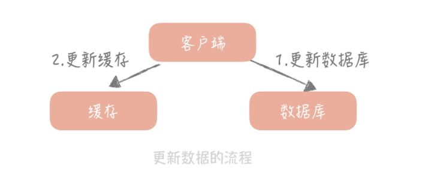

会造成缓存和数据库的不一致

比如A把ID为1的更新为20，B把ID为1的更新为21，那么A写入数据库、B写入数据库、B更新缓存、A更新缓存，此时数据库中的值是21，缓存中是20


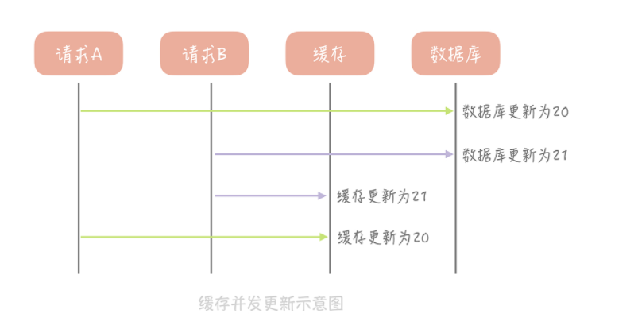


2、先更新缓存、再更新数据库

比如说原有金额是 20，A 请求从缓存中读到数据，并且把金额加 1，变更成 21，在未写入缓存之前又有请求 B 也读到缓存的数据后把金额也加 1，也变更成 21，两个请求同时把金额写回缓存，这时缓存里面的金额是 21，但是我们实际上预期是金额数加 2，这也是一个比较大的问题。


3、先删除缓存，再更新数据库

也会有数据不一致问题，比如A请求更新值，先把缓存删除了，然后A更新数据库时B请求来了，此时没有缓存，就从数据库中加载，那么A更新完数据库之后就出现数据不一致问题

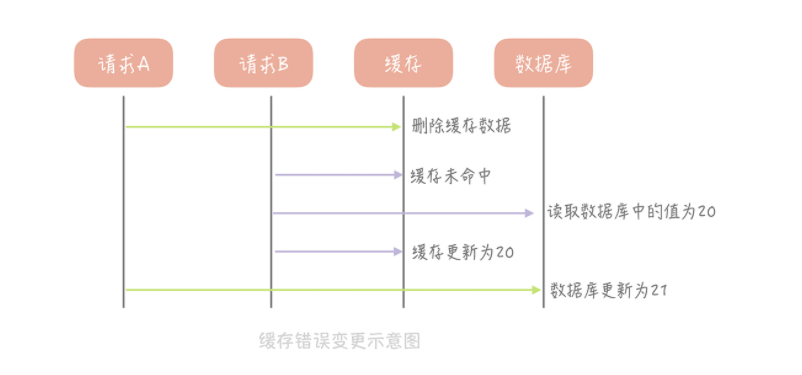


**4、先更新数据库，再删除缓存（旁路缓存）**

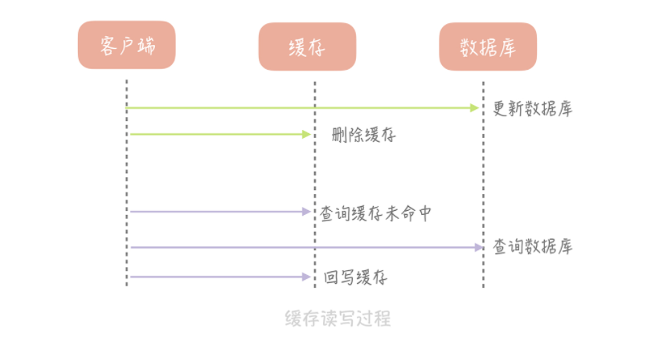


此策略数据以数据库中的数据为准，缓存中的数据时按需加载的。

可分为读策略和写策略

**读策略：**

- 从缓存中读取数据
- 如果缓存命中，则直接返回数据
- 如果缓存没命中，则从数据库中查询数据
- 查询到数据后，将数据写入到缓存中，并返回给用户


**写策略：**

- 更新数据库中的记录
- 删除缓存记录


问题：

假如某个缓存不存在，请求A将数据从数据库中查询，此时B将数据更新为其他值，然后B删除缓存数据，此时A将数据加载到缓存，那么又出现了数据不一致的情况

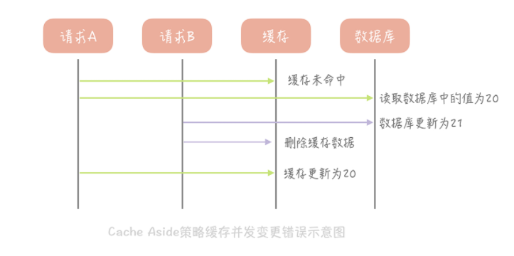


在读写分离的时候，刚写入就要读取的时候会出现因为主从延迟所以读不到的情况

解决方法时在插入新数据到数据库之后写入缓存，这样后续的读请求就会从缓存中读取到数据


旁路缓存的最大问题就是当写入比较频繁时，缓存中的数据会被频繁清理，这会降低缓存命中率。

两种解决方案：

1、更新数据时也更新缓存，只是在更新缓存前先加一个分布式锁，因为这样在同一时间只允许一个线程更新缓存，就不会产生并发问题了，这样做对于写入的性能会有一些影响。

2、更新数据时更新缓存，只是给缓存加一个较短的过期时间，这样即使出现缓存不一致的情况，缓存的数据也会很快地过期，对业务的影响也是可以接受。


#### （2）Read/Write Through（读穿/写穿）策略

核心思想时用户只跟缓存打交道，由缓存和数据库通信，写入或读取数据。


Write Through的策略是这样的：先查询要写入的数据在缓存中是否已经存在，如果已经存在，则更新缓存中的数据，并且由缓存组件同步更新到数据库中，如果缓存中数据不存在，这种情况就称为：Write Miss（写失效）

两种Write Miss 方式： 一个是 Write Allocate（按写分配），写入缓存相应位置，再由缓存组件同步更新到数据库中。另一个是 No-write allocate（不按写分配），不写入缓存中，而是直接更新到数据库中


在 Write Through 策略中，我们一般选择“No-write allocate”方式，原因是无论采用哪种“Write Miss”方式，我们都需要同步将数据更新到数据库中，而“No-write allocate”方式相比“Write Allocate”还减少了一次缓存的写入，能够提升写入的性能。


Read Through 策略就简单一些，它的步骤是这样的：先查询缓存中数据是否存在，如果存在则直接返回，如果不存在，则由缓存组件负责从数据库中同步加载数据。


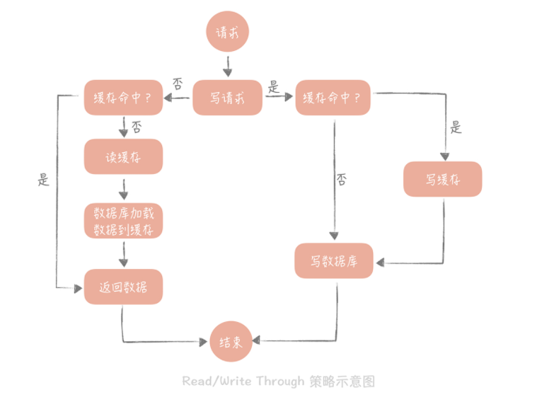


#### （3）Write Back（写回）策略

核心思想实在写入数据时只写入缓存，并把缓存块标记为“脏”的，而脏块只有被再次使用时才会将其中的数据写入到后端存储中。

在Write Miss中，采用的是Write Allocate方式，也就是写入后端存储的同时要写入缓存，这样在之后的写请求中都只需要更新缓存即可，而无需更新后端存储

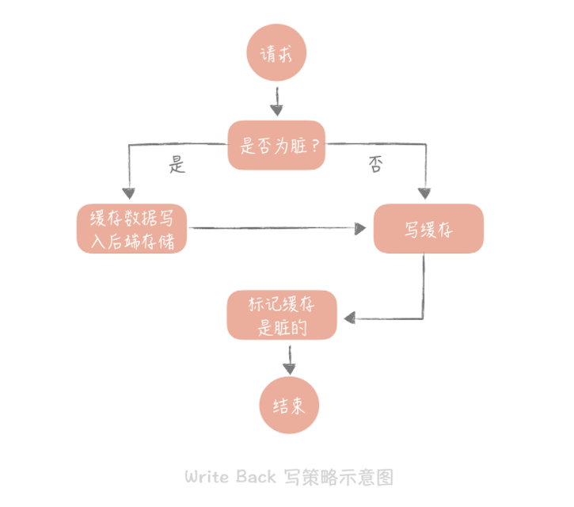

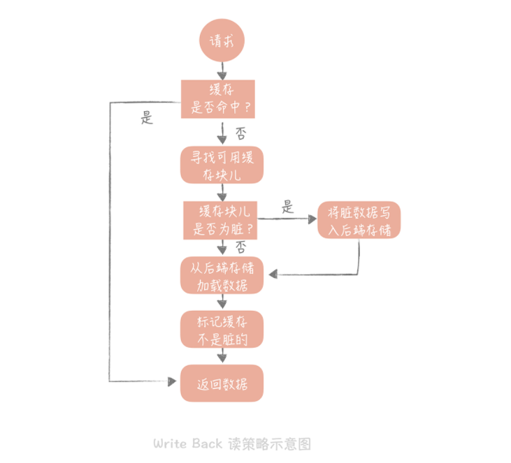


#### （4）总结

1、Cache Aside是使用分布式缓存时最常用的策略，可在实际工作中直接拿来使用

2、Read/Write Through 和 Write Back策略需要缓存组件的支持，所以比较适合实现本地缓存组件的时候使用

3、Write Back策略时计算机系结构中的策略，不过写入策略中的只写缓存，异步写入后端存储的策略倒是有很多的应用场景。


### 3、缓存高可用策略

主要有客户端方案、中间代理层方案和服务端方案

客户端方案： 在客户端配置多个缓存的节点，通过缓存写入和读取算法策略来实现分布式，从而提高缓存可用性

中间代理层方案：在应用代码和缓存节点之间增加代理层，客户端所有的写入和读取的请求都通过代理层，而代理层中会内置高可用策略，帮助提升缓存系统的高可用

服务端方案： 就是Redis的 Redis Sentinel方案


#### （1）客户端方案

需要关注缓存读、写两个方面：
- 写入数据时，需要把被写入缓存的数据分散到多个节点中，即进行数据分片
- 读取数据时，可利用多组缓存来做容错，提升缓存系统可用性。可使用主从和多副本两种策略


##### 1、缓存数据如何分片

最常用的就是Hash分片算法和一致性Hash分片算法

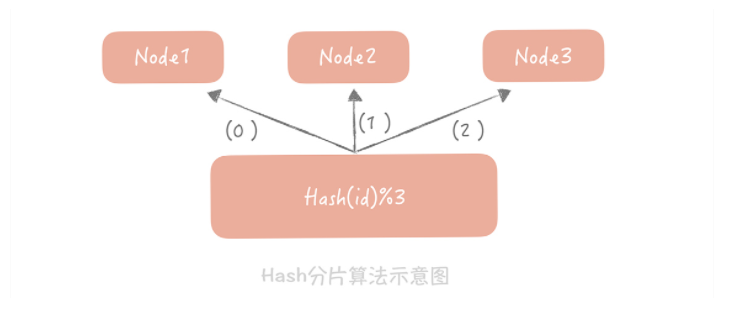

Hash分片算法缺点是在缓存节点个数变化会造成缓存失效不可用，缓存命中率下降


用一致性Hash算法可很好的解决增加和删减节点时，命中率下降的问题。

一致性hash算法将整个hash值空间组织成一个虚拟的圆环，然后将缓存节点的IP地址或主机名做hash取值后，放置在这个圆环上，当需要确定某一个Key需存取到哪个节点上时，
先对这个key做同样的Hash取值，确定环上位置，然后按照顺时针方向在环上行走，遇到的第一个缓存节点就是要访问的节点。

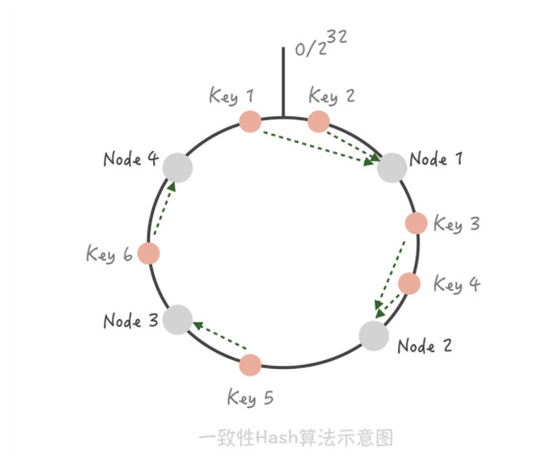

这样在增加或删除节点时，只有一部分的key会转移到其他节点上，而大部分的key命中的节点会保持不变


**问题：**

1、缓存节点在圆环上分布不均匀，造成部分节点压力过大，当某个节点故障时，这个节点索要承担的所有访问都会被顺移到另一个节点上，会对后面这个节点造成压力。

利用虚拟节点将一个缓存节点计算多个 Hash 值分散到圆环的不同位置，这样既实现了数据的平均，
而且当某一个节点故障或者退出的时候，它原先承担的 Key 将以更加平均的方式分配到其他节点上，从而避免雪崩的发生。

2、一致性Hash算法的脏数据问题

例如key为k的缓存在A上，此时更新缓存值，A刚好出现问题，就会将缓存写入到B上，那么当A恢复过来之后，客户端获取k的值就到A上获取，取到脏数据

在使用一致性 Hash 算法时一定要设置缓存的过期时间，这样当发生漂移时，之前存储的脏数据可能已经过期，就可以减少存在脏数据的几率。


##### 2、Memcached的主从机制

Memcached并不支持主从部署

为每一组 Master 配置一组 Slave，更新数据时主从同步更新。读取时，优先从 Slave 中读数据，如果读取不到数据就穿透到 Master 读取，并且将数据回种到 Slave 中以保持 Slave 数据的热度。

主从机制最大的优点就是当某一个 Slave 宕机时，还会有 Master 作为兜底，不会有大量请求穿透到数据库的情况发生，提升了缓存系统的高可用性。

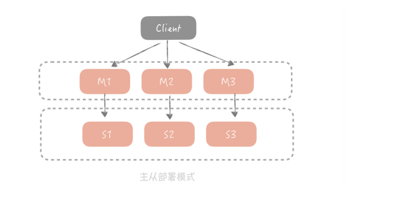


##### 3、多副本

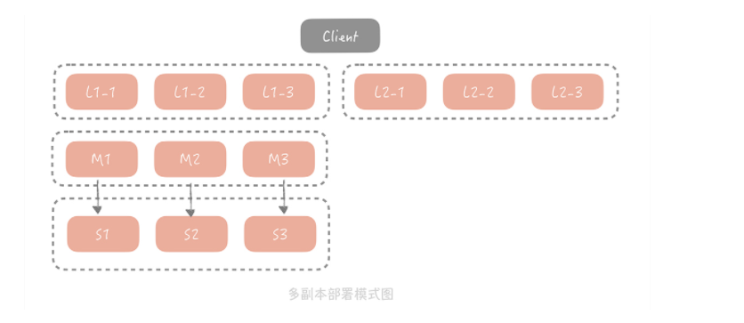

在这个方案中，当客户端发起查询请求时，请求首先会先从多个副本组中选取一个副本组发起查询，如果查询失败，就继续查询 Master/Slave，并且将查询的结果回种到所有副本组中，避免副本组中脏数据的存在。

基于成本的考虑，每一个副本组容量比 Master 和 Slave 要小，因此它只存储了更加热的数据。在这套架构中，Master 和 Slave 的请求量会大大减少，为了保证它们存储数据的热度，在实践中我们会把 Master 和 Slave 作为一组副本组使用。


#### （2）中间代理层方案

将客户端方案中的高可用逻辑封装在代理层代码里面，这样用户在使用你的代理层的时候就不需要关心缓存的高可用是如何做的，只需要依赖你的代理层就好了。

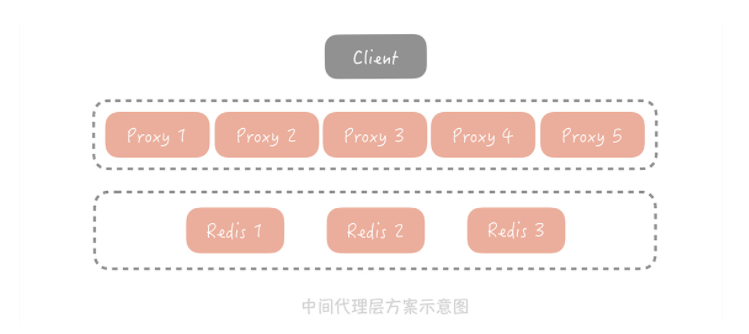

所有缓存的读写请求都是经过代理层完成的。代理层是无状态的，主要负责读写请求的路由功能，并且在其中内置了一些高可用的逻辑，
不同的开源中间代理层方案中使用的高可用策略各有不同。比如在 Twemproxy 中，Proxy 保证在某一个 Redis 节点挂掉之后会把它从集群中移除，
后续的请求将由其他节点来完成；而 Codis 的实现略复杂，它提供了一个叫 Codis Ha 的工具来实现自动从节点提主节点，在 3.2 版本之后换做了 Redis Sentinel 方式，从而实现 Redis 节点的高可用。


#### （3）服务端方案

Redis的哨兵模式

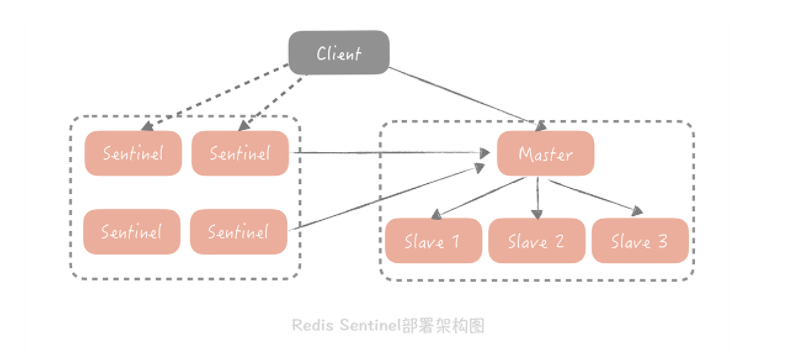


### 4、缓存穿透

就是指从缓存中没查到数据，而不得不从数据库中查询的情况。

大量的缓存穿透会造成系统压力激增，最终导致宕机


#### （1）解决方案

回种空值、使用布隆过滤器


##### 1、回种空值

当从数据库中查询到空值或者发生异常时候，可以向缓存中回种空值，但是空值并不是准确的业务数据，并会占用缓存空间，所以需要加一个较短的过期时间。


```java
Object nullValue = new Object();
try {
  Object valueFromDB = getFromDB(uid); // 从数据库中查询数据
  if (valueFromDB == null) {
    cache.set(uid, nullValue, 10);   // 如果从数据库中查询到空值，就把空值写入缓存，设置较短的超时时间
  } else {
    cache.set(uid, valueFromDB, 1000);
  }
} catch(Exception e) {
  cache.set(uid, nullValue, 10);
}
```


##### 2、布隆过滤器

初始化布隆过滤器，将根据特定值计算出hash值并映射到这个大数组中，映射位置设置为1，其他值设置为0

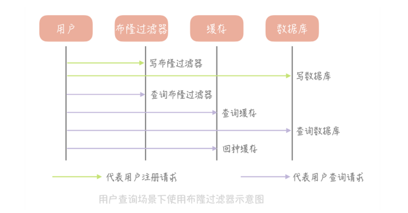


主要有两个缺陷：

1. 它在判断元素是否在集合中时是有一定错误几率的，比如它会把不是集合中的元素判断为处在集合中；

2. 不支持删除元素。


第一个缺陷，主要是 Hash 算法的问题。因为布隆过滤器是由一个二进制数组和一个 Hash 算法组成的，Hash 算法存在着一定的碰撞几率。
可以使用多个 Hash 算法为元素计算出多个 Hash 值，只有所有 Hash 值对应的数组中的值都为 1 时，才会认为这个元素在集合中。


不支持删除元素的缺陷也和 Hash 碰撞有关。给你举一个例子，假如两个元素 A 和 B 都是集合中的元素，它们有相同的 Hash 值，它们就会映射到数组的同一个位置。
这时我们删除了 A，数组中对应位置的值也从 1 变成 0，那么在判断 B 的时候发现值是 0，也会判断 B 是不在集合中的元素，就会得到错误的结论。

可以使用计数值，比如一个位置有n个key映射到，那么这个位置存储的就是n，当删除的时候，就进行减1


当有一个极热点的缓存项，它一旦失效会有大量请求穿透到数据库，这会对数据库造成瞬时极大的压力，我们把这个场景叫做“dog-pile effect”（狗桩效应），

解决狗桩效应的思路是尽量地减少缓存穿透后的并发，方案也比较简单：

1. 在代码中，控制在某一个热点缓存项失效之后启动一个后台线程，穿透到数据库，将数据加载到缓存中，在缓存未加载之前，所有访问这个缓存的请求都不再穿透而直接返回。

2. 通过在 Memcached 或者 Redis 中设置分布式锁，只有获取到锁的请求才能够穿透到数据库。


### 5、静态资源加速

1.DNS 技术是 CDN 实现中使用的核心技术，可以将用户的请求映射到 CDN 节点上；

2.DNS 解析结果需要做本地缓存，降低 DNS 解析过程的响应时间；

3.GSLB 可以给用户返回一个离着他更近的节点，加快静态资源的访问速度。


