<!-- vscode-markdown-toc -->
* 1. [基础篇](#)
	* 1.1. [通用设计方法](#-1)
	* 1.2. [分层架构](#-1)
	* 1.3. [如何提升系统性能](#-1)
	* 1.4. [高可用](#-1)
	* 1.5. [可扩展](#-1)
* 2. [数据库](#-1)
	* 2.1. [池化技术](#-1)
	* 2.2. [读写分离（主从）](#-1)
		* 2.2.1. [主从复制](#-1)
		* 2.2.2. [如何访问数据库](#-1)
	* 2.3. [分库分表](#-1)
		* 2.3.1. [垂直拆分](#-1)
		* 2.3.2. [水平拆分](#-1)
		* 2.3.3. [问题：](#-1)
	* 2.4. [发号器](#-1)
		* 2.4.1. [基于Snowflake算法搭建发号器](#Snowflake)
	* 2.5. [RDS与NoSQL互补](#RDSNoSQL)
		* 2.5.1. [使用NoSQL提升性能](#NoSQL)
		* 2.5.2. [提升扩展性](#-1)
	* 2.6. [数据迁移](#-1)
		* 2.6.1. [双写方案](#-1)
		* 2.6.2. [级联同步方案](#-1)
* 3. [缓存](#-1)
	* 3.1. [缓存加速](#-1)
		* 3.1.1. [缓存分类](#-1)
		* 3.1.2. [缓存的不足](#-1)
	* 3.2. [缓存读写策略](#-1)
		* 3.2.1. [Cache Aside（旁路缓存）策略](#CacheAside)
		* 3.2.2. [Read/Write Through（读穿/写穿）策略](#ReadWriteThrough)
		* 3.2.3. [Write Back（写回）策略](#WriteBack)
	* 3.3. [缓存高可用](#-1)
		* 3.3.1. [客户端方案](#-1)
		* 3.3.2. [代理层方案](#-1)
		* 3.3.3. [服务端方案](#-1)
	* 3.4. [缓存穿透](#-1)
		* 3.4.1. [回种空值](#-1)
		* 3.4.2. [布隆过滤器](#-1)
	* 3.5. [CDN内容分发网络](#CDN)
* 4. [消息队列](#-1)
	* 4.1. [消息队列在高并发系统中的角色](#-1)
	* 4.2. [消息投递：幂等性](#-1)

<!-- vscode-markdown-toc-config
	numbering=true
	autoSave=true
	/vscode-markdown-toc-config -->
<!-- /vscode-markdown-toc -->

参考： https://zq99299.github.io/note-architect/hc
##  1. 基础篇

###  1.1. 通用设计方法
在面带高并发大流量的时候，通常采用三类方法去应对：
- Scale-out横向扩展
  - 通过分布式系统将流量分摊到多台机器上，减少服务器压力。
- 缓存
  - 通过缓存热点数据，让数据读取速率更快。
- 异步
  - 将同步更改为异步，减少CPU阻塞时间，让CPU能处理更多请求。

注意：
- 一般在项目初期的时候使用scale-up去提升系统处理性能，后期qps上来后，提升机器配置产生的收益已经远远低于增加机器数量，所以后期都是通过scale-out去提升服务处理能力。

###  1.2. 分层架构
架构分层可以让每一层专门处理相应的事务，有利于逻辑划分。
例如TCP/IP五层模型、MVC模型等。

分层之间边界需要清晰

例如：
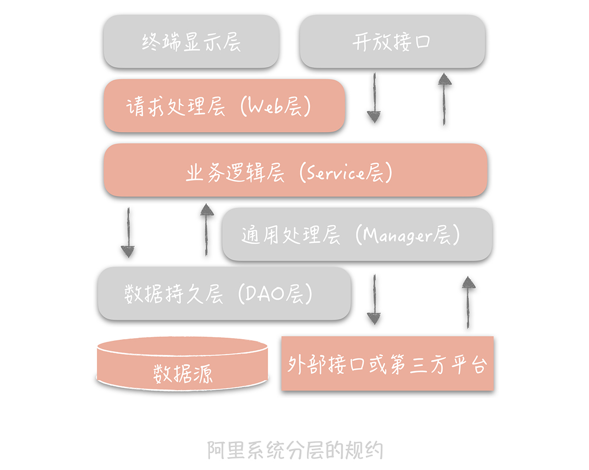

- 开放接口层：
  - 将Service层方法封装成开放接口，同时进行网关安全控制和流量控制等
- web层
  - 网关层，对请求进行转发、参数校验、权限校验等操作
- Service层（编排层）
  - 业务逻辑层，对原子能力接口进行逻辑上的编排处理
- Manager层
  - 通用业务处理层，提供原子接口
    - 其一，你可以将原先 Service 层的一些通用能力下沉到这一层，比如 与缓存和存储交互策略，中间件的接入；
    - 其二，你也可以在这一层 封装对第三方接口的调用，比如调用支付服务，调用审核服务等。
- Dao层
  - 数据访问层，与底层 MySQL、Oracle、Hbase 等进行数据交互。
- 外部接口或第三方平台：
  - 包括其它部门 RPC 开放接口，基础平台，其它公司的 HTTP 接口。

在这个分层架构中 主要增加了 Manager 层，它与 Service 层的关系是：Manager 层提供原子的服务接口，Service 层负责依据业务逻辑来编排原子接口。

以上面的例子来说，Manager 层提供 创建用户 和 获取用户信息 的接口，而 Service 层负责将这两个接口组装起来。这样就把原先散布在表现层的业务逻辑都统一到了 Service 层，每一层的边界就非常清晰了。

###  1.3. 如何提升系统性能
衡量系统性能的三大指标：高性能、高可用、可扩展

性能都必须建立在高并发的基础上。

**性能优化原则**
- 性能优化是问题导向
- 遵循二八原则
  - 花20%的时间解决80%的问题
- 需要数据支撑：时刻了解优化效果
- 过程是持续的

**性能优化度量指标**
- 平均值
  - 敏感度较差，无法反应真实状况，比如有个请求的时间特别长，会把所有请求的时间都拉下来
- 最大值
  - 过于敏感，问题类似于平均值
- 分位值

**高并发下的性能优化**
- 提高系统的处理核心数
  - 增加系统并行处理能力
- 减少单次任务响应时间
  - 单位时间内能处理更多请求
  - CPU密集型
    - 选用更高效的算法或者减少运算次数就是这类系统重要的优化手段
  - IO密集型
    - 监控和工具发现

###  1.4. 高可用
指的是系统具备较高的无故障运行能力

**度量**

与之相关的概念是： MTBF 和 MTTR。

**MTBF（Mean Time Between Failure）** 是平均故障间隔的意思，代表两次故障的间隔时间，也就是系统正常运转的平均时间。这个时间越长，系统稳定性越高。

**MTTR（Mean Time To Repair）** 表示故障的平均恢复时间，也可以理解为平均故障时间。这个值越小，故障对于用户的影响越小。

可用性与 MTBF 和 MTTR 的值息息相关，我们可以用下面的公式表示它们之间的关系：

``Availability = MTBF / (MTBF + MTTR)``

高可用的系统需要从系统设计和系统运维这两方面来保障：

**系统设计**

包含故障转移、超时控制、限流、降级等

- failover故障转移
  - 对等节点中，也就是分布式节点中，直接进行流量转移即可
  - 非对等节点中，也就是系统中存在主备节点
- 超时控制
  - 收集系统之间的调用日志，统计响应时间
  - 如果请求超过设定时间，则让请求失败。
- 限流
  - 限制单位时间内的qps
- 降级
  - 为了保证核心服务的稳定而牺牲非核心服务的做法。

**系统运维**

包含灰度发布、故障演练等。

###  1.5. 可扩展

指的是通过增加机器的数量来线性提高系统的处理能力，从而承担更高的流量和并发。

无状态的服务和组件更易于扩展，而像Mysql这类有状态的存储就比较难以扩展，因为扩展涉及到大量的数据迁移。

扩展需考虑的因素：
- 服务数量
- 数据库
- 缓存
- 依赖的第三方服务
- 负载均衡
- 交换机带宽等

最重要的思路就是`拆分`

**存储层的扩展性**

存储拆分首先考虑的维度是业务维度，这个就是垂直拆分。

拆分之后，系统就有了用户库、内容库、评论库、点赞库和关系库等，一个挂了之后不影响其他服务。

业务按照垂直拆分运行一段时间后，数据量会增加，那么此时就会需要进行二次拆分，按照数据特征拆分，这个就叫水平拆分，例如对用户库进行分库分表等操作。

当数据库按照业务和数据维度拆分之后，我们 尽量不要使用事务。因为当一个事务中同时更新不同的数据库时，需要使用二阶段提交，来协调所有数据库要么全部更新成功，要么全部更新失败。这个协调的成本会随着资源的扩展不断升高，最终达到无法承受的程度。

**业务层的扩展性**

会从三个维度考虑业务层的拆分方案，它们分别是：业务纬度 ，重要性纬度 和 请求来源纬度。

- 业务纬度：
  
    把相同业务的服务拆分成单独的业务池，比如用户服务单独拆出来部署。

    每个业务依赖独自的数据库资源，不会依赖其它业务的数据库资源，在某个业务需要扩展的时候就会大大减少复杂度。

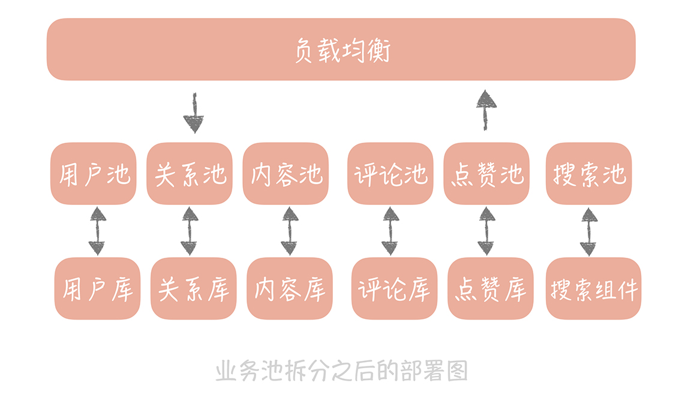

- 重要性纬度：

    根据业务接口的重要性，把业务分成核心池和非核心池，优先保证核心池的服务稳定性

    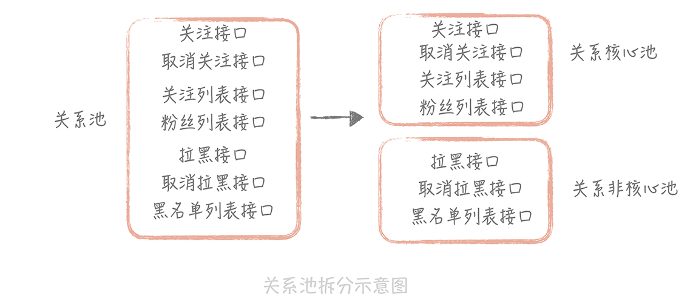

##  2. 数据库

###  2.1. 池化技术
可以减少频繁创建连接引起的性能损耗

1、数据库连接池化

数据库连接池有两个最重要的配置： 最小连接数和最大连接数， 它们控制着从连接池中获取连接的流程：

- 如果当前连接数小于最小连接数，则创建新的连接处理数据库请求；
- 如果连接池中有空闲连接则复用空闲连接；
- 如果空闲池中没有连接并且当前连接数小于最大连接数，则创建新的连接处理请求；
- 如果当前连接数已经大于等于最大连接数，则按照配置中设定的时间（C3P0 的连接池配置是 checkoutTimeout）等待旧的连接可用；
- 如果等待超过了这个设定时间则向用户抛出错误。

2、线程池连接池化

比如java的

- 如果线程池中的线程数少于 coreThreadCount 时，处理新的任务时会创建新的线程；
- 如果线程数大于 coreThreadCount 则把任务丢到一个队列里面，由当前空闲的线程执行；
- 当队列中的任务堆积满了的时候，则继续创建线程，直到达到 maxThreadCount；
- 当线程数达到 maxTheadCount 时还有新的任务提交，那么我们就不得不将它们丢弃了（还得看具体的策略）。

###  2.2. 读写分离（主从）
两个关键点：
- 主从复制
- 如何屏蔽底层主从架构，让使用者可以像使用单点系统一样使用数据库

####  2.2.1. 主从复制
对MySQL来说，主从复制依赖binlog，主库异步将binlog传输到从库

过程：
- 首先从库在连接到主节点时会创建一个 IO 线程，用以请求主库更新的 binlog，并且把接收到的 binlog 信息写入一个叫做 relay log 的日志文件中（避免直接写入从库耗时较高，造成主从数据延迟）
- 而主库也会创建一个 log dump 线程来发送 binlog 给从库；
- 同时，从库还会创建一个 SQL 线程读取 relay log 中的内容，并且在从库中做回放，最终实现主从的一致性。这是一种比较常见的主从复制方式。

无需太多从库，因为从库每多一个，就会创建一个线程，线程越多，对主库的性能会有影响。最多挂3-5个

**缺点：**

1、主从同步延迟，造成主库写入之后，从库中无法读取的情况

解决方案就是尽量不去从库查询数据：
- 数据冗余：将完整数据发送至队列等，避免二次查询数据
- 缓存：将数据同步写入缓存中，会有缓存与数据不一致的情况
- 直接查询主库： 

####  2.2.2. 如何访问数据库
通过中间件去查询数据，屏蔽主从分离后数据库访问的细节。

###  2.3. 分库分表
数据库的写入请求大造成的性能和可用性方面的问题？

可以对数据进行分片，分摊读写压力，突破单机的存储瓶颈，也就是分库分表。

数据库分库分表的方式有两种：一种是垂直拆分，另一种是水平拆分。

####  2.3.1. 垂直拆分
将不同业务的表拆分到不同的数据库

垂直拆分的原则一般是按照业务类型来拆分，核心思想是专库专用，将业务耦合度比较高的表拆分到单独的库中

可以暂缓数据库压力，但是如果某个业务是核心业务，数据量增长速度很快，同样会造成数据库瓶颈，需要进行二次拆分，也就是水平拆分

####  2.3.2. 水平拆分
两种方式：
- 根据某个字段hash值进行拆分，将数据放到不同的库中。
- 按照某一个字段的 区间 来拆分，比较常用的是时间字段。

第一种方式无法进行排序
第二种方式可以进行排序，也可以解决热点数据问题，比如热点数据是最近一周或一个月的。

####  2.3.3. 问题：
- 查询都需要带上分区字段
  - 比如根据id分区，查询昵称，这个时候需要对昵称再做分区，就很麻烦，可以对id和昵称建立映射，先查询对应的id，然后再查询。
- 查询次数增多
- 无法进行连表查询

###  2.4. 发号器
数据库的主键在于全局唯一性，对于单机来说，可以使用自增主键，但是对于主从分离、分库分表来说，就无法使用自增主键，需要一个能生成全局唯一性的主键

很容易想到的是UUID，但UUID是无序的，无法对数据进行排序功能，同时写入数据库也会有相应的性能问题。对于mysql的B+树来说，顺序写比随机写性能要好很多。

其次UUID是32个16进制的数字组成，对于mysql的存储来说也是比较耗费空间

####  2.4.1. 基于Snowflake算法搭建发号器
核心思想是将 64bit 的二进制数字分成若干部分，每一部分都存储有特定含义的数据，比如说时间戳、机器 ID、序列号等等，最终生成全局唯一的有序 ID。它的标准算法是这样的：
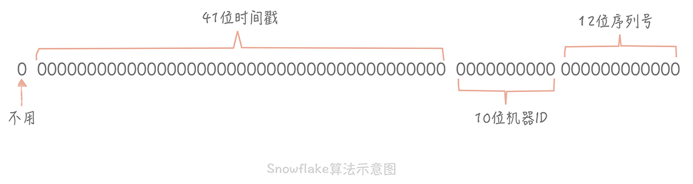

可以根据自身业务对算法进行改造，比如：1 位兼容位恒为 0 + 41 位时间信息 + 6 位 IDC 信息（支持 64 个 IDC）+ 6 位业务信息（支持 64 个业务）+ 10 位自增信息（每毫秒支持 1024 个号）

**算法实现方式：**
- 嵌入到业务代码里，也就是分布在业务服务器中
  - 优点：
    - 无需跨网络调用
  - 缺点：
    - 业务服务器众多，需要更多的机器id位数，由于很难保证机器id的唯一性，所以需要引入第三方组件去保证，比如zk
- 独立的服务部署，也就是发号器服务
  - 缺点：
    - 多一次网络调用
  - 优点：
    - 机器id唯一

雪花算法的缺点是太依赖于时间戳，如果时间戳不准，需要重新校准后再进行发号。

另外，在qps不高的情况下，比如发号器每毫米只发一个，那么id尾数就永远是1，对于分库分表来说会造成数据不均匀的情况，
- 时间戳不记录毫秒而是记录秒，这样在一个时间区间里可以多发出几个号，避免出现分库分表时数据分配不均。

- 生成的序列号的起始号可以做一下随机，这一秒是 21，下一秒是 30，这样就会尽量的均衡了。

###  2.5. RDS与NoSQL互补

**NoSQL**

- Redis、LevelDB 这样的 KV 存储。这类存储相比于传统的数据库的优势是极高的读写性能，一般对性能有比较高的要求的场景会使用。
- Hbase、Cassandra 这样的 列式存储数据库。这种数据库的特点是数据不像传统数据库以行为单位来存储，而是以列来存储，适用于一些离线数据统计的场景。
- 像 MongoDB、CouchDB、ES 这样的文档型数据库。这种数据库的特点是 Schema Free（模式自由），数据表中的字段可以任意扩展，比如说电商系统中的商品有非常多的字段，并且不同品类的商品的字段也都不尽相同，使用关系型数据库就需要不断增加字段支持，而用文档型数据库就简单很多了。

####  2.5.1. 使用NoSQL提升性能
mysql更新binlog、redolog、undolog都是顺序写，只有更新datafile、索引是随机写，随机写比顺序写性能差了几个等级，所以mysql使用了先写内存然后再批量写磁盘去优化，但是还是会有随机写的情况。

**NoSQL方案**

基于 LSM（（Log-Structured Merge Tree）） 树的存储引擎

数据首先会写入到一个叫做 MemTable 的内存结构中，在 MemTable 中数据是按照写入的 Key 来排序的。为了防止 MemTable 里面的数据因为机器掉电或者重启而丢失，一般会通过写 Write Ahead Log 的方式将数据备份在磁盘上。

MemTable 在累积到一定规模时，它会被刷新生成一个新的文件，我们把这个文件叫做 SSTable（Sorted String Table）。当 SSTable 达到一定数量时，我们会将这些 SSTable 合并，减少文件的数量，因为 SSTable 都是有序的，所以合并的速度也很快。

当从 LSM 树里面读数据时，我们首先从 MemTable 中查找数据，如果数据没有找到，再从 SSTable 中查找数据。因为存储的数据都是有序的，所以查找的效率是很高的，只是因为数据被拆分成多个 SSTable，所以读取的效率会低于 B+ 树索引

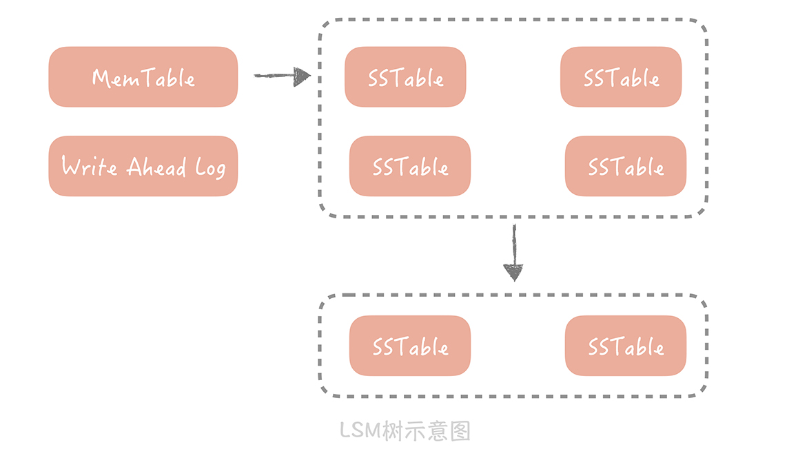

####  2.5.2. 提升扩展性
RDS在数据量大的时候就需要进行分库分表，此时进行数据迁移是一件非常耗时的事情，也很麻烦

此时可以借助NoSQL的特性，
比如MongoDB的特性，
- Replica也就是副本集，自带数据冗余
- Shard，分片，自带分库分表，MongoDB 的 Sharding 特性一般需要三个角色来支持，一个是 Shard Server，它是实际存储数据的节点，是一个独立的 Mongod 进程；二是 Config Server，也是一组 Mongod 进程，主要存储一些元信息，比如说哪些分片存储了哪些数据等；最后是 Route Server，它不实际存储数据，仅仅作为路由使用，它从 Config Server 中获取元信息后，将请求路由到正确的 Shard Server 中。
- 负载均衡，当数据不均匀的时候，自动触发Balancer进行重新分配，需要扩容时，数据会自动迁移到新的节点上，无需手动介入。

NoSQL 数据库中内置的扩展性方面的特性可以让我们不再需要对数据库做分库分表和主从分离，也是对传统数据库一个良好的补充。

###  2.6. 数据迁移
迁移过程需要满足以下几个目标：
- 迁移应该是在线的迁移，也就是在迁移的同时还会有数据的写入；
- 数据应该保证完整性，也就是说在迁移之后需要保证新的库和旧的库的数据是一致的；
- 迁移的过程需要做到可以回滚，这样一旦迁移的过程中出现问题，可以立刻回滚到源库，不会对系统的可用性造成影响。

####  2.6.1. 双写方案
1. 将新的库配置为源库的从库，用来同步数据；

    如果需要将数据同步到多库多表，那么可以使用一些第三方工具获取 Binlog 的增量日志（比如开源工具 Canal），在获取增量日志之后就可以按照分库分表的逻辑写入到新的库表中了。

2. 同时，我们需要改造业务代码，在数据写入的时候，不仅要写入旧库，也要写入新库。

    当然，基于性能的考虑，我们可以异步地写入新库，只要保证旧库写入成功即可。 但是，我们需要注意的是， 需要将写入新库失败的数据记录在单独的日志中，这样方便后续对这些数据补写，保证新库和旧库的数据一致性。

3. 然后，我们就可以开始校验数据了。由于数据库中数据量很大，做全量的数据校验不太现实。你可以抽取部分数据，具体数据量依据总体数据量而定，只要保证这些数据是一致的就可以。

4. 如果一切顺利，我们就可以将读流量切换到新库了。

  由于担心一次切换全量读流量可能会对系统产生未知的影响，所以这里 最好采用灰度的方式来切换， 比如开始切换 10% 的流量，如果没有问题再切换到 50% 的流量，最后再切换到 100%。

5. 由于有双写的存在，所以在切换的过程中出现任何的问题，都可以将读写流量随时切换到旧库去，保障系统的性能。

6. 在观察了几天发现数据的迁移没有问题之后，就可以将数据库的双写改造成只写新库，数据的迁移也就完成了。

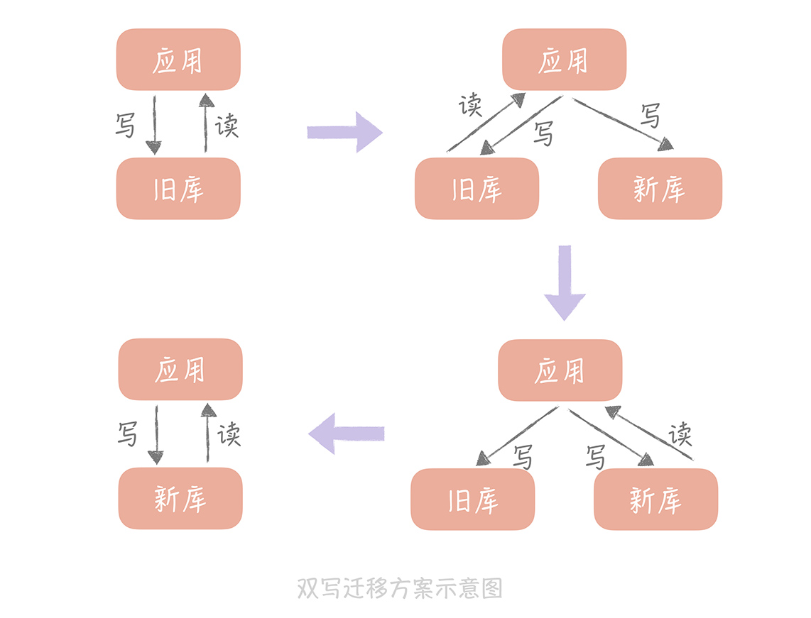

**最容易出问题的步骤就是数据校验的工作**

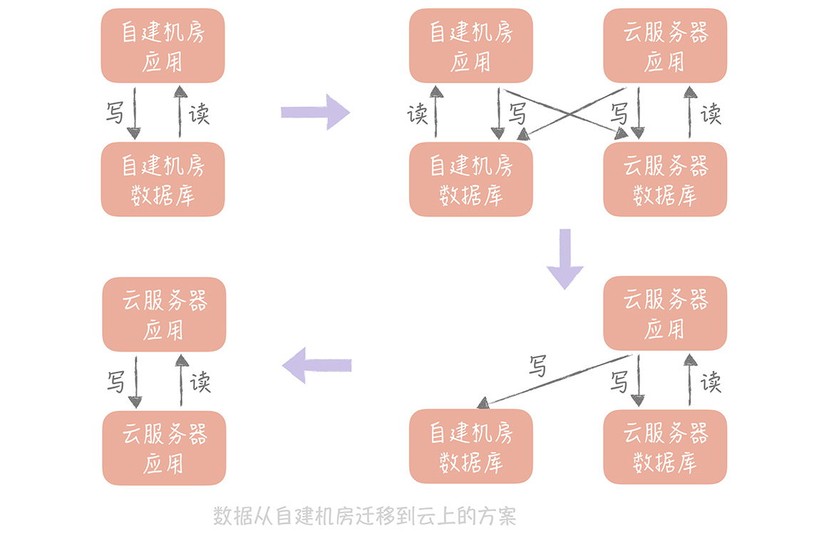

对于mysql、Redis中的数据都可以用这个方案去迁移

- 好处是： 迁移的过程可以随时回滚，将迁移的风险降到了最低。
- 劣势是： 时间周期比较长，应用有改造的成本。

####  2.6.2. 级联同步方案

在自建机房准备一个备库，在云上环境上准备一个新库，通过级联同步的方式在自建机房留下一个可回滚的数据库，具体的步骤如下：

1. 先将新库配置为旧库的从库，用作数据同步；

2. 再将一个备库配置为新库的从库，用作数据的备份；

3. 等到三个库的写入一致后，将数据库的读流量切换到新库；

4. 然后暂停应用的写入，将业务的写入流量切换到新库（由于这里需要暂停应用的写入，所以需要安排在业务的低峰期）。

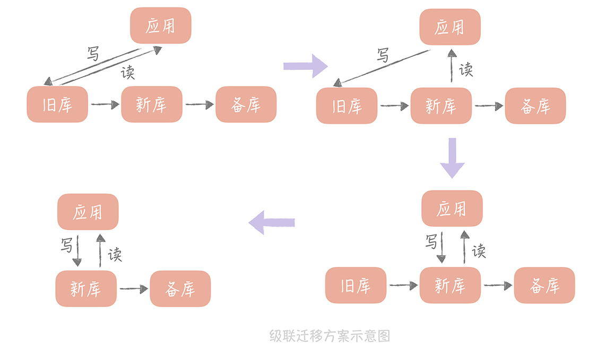

这种方案的回滚方案也比较简单， 可以先将读流量切换到备库，再暂停应用的写入，将写流量切换到备库，这样所有的流量都切换到了备库，也就是又回到了自建机房的环境，就可以认为已经回滚了。

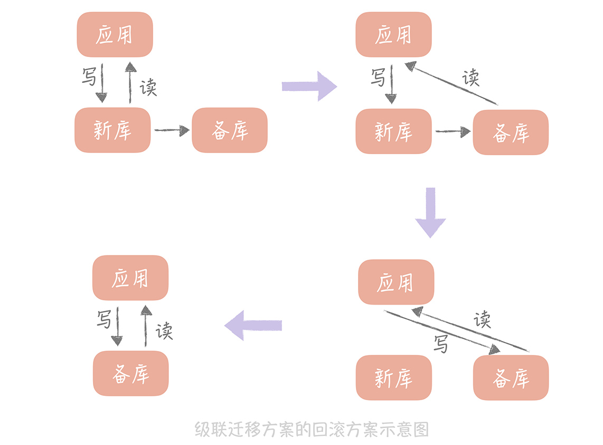

- 优势是 简单易实施，在业务上基本没有改造的成本；
- 缺点是 在切写的时候需要短暂的停止写入，对于业务来说是有损的，不过如果在业务低峰期来执行切写，可以将对业务的影响降至最低

**注意：缓存迁移也需要考虑到**

##  3. 缓存

###  3.1. 缓存加速
缓存，是一种存储数据的组件，它的作用是让对数据的请求更快地返回。

####  3.1.1. 缓存分类
- 静态缓存
- 分布式缓存
  - 例如Redis等存储组件
- 热点本地缓存
  - 例如当有热点事件的时候，某个分区承担的流量就会异常高，此时需要使用本地缓存缓解服务器压力

####  3.1.2. 缓存的不足
- 适合读多写少的场景，并且数据具有热点属性
- 缓存会给整体系统带来复杂度，并且会有数据不一致的风险
- 增加运维成本

###  3.2. 缓存读写策略
考虑点：
- 是否可能写入脏数据
- 读写性能
- 命中率

####  3.2.1. Cache Aside（旁路缓存）策略
**先更新数据库，再更新缓存**

会发生数据不一致的情况，比如A将数据修改，然后还未更新缓存的时候，B已经将数据修改为其他的并且更新了缓存，最后A才把缓存给更新了。

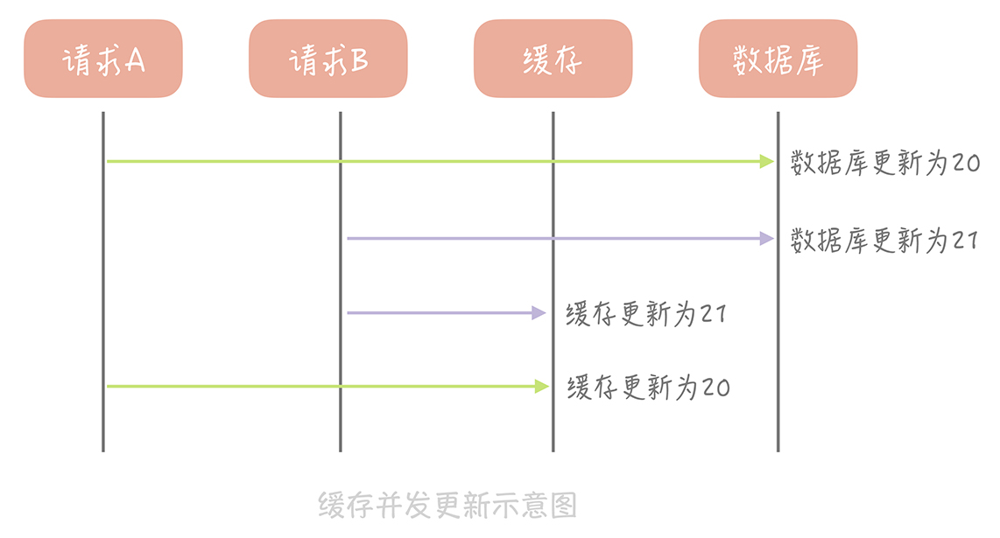

**先删除缓存，再更新数据库**

同样会发生数据不一致的情况，比如A先删除缓存，此时B过来了，发现缓存中没有数据，就读了数据库中旧的数据，添加到缓存中，最后A才将数据库进行更新。

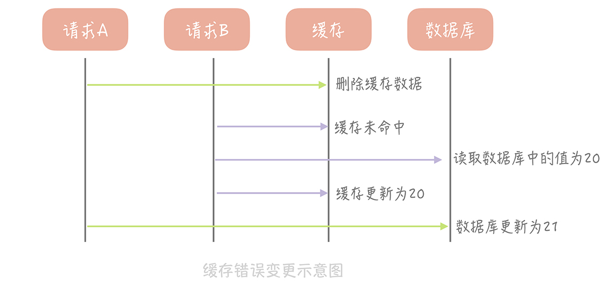

**先更新数据库，然后再删除缓存**

这个策略就是Cache Aside 策略（也叫旁路缓存策略），这个策略数据 以数据库中的数据为准，缓存中的数据是按需加载的 。它可以分为读策略和写策略，

读策略的步骤是：

- 从缓存中读取数据；
- 如果缓存命中，则直接返回数据；
- 如果缓存不命中，则从数据库中查询数据；
- 查询到数据后，将数据写入到缓存中，并且返回给用户。

写策略的步骤是：

- 更新数据库中的记录；
- 删除缓存记录。
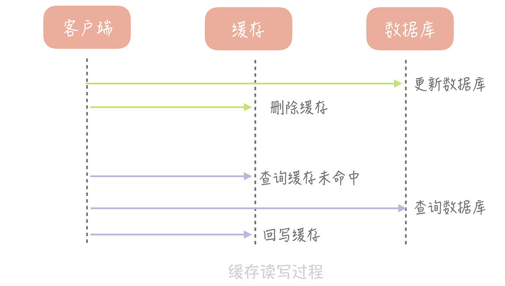

此策略依旧会有数据不一致的情况
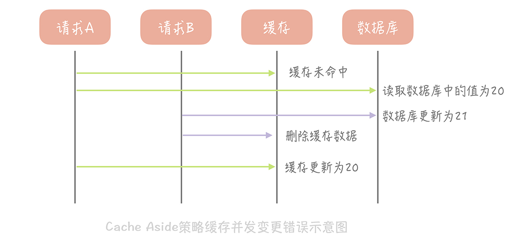

Cache Aside 存在的最大的问题是当写入比较频繁时，缓存中的数据会被频繁地清理，这样会对缓存的命中率有一些影响。 如果你的业务对缓存命中率有严格的要求，那么可以考虑两种解决方案：

- 一种做法是在更新数据时也更新缓存，只是在更新缓存前先加一个分布式锁，因为这样在同一时间只允许一个线程更新缓存，就不会产生并发问题了。当然这么做对于写入的性能会有一些影响；（有疑问，为什么加锁能解决命中率问题？）
- 另一种做法同样也是在更新数据时更新缓存，只是给缓存加一个较短的过期时间，这样即使出现缓存不一致的情况，缓存的数据也会很快地过期，对业务的影响也是可以接受。

####  3.2.2. Read/Write Through（读穿/写穿）策略
这个策略的核心原则是用户只与缓存打交道，由缓存和数据库通信，写入或者读取数据

Write Through 的策略是这样的：先查询要写入的数据在缓存中是否已经存在，如果已经存在，则更新缓存中的数据，并且由缓存组件同步更新到数据库中，如果缓存中数据不存在，我们把这种情况叫做 Write Miss（写失效）。

一般来说，我们可以选择两种 Write Miss 方式：

- Write Allocate（按写分配）

  - 做法是写入缓存相应位置，再由缓存组件同步更新到数据库中；

- No-write allocate（不按写分配）

  - 做法是不写入缓存中，而是直接更新到数据库中
  - 一般选择这种，减少一次缓存写入，提升性能

Read Through 策略就简单一些，它的步骤是这样的：先查询缓存中数据是否存在，如果存在则直接返回，如果不存在，则由缓存组件负责从数据库中同步加载数据。

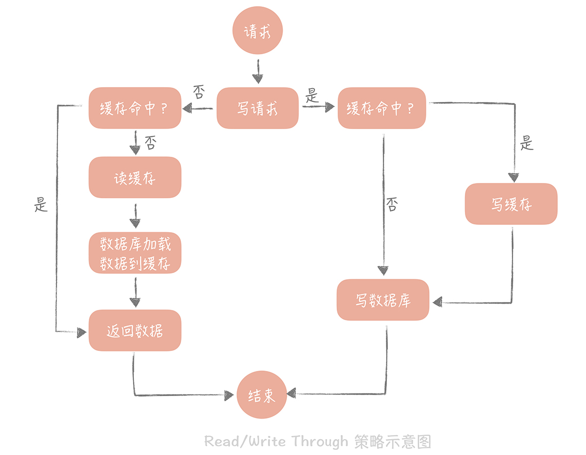

####  3.2.3. Write Back（写回）策略

在写入数据时只写入缓存，并且把缓存块儿标记为 「脏」 的。而脏块儿只有被再次使用时才会将其中的数据写入到后端存储中。

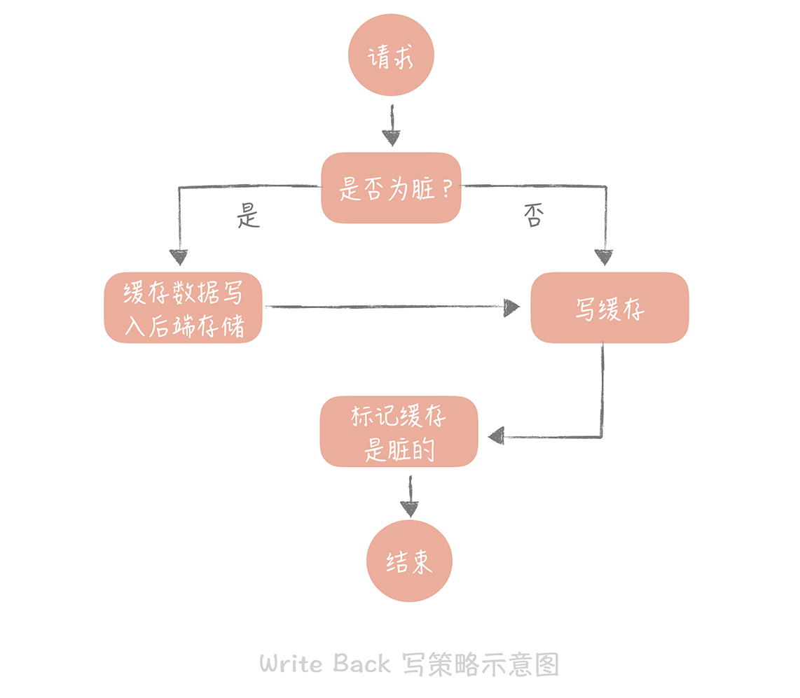

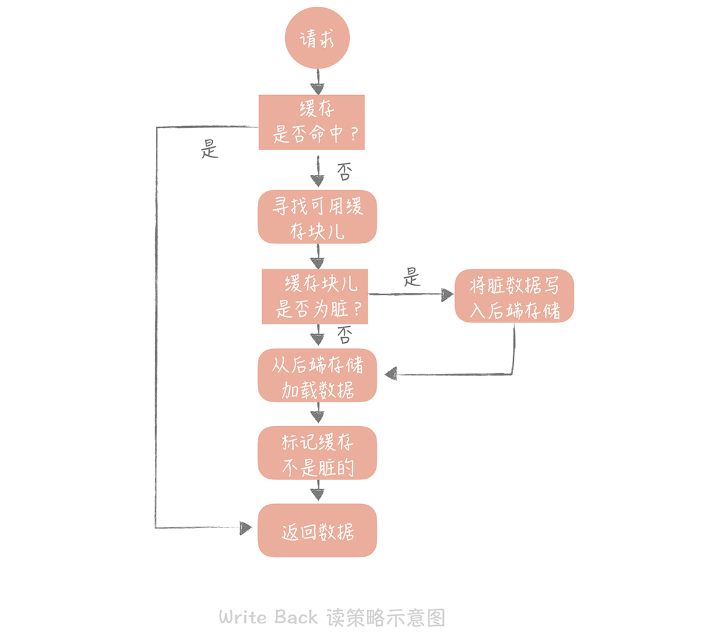

此策略跟计算机系统的page cache采用的是一样的，只写缓存，后续异步写入后端存储中。

###  3.3. 缓存高可用

####  3.3.1. 客户端方案
在客户端配置多个缓存的节点，通过缓存写入和读取算法策略来实现分布式，从而提高缓存的可用性。

- 写入数据时，需要把被写入缓存的数据分散到多个节点中，即进行数据分片；
- 读数据时，可以利用多组的缓存来做容错，提升缓存系统的可用性。关于读数据，这里可以使用主从和多副本两种策略，两种策略是为了解决不同的问题而提出的。

可以使用一致性hash算法，缺点是当节点挂掉后，数据更新过，然后节点起来后会有脏数据问题

同时可以通过主从和多副本提高可用性

####  3.3.2. 代理层方案
是在应用代码和缓存节点之间增加代理层，客户端所有的写入和读取的请求都通过代理层，而代理层中会内置高可用策略，帮助提升缓存系统的高可用。

可以解决跨语言的问题

####  3.3.3. 服务端方案
比如Redia的哨兵模式

###  3.4. 缓存穿透
####  3.4.1. 回种空值
当数据库中没有数据时，可以向缓存中回种一个空值，但这个需要设置过期时间，避免空值太多占用内存，导致有效的数据反而得不到缓存。

####  3.4.2. 布隆过滤器
通过布隆过滤器先判断数据是否存在，避免请求直接到数据库。
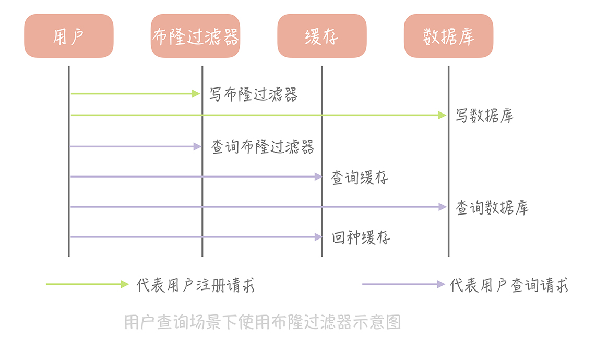

缺陷：
- 判断有一定概率误差，比如hash碰撞发生的时候，此时可以用多个hash函数，如果多个位置都为1的情况下就判断数据确实存在
- 无法删除数据，也是因为hash碰撞，比如A、B经过hash后在同一个bit位，将这个bit位置为0后会影响A、B的判断。

建议：

- 选择多个 Hash 函数计算多个 Hash 值，这样可以减少误判的几率；
- 布隆过滤器会消耗一定的内存空间，所以在使用时需要评估你的业务场景下需要多大的内存，存储的成本是否可以接受。

**狗桩效应：**

当有一个极热点的缓存项，它一旦失效会有大量请求穿透到数据库，这会对数据库造成瞬时极大的压力

解决狗桩效应的思路是尽量地减少缓存穿透后的并发，方案也比较简单：

- 在代码中，控制在某一个热点缓存项失效之后启动一个后台线程，穿透到数据库，将数据加载到缓存中，在缓存未加载之前，所有访问这个缓存的请求都不再穿透而直接返回。
- 通过在 Memcached 或者 Redis 中设置分布式锁，只有获取到锁的请求才能够穿透到数据库。

###  3.5. CDN内容分发网络
1、DNS 技术是 CDN 实现中使用的核心技术，可以将用户的请求映射到 CDN 节点上；

2、DNS 解析结果需要做本地缓存，降低 DNS 解析过程的响应时间；

3、GSLB（全局负载均衡） 可以给用户返回一个离着他更近的节点，加快静态资源的访问速度。

##  4. 消息队列
###  4.1. 消息队列在高并发系统中的角色
1、 削峰填谷，存在造成请求延迟的情况

2、异步处理，提升系统性能，划分系统的同步流程与异步流程，同时消息存在丢失的风险，需要考虑消息如何能准备到达，也就是EOC

3、解耦合，提升系统鲁棒性，同时在系统架构中也可以避免成环。

###  4.2. 消息投递：幂等性
#### 消息丢失的三个场景

`1、消息生产过程中丢失消息`

可以进行消息重传，如果重传失败，可以设置死信队列

`2、在消息队列中丢失消息`

例如kafka的消息是存储在文件中的，需要先写入page cache然后通过操作系统进行刷盘，如果此时机器宕机了，page cache中的数据就丢失了。

可以把刷盘间隔设置的很小，但是这样会造成系统性能下降。

kafka集群中有个ISR（in-sync replicas）机制，如果leader宕机了，可以从ISR列表中选出新的节点，Leader的消息会复制给Follower，减少消息丢失的可能。

同时kafka提供了ack机制，在消息投递到队列中，会有几种情况：
- 0 代表producer往集群发送数据不需要等到集群的返回，不确保消息发送成功。安全性最低但是效率最高。
- 1 代表producer往集群发送数据只要leader应答就可以发送下一条，只确保leader发送成功。
- all 代表producer往集群发送数据需要所有的follower都完成从leader的同步才会发送下一条，确保leader发送成功和所有的副本都完成备份。安全性最高，但是效率最低。

`3、消息消费过程中消息丢失`

消息消费分成三个步骤：接受消息、处理消息、更新消费进度

一定要等到消息接收和处理完成后才能更新消费进度，关闭自动更新，手动的更新offset

#### 如何保证消息只被消费一次
**生产者方面**

在 Kafka0.11 版本和 Pulsar 中都支持 producer idempotency 的特性，翻译过来就是生产过程的幂等性，这种特性保证消息虽然可能在生产端产生重复，但是最终在消息队列存储时只会存储一份 。

它的做法是给每一个生产者一个唯一的 ID，并且为生产的每一条消息赋予一个唯一 ID，消息队列的服务端会存储 < 生产者 ID，最后一条消息 ID> 的映射。当某一个生产者产生新的消息时，消息队列服务端会比对消息 ID 是否与存储的最后一条 ID 一致，如果一致，就认为是重复的消息，服务端会自动丢弃。

**消费者方面**

- 通用层面：
  - 给消息一个唯一ID，消费的时候检查数据库中是否有相同的记录
    - 此时需要保证处理消息和插入数据库这两个步骤的原子性，如果插入数据库失败，会有重复消费的可能。
- 业务层面：
  - 可以使用乐观锁保证原子性

### 如何降低消息延迟
#### 如何监控消息延迟
监控消息的延迟有两种方式：
- 使用消息队列提供的工具，通过监控消息的堆积来完成；
- 通过生成监控消息的方式来监控消息的延迟情况。

第一种方式，比如kafka提供了查看topic分区消息消费的记录，可以通过工具查看
第二种方式，可以定期写入一个消息，记录消息生产的时间戳，当消费到此消息的时候，对比当前时间，如果超过阈值，就进行报警。

#### 降低延迟

在消费端，我们的目标是提升消费者的消息处理能力，你能做的是：
- 优化消费代码提升性能；
- 增加消费者的数量（这个方式比较简单，在kafka中，当消费者数量跟partition数量一致的时候，就难以提升消费速度了）。

对于消息队列本身，可以考虑两个方面：
- 消息的存储
- 零拷贝技术