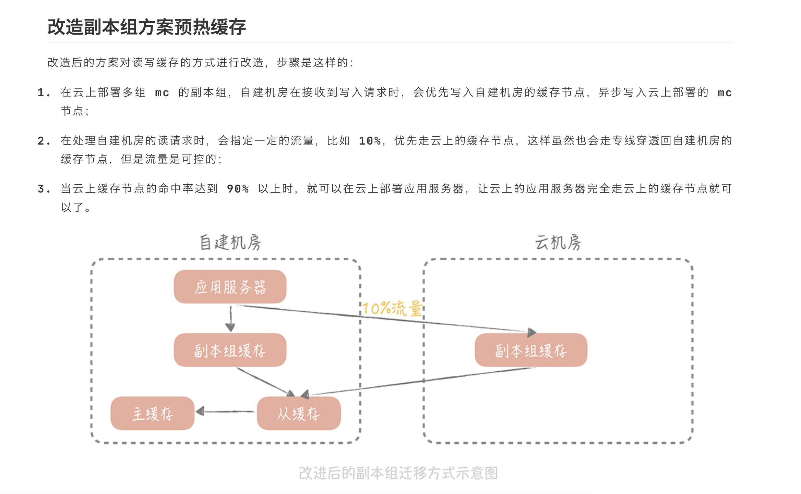
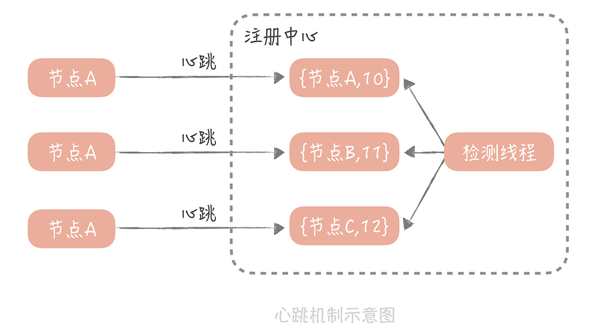
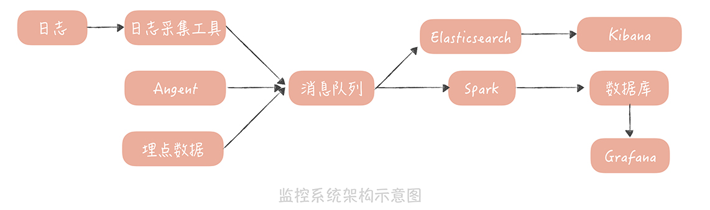

<!-- vscode-markdown-toc -->
* 1. [基础篇](#)
	* 1.1. [通用设计方法](#-1)
	* 1.2. [分层架构](#-1)
	* 1.3. [如何提升系统性能](#-1)
	* 1.4. [高可用](#-1)
	* 1.5. [可扩展](#-1)
* 2. [数据库](#-1)
	* 2.1. [池化技术](#-1)
	* 2.2. [读写分离（主从）](#-1)
		* 2.2.1. [主从复制](#-1)
		* 2.2.2. [如何访问数据库](#-1)
	* 2.3. [分库分表](#-1)
		* 2.3.1. [垂直拆分](#-1)
		* 2.3.2. [水平拆分](#-1)
		* 2.3.3. [问题：](#-1)
	* 2.4. [发号器](#-1)
		* 2.4.1. [基于Snowflake算法搭建发号器](#Snowflake)
	* 2.5. [RDS与NoSQL互补](#RDSNoSQL)
		* 2.5.1. [使用NoSQL提升性能](#NoSQL)
		* 2.5.2. [提升扩展性](#-1)
	* 2.6. [数据迁移](#-1)
		* 2.6.1. [双写方案](#-1)
		* 2.6.2. [级联同步方案](#-1)
* 3. [缓存](#-1)
	* 3.1. [缓存加速](#-1)
		* 3.1.1. [缓存分类](#-1)
		* 3.1.2. [缓存的不足](#-1)
	* 3.2. [缓存读写策略](#-1)
		* 3.2.1. [Cache Aside（旁路缓存）策略](#CacheAside)
		* 3.2.2. [Read/Write Through（读穿/写穿）策略](#ReadWriteThrough)
		* 3.2.3. [Write Back（写回）策略](#WriteBack)
	* 3.3. [缓存高可用](#-1)
		* 3.3.1. [客户端方案](#-1)
		* 3.3.2. [代理层方案](#-1)
		* 3.3.3. [服务端方案](#-1)
	* 3.4. [缓存穿透](#-1)
		* 3.4.1. [回种空值](#-1)
		* 3.4.2. [布隆过滤器](#-1)
	* 3.5. [CDN内容分发网络](#CDN)
* 4. [消息队列](#-1)
	* 4.1. [消息队列在高并发系统中的角色](#-1)
	* 4.2. [消息投递：幂等性](#-1)
		* 4.2.1. [消息丢失的三个场景](#-1)
		* 4.2.2. [如何保证消息只被消费一次](#-1)
	* 4.3. [如何降低消息延迟](#-1)
		* 4.3.1. [如何监控消息延迟](#-1)
		* 4.3.2. [降低延迟](#-1)
* 5. [分布式服务](#-1)
	* 5.1. [RPC](#RPC)
		* 5.1.1. [提升网络传输性能](#-1)
		* 5.1.2. [序列化方式](#-1)
	* 5.2. [注册中心](#-1)
		* 5.2.1. [探活机制：](#-1)
	* 5.3. [分布式Trace](#Trace)
	* 5.4. [负载均衡](#-1)
		* 5.4.1. [代理类负载均衡](#-1)
		* 5.4.2. [客户端负载均衡](#-1)
		* 5.4.3. [负载均衡策略](#-1)
		* 5.4.4. [如何检测节点是否故障](#-1)
	* 5.5. [API网关](#API)
		* 5.5.1. [如何实现](#-1)
		* 5.5.2. [如何引入](#-1)
	* 5.6. [多机房部署](#-1)
	* 5.7. [ServiceMesh](#ServiceMesh)
		* 5.7.1. [如何将流量转发到sidecar中](#sidecar)
* 6. [维护](#-1)
	* 6.1. [服务端监控](#-1)
		* 6.1.1. [监控指标选择](#-1)
		* 6.1.2. [数据采集方式](#-1)
		* 6.1.3. [数据处理与存储](#-1)
	* 6.2. [应用性能管理](#-1)
	* 6.3. [系统压测](#-1)
		* 6.3.1. [如何搭建](#-1)
	* 6.4. [配置中心](#-1)
	* 6.5. [降级熔断](#-1)

<!-- vscode-markdown-toc-config
	numbering=true
	autoSave=true
	/vscode-markdown-toc-config -->
<!-- /vscode-markdown-toc -->

参考： https://zq99299.github.io/note-architect/hc
##  1. 基础篇

###  1.1. 通用设计方法
在面带高并发大流量的时候，通常采用三类方法去应对：
- Scale-out横向扩展
  - 通过分布式系统将流量分摊到多台机器上，减少服务器压力。
- 缓存
  - 通过缓存热点数据，让数据读取速率更快。
- 异步
  - 将同步更改为异步，减少CPU阻塞时间，让CPU能处理更多请求。

注意：
- 一般在项目初期的时候使用scale-up去提升系统处理性能，后期qps上来后，提升机器配置产生的收益已经远远低于增加机器数量，所以后期都是通过scale-out去提升服务处理能力。

###  1.2. 分层架构
架构分层可以让每一层专门处理相应的事务，有利于逻辑划分。
例如TCP/IP五层模型、MVC模型等。

分层之间边界需要清晰

例如：

- 开放接口层：
  - 将Service层方法封装成开放接口，同时进行网关安全控制和流量控制等
- web层
  - 网关层，对请求进行转发、参数校验、权限校验等操作
- Service层（编排层）
  - 业务逻辑层，对原子能力接口进行逻辑上的编排处理
- Manager层
  - 通用业务处理层，提供原子接口
    - 其一，你可以将原先 Service 层的一些通用能力下沉到这一层，比如 与缓存和存储交互策略，中间件的接入；
    - 其二，你也可以在这一层 封装对第三方接口的调用，比如调用支付服务，调用审核服务等。
- Dao层
  - 数据访问层，与底层 MySQL、Oracle、Hbase 等进行数据交互。
- 外部接口或第三方平台：
  - 包括其它部门 RPC 开放接口，基础平台，其它公司的 HTTP 接口。

在这个分层架构中 主要增加了 Manager 层，它与 Service 层的关系是：Manager 层提供原子的服务接口，Service 层负责依据业务逻辑来编排原子接口。

以上面的例子来说，Manager 层提供 创建用户 和 获取用户信息 的接口，而 Service 层负责将这两个接口组装起来。这样就把原先散布在表现层的业务逻辑都统一到了 Service 层，每一层的边界就非常清晰了。

###  1.3. 如何提升系统性能
衡量系统性能的三大指标：高性能、高可用、可扩展

性能都必须建立在高并发的基础上。

**性能优化原则**
- 性能优化是问题导向
- 遵循二八原则
  - 花20%的时间解决80%的问题
- 需要数据支撑：时刻了解优化效果
- 过程是持续的

**性能优化度量指标**
- 平均值
  - 敏感度较差，无法反应真实状况，比如有个请求的时间特别长，会把所有请求的时间都拉下来
- 最大值
  - 过于敏感，问题类似于平均值
- 分位值

**高并发下的性能优化**
- 提高系统的处理核心数
  - 增加系统并行处理能力
- 减少单次任务响应时间
  - 单位时间内能处理更多请求
  - CPU密集型
    - 选用更高效的算法或者减少运算次数就是这类系统重要的优化手段
  - IO密集型
    - 监控和工具发现

###  1.4. 高可用
指的是系统具备较高的无故障运行能力

**度量**

与之相关的概念是： MTBF 和 MTTR。

**MTBF（Mean Time Between Failure）** 是平均故障间隔的意思，代表两次故障的间隔时间，也就是系统正常运转的平均时间。这个时间越长，系统稳定性越高。

**MTTR（Mean Time To Repair）** 表示故障的平均恢复时间，也可以理解为平均故障时间。这个值越小，故障对于用户的影响越小。

可用性与 MTBF 和 MTTR 的值息息相关，我们可以用下面的公式表示它们之间的关系：

``Availability = MTBF / (MTBF + MTTR)``

高可用的系统需要从系统设计和系统运维这两方面来保障：

**系统设计**

包含故障转移、超时控制、限流、降级等

- failover故障转移
  - 对等节点中，也就是分布式节点中，直接进行流量转移即可
  - 非对等节点中，也就是系统中存在主备节点
- 超时控制
  - 收集系统之间的调用日志，统计响应时间
  - 如果请求超过设定时间，则让请求失败。
- 限流
  - 限制单位时间内的qps
- 降级
  - 为了保证核心服务的稳定而牺牲非核心服务的做法。

**系统运维**

包含灰度发布、故障演练等。

###  1.5. 可扩展

指的是通过增加机器的数量来线性提高系统的处理能力，从而承担更高的流量和并发。

无状态的服务和组件更易于扩展，而像Mysql这类有状态的存储就比较难以扩展，因为扩展涉及到大量的数据迁移。

扩展需考虑的因素：
- 服务数量
- 数据库
- 缓存
- 依赖的第三方服务
- 负载均衡
- 交换机带宽等

最重要的思路就是`拆分`

**存储层的扩展性**

存储拆分首先考虑的维度是业务维度，这个就是垂直拆分。

拆分之后，系统就有了用户库、内容库、评论库、点赞库和关系库等，一个挂了之后不影响其他服务。

业务按照垂直拆分运行一段时间后，数据量会增加，那么此时就会需要进行二次拆分，按照数据特征拆分，这个就叫水平拆分，例如对用户库进行分库分表等操作。

当数据库按照业务和数据维度拆分之后，我们 尽量不要使用事务。因为当一个事务中同时更新不同的数据库时，需要使用二阶段提交，来协调所有数据库要么全部更新成功，要么全部更新失败。这个协调的成本会随着资源的扩展不断升高，最终达到无法承受的程度。

**业务层的扩展性**

会从三个维度考虑业务层的拆分方案，它们分别是：业务纬度 ，重要性纬度 和 请求来源纬度。

- 业务纬度：
  
    把相同业务的服务拆分成单独的业务池，比如用户服务单独拆出来部署。

    每个业务依赖独自的数据库资源，不会依赖其它业务的数据库资源，在某个业务需要扩展的时候就会大大减少复杂度。

- 重要性纬度：

    根据业务接口的重要性，把业务分成核心池和非核心池，优先保证核心池的服务稳定性

    

##  2. 数据库

###  2.1. 池化技术
可以减少频繁创建连接引起的性能损耗

1、数据库连接池化

数据库连接池有两个最重要的配置： 最小连接数和最大连接数， 它们控制着从连接池中获取连接的流程：

- 如果当前连接数小于最小连接数，则创建新的连接处理数据库请求；
- 如果连接池中有空闲连接则复用空闲连接；
- 如果空闲池中没有连接并且当前连接数小于最大连接数，则创建新的连接处理请求；
- 如果当前连接数已经大于等于最大连接数，则按照配置中设定的时间（C3P0 的连接池配置是 checkoutTimeout）等待旧的连接可用；
- 如果等待超过了这个设定时间则向用户抛出错误。

2、线程池连接池化

比如java的

- 如果线程池中的线程数少于 coreThreadCount 时，处理新的任务时会创建新的线程；
- 如果线程数大于 coreThreadCount 则把任务丢到一个队列里面，由当前空闲的线程执行；
- 当队列中的任务堆积满了的时候，则继续创建线程，直到达到 maxThreadCount；
- 当线程数达到 maxTheadCount 时还有新的任务提交，那么我们就不得不将它们丢弃了（还得看具体的策略）。

###  2.2. 读写分离（主从）
两个关键点：
- 主从复制
- 如何屏蔽底层主从架构，让使用者可以像使用单点系统一样使用数据库

####  2.2.1. 主从复制
对MySQL来说，主从复制依赖binlog，主库异步将binlog传输到从库

过程：
- 首先从库在连接到主节点时会创建一个 IO 线程，用以请求主库更新的 binlog，并且把接收到的 binlog 信息写入一个叫做 relay log 的日志文件中（避免直接写入从库耗时较高，造成主从数据延迟）
- 而主库也会创建一个 log dump 线程来发送 binlog 给从库；
- 同时，从库还会创建一个 SQL 线程读取 relay log 中的内容，并且在从库中做回放，最终实现主从的一致性。这是一种比较常见的主从复制方式。

无需太多从库，因为从库每多一个，就会创建一个线程，线程越多，对主库的性能会有影响。最多挂3-5个

**缺点：**

1、主从同步延迟，造成主库写入之后，从库中无法读取的情况

解决方案就是尽量不去从库查询数据：
- 数据冗余：将完整数据发送至队列等，避免二次查询数据
- 缓存：将数据同步写入缓存中，会有缓存与数据不一致的情况
- 直接查询主库： 

####  2.2.2. 如何访问数据库
通过中间件去查询数据，屏蔽主从分离后数据库访问的细节。

###  2.3. 分库分表
数据库的写入请求大造成的性能和可用性方面的问题？

可以对数据进行分片，分摊读写压力，突破单机的存储瓶颈，也就是分库分表。

数据库分库分表的方式有两种：一种是垂直拆分，另一种是水平拆分。

####  2.3.1. 垂直拆分
将不同业务的表拆分到不同的数据库

垂直拆分的原则一般是按照业务类型来拆分，核心思想是专库专用，将业务耦合度比较高的表拆分到单独的库中

可以暂缓数据库压力，但是如果某个业务是核心业务，数据量增长速度很快，同样会造成数据库瓶颈，需要进行二次拆分，也就是水平拆分

####  2.3.2. 水平拆分
两种方式：
- 根据某个字段hash值进行拆分，将数据放到不同的库中。
- 按照某一个字段的 区间 来拆分，比较常用的是时间字段。

第一种方式无法进行排序
第二种方式可以进行排序，也可以解决热点数据问题，比如热点数据是最近一周或一个月的。

####  2.3.3. 问题：
- 查询都需要带上分区字段
  - 比如根据id分区，查询昵称，这个时候需要对昵称再做分区，就很麻烦，可以对id和昵称建立映射，先查询对应的id，然后再查询。
- 查询次数增多
- 无法进行连表查询

###  2.4. 发号器
数据库的主键在于全局唯一性，对于单机来说，可以使用自增主键，但是对于主从分离、分库分表来说，就无法使用自增主键，需要一个能生成全局唯一性的主键

很容易想到的是UUID，但UUID是无序的，无法对数据进行排序功能，同时写入数据库也会有相应的性能问题。对于mysql的B+树来说，顺序写比随机写性能要好很多。

其次UUID是32个16进制的数字组成，对于mysql的存储来说也是比较耗费空间

####  2.4.1. 基于Snowflake算法搭建发号器
核心思想是将 64bit 的二进制数字分成若干部分，每一部分都存储有特定含义的数据，比如说时间戳、机器 ID、序列号等等，最终生成全局唯一的有序 ID。它的标准算法是这样的：

可以根据自身业务对算法进行改造，比如：1 位兼容位恒为 0 + 41 位时间信息 + 6 位 IDC 信息（支持 64 个 IDC）+ 6 位业务信息（支持 64 个业务）+ 10 位自增信息（每毫秒支持 1024 个号）

**算法实现方式：**
- 嵌入到业务代码里，也就是分布在业务服务器中
  - 优点：
    - 无需跨网络调用
  - 缺点：
    - 业务服务器众多，需要更多的机器id位数，由于很难保证机器id的唯一性，所以需要引入第三方组件去保证，比如zk
- 独立的服务部署，也就是发号器服务
  - 缺点：
    - 多一次网络调用
  - 优点：
    - 机器id唯一

雪花算法的缺点是太依赖于时间戳，如果时间戳不准，需要重新校准后再进行发号。

另外，在qps不高的情况下，比如发号器每毫米只发一个，那么id尾数就永远是1，对于分库分表来说会造成数据不均匀的情况，
- 时间戳不记录毫秒而是记录秒，这样在一个时间区间里可以多发出几个号，避免出现分库分表时数据分配不均。

- 生成的序列号的起始号可以做一下随机，这一秒是 21，下一秒是 30，这样就会尽量的均衡了。

###  2.5. RDS与NoSQL互补

**NoSQL**

- Redis、LevelDB 这样的 KV 存储。这类存储相比于传统的数据库的优势是极高的读写性能，一般对性能有比较高的要求的场景会使用。
- Hbase、Cassandra 这样的 列式存储数据库。这种数据库的特点是数据不像传统数据库以行为单位来存储，而是以列来存储，适用于一些离线数据统计的场景。
- 像 MongoDB、CouchDB、ES 这样的文档型数据库。这种数据库的特点是 Schema Free（模式自由），数据表中的字段可以任意扩展，比如说电商系统中的商品有非常多的字段，并且不同品类的商品的字段也都不尽相同，使用关系型数据库就需要不断增加字段支持，而用文档型数据库就简单很多了。

####  2.5.1. 使用NoSQL提升性能
mysql更新binlog、redolog、undolog都是顺序写，只有更新datafile、索引是随机写，随机写比顺序写性能差了几个等级，所以mysql使用了先写内存然后再批量写磁盘去优化，但是还是会有随机写的情况。

**NoSQL方案**

基于 LSM（（Log-Structured Merge Tree）） 树的存储引擎

数据首先会写入到一个叫做 MemTable 的内存结构中，在 MemTable 中数据是按照写入的 Key 来排序的。为了防止 MemTable 里面的数据因为机器掉电或者重启而丢失，一般会通过写 Write Ahead Log 的方式将数据备份在磁盘上。

MemTable 在累积到一定规模时，它会被刷新生成一个新的文件，我们把这个文件叫做 SSTable（Sorted String Table）。当 SSTable 达到一定数量时，我们会将这些 SSTable 合并，减少文件的数量，因为 SSTable 都是有序的，所以合并的速度也很快。

当从 LSM 树里面读数据时，我们首先从 MemTable 中查找数据，如果数据没有找到，再从 SSTable 中查找数据。因为存储的数据都是有序的，所以查找的效率是很高的，只是因为数据被拆分成多个 SSTable，所以读取的效率会低于 B+ 树索引

####  2.5.2. 提升扩展性
RDS在数据量大的时候就需要进行分库分表，此时进行数据迁移是一件非常耗时的事情，也很麻烦

此时可以借助NoSQL的特性，
比如MongoDB的特性，
- Replica也就是副本集，自带数据冗余
- Shard，分片，自带分库分表，MongoDB 的 Sharding 特性一般需要三个角色来支持，一个是 Shard Server，它是实际存储数据的节点，是一个独立的 Mongod 进程；二是 Config Server，也是一组 Mongod 进程，主要存储一些元信息，比如说哪些分片存储了哪些数据等；最后是 Route Server，它不实际存储数据，仅仅作为路由使用，它从 Config Server 中获取元信息后，将请求路由到正确的 Shard Server 中。
- 负载均衡，当数据不均匀的时候，自动触发Balancer进行重新分配，需要扩容时，数据会自动迁移到新的节点上，无需手动介入。

NoSQL 数据库中内置的扩展性方面的特性可以让我们不再需要对数据库做分库分表和主从分离，也是对传统数据库一个良好的补充。

###  2.6. 数据迁移
迁移过程需要满足以下几个目标：
- 迁移应该是在线的迁移，也就是在迁移的同时还会有数据的写入；
- 数据应该保证完整性，也就是说在迁移之后需要保证新的库和旧的库的数据是一致的；
- 迁移的过程需要做到可以回滚，这样一旦迁移的过程中出现问题，可以立刻回滚到源库，不会对系统的可用性造成影响。

####  2.6.1. 双写方案
1. 将新的库配置为源库的从库，用来同步数据；

    如果需要将数据同步到多库多表，那么可以使用一些第三方工具获取 Binlog 的增量日志（比如开源工具 Canal），在获取增量日志之后就可以按照分库分表的逻辑写入到新的库表中了。

2. 同时，我们需要改造业务代码，在数据写入的时候，不仅要写入旧库，也要写入新库。

    当然，基于性能的考虑，我们可以异步地写入新库，只要保证旧库写入成功即可。 但是，我们需要注意的是， 需要将写入新库失败的数据记录在单独的日志中，这样方便后续对这些数据补写，保证新库和旧库的数据一致性。

3. 然后，我们就可以开始校验数据了。由于数据库中数据量很大，做全量的数据校验不太现实。你可以抽取部分数据，具体数据量依据总体数据量而定，只要保证这些数据是一致的就可以。

4. 如果一切顺利，我们就可以将读流量切换到新库了。

  由于担心一次切换全量读流量可能会对系统产生未知的影响，所以这里 最好采用灰度的方式来切换， 比如开始切换 10% 的流量，如果没有问题再切换到 50% 的流量，最后再切换到 100%。

5. 由于有双写的存在，所以在切换的过程中出现任何的问题，都可以将读写流量随时切换到旧库去，保障系统的性能。

6. 在观察了几天发现数据的迁移没有问题之后，就可以将数据库的双写改造成只写新库，数据的迁移也就完成了。

**最容易出问题的步骤就是数据校验的工作**

对于mysql、Redis中的数据都可以用这个方案去迁移

- 好处是： 迁移的过程可以随时回滚，将迁移的风险降到了最低。
- 劣势是： 时间周期比较长，应用有改造的成本。

####  2.6.2. 级联同步方案

在自建机房准备一个备库，在云上环境上准备一个新库，通过级联同步的方式在自建机房留下一个可回滚的数据库，具体的步骤如下：

1. 先将新库配置为旧库的从库，用作数据同步；

2. 再将一个备库配置为新库的从库，用作数据的备份；

3. 等到三个库的写入一致后，将数据库的读流量切换到新库；

4. 然后暂停应用的写入，将业务的写入流量切换到新库（由于这里需要暂停应用的写入，所以需要安排在业务的低峰期）。

这种方案的回滚方案也比较简单， 可以先将读流量切换到备库，再暂停应用的写入，将写流量切换到备库，这样所有的流量都切换到了备库，也就是又回到了自建机房的环境，就可以认为已经回滚了。

- 优势是 简单易实施，在业务上基本没有改造的成本；
- 缺点是 在切写的时候需要短暂的停止写入，对于业务来说是有损的，不过如果在业务低峰期来执行切写，可以将对业务的影响降至最低

**注意：缓存迁移也需要考虑到**

##  3. 缓存

###  3.1. 缓存加速
缓存，是一种存储数据的组件，它的作用是让对数据的请求更快地返回。

####  3.1.1. 缓存分类
- 静态缓存
- 分布式缓存
  - 例如Redis等存储组件
- 热点本地缓存
  - 例如当有热点事件的时候，某个分区承担的流量就会异常高，此时需要使用本地缓存缓解服务器压力

####  3.1.2. 缓存的不足
- 适合读多写少的场景，并且数据具有热点属性
- 缓存会给整体系统带来复杂度，并且会有数据不一致的风险
- 增加运维成本

###  3.2. 缓存读写策略
考虑点：
- 是否可能写入脏数据
- 读写性能
- 命中率

####  3.2.1. Cache Aside（旁路缓存）策略
**先更新数据库，再更新缓存**

会发生数据不一致的情况，比如A将数据修改，然后还未更新缓存的时候，B已经将数据修改为其他的并且更新了缓存，最后A才把缓存给更新了。

**先删除缓存，再更新数据库**

同样会发生数据不一致的情况，比如A先删除缓存，此时B过来了，发现缓存中没有数据，就读了数据库中旧的数据，添加到缓存中，最后A才将数据库进行更新。

**先更新数据库，然后再删除缓存**

这个策略就是Cache Aside 策略（也叫旁路缓存策略），这个策略数据 以数据库中的数据为准，缓存中的数据是按需加载的 。它可以分为读策略和写策略，

读策略的步骤是：

- 从缓存中读取数据；
- 如果缓存命中，则直接返回数据；
- 如果缓存不命中，则从数据库中查询数据；
- 查询到数据后，将数据写入到缓存中，并且返回给用户。

写策略的步骤是：

- 更新数据库中的记录；
- 删除缓存记录。

此策略依旧会有数据不一致的情况

Cache Aside 存在的最大的问题是当写入比较频繁时，缓存中的数据会被频繁地清理，这样会对缓存的命中率有一些影响。 如果你的业务对缓存命中率有严格的要求，那么可以考虑两种解决方案：

- 一种做法是在更新数据时也更新缓存，只是在更新缓存前先加一个分布式锁，因为这样在同一时间只允许一个线程更新缓存，就不会产生并发问题了。当然这么做对于写入的性能会有一些影响；（有疑问，为什么加锁能解决命中率问题？）
- 另一种做法同样也是在更新数据时更新缓存，只是给缓存加一个较短的过期时间，这样即使出现缓存不一致的情况，缓存的数据也会很快地过期，对业务的影响也是可以接受。

####  3.2.2. Read/Write Through（读穿/写穿）策略
这个策略的核心原则是用户只与缓存打交道，由缓存和数据库通信，写入或者读取数据

Write Through 的策略是这样的：先查询要写入的数据在缓存中是否已经存在，如果已经存在，则更新缓存中的数据，并且由缓存组件同步更新到数据库中，如果缓存中数据不存在，我们把这种情况叫做 Write Miss（写失效）。

一般来说，我们可以选择两种 Write Miss 方式：

- Write Allocate（按写分配）

  - 做法是写入缓存相应位置，再由缓存组件同步更新到数据库中；

- No-write allocate（不按写分配）

  - 做法是不写入缓存中，而是直接更新到数据库中
  - 一般选择这种，减少一次缓存写入，提升性能

Read Through 策略就简单一些，它的步骤是这样的：先查询缓存中数据是否存在，如果存在则直接返回，如果不存在，则由缓存组件负责从数据库中同步加载数据。

####  3.2.3. Write Back（写回）策略

在写入数据时只写入缓存，并且把缓存块儿标记为 「脏」 的。而脏块儿只有被再次使用时才会将其中的数据写入到后端存储中。

此策略跟计算机系统的page cache采用的是一样的，只写缓存，后续异步写入后端存储中。

###  3.3. 缓存高可用

####  3.3.1. 客户端方案
在客户端配置多个缓存的节点，通过缓存写入和读取算法策略来实现分布式，从而提高缓存的可用性。

- 写入数据时，需要把被写入缓存的数据分散到多个节点中，即进行数据分片；
- 读数据时，可以利用多组的缓存来做容错，提升缓存系统的可用性。关于读数据，这里可以使用主从和多副本两种策略，两种策略是为了解决不同的问题而提出的。

可以使用一致性hash算法，缺点是当节点挂掉后，数据更新过，然后节点起来后会有脏数据问题

同时可以通过主从和多副本提高可用性

####  3.3.2. 代理层方案
是在应用代码和缓存节点之间增加代理层，客户端所有的写入和读取的请求都通过代理层，而代理层中会内置高可用策略，帮助提升缓存系统的高可用。

可以解决跨语言的问题

####  3.3.3. 服务端方案
比如Redia的哨兵模式

###  3.4. 缓存穿透
####  3.4.1. 回种空值
当数据库中没有数据时，可以向缓存中回种一个空值，但这个需要设置过期时间，避免空值太多占用内存，导致有效的数据反而得不到缓存。

####  3.4.2. 布隆过滤器
通过布隆过滤器先判断数据是否存在，避免请求直接到数据库。

缺陷：
- 判断有一定概率误差，比如hash碰撞发生的时候，此时可以用多个hash函数，如果多个位置都为1的情况下就判断数据确实存在
- 无法删除数据，也是因为hash碰撞，比如A、B经过hash后在同一个bit位，将这个bit位置为0后会影响A、B的判断。

建议：

- 选择多个 Hash 函数计算多个 Hash 值，这样可以减少误判的几率；
- 布隆过滤器会消耗一定的内存空间，所以在使用时需要评估你的业务场景下需要多大的内存，存储的成本是否可以接受。

**狗桩效应：**

当有一个极热点的缓存项，它一旦失效会有大量请求穿透到数据库，这会对数据库造成瞬时极大的压力

解决狗桩效应的思路是尽量地减少缓存穿透后的并发，方案也比较简单：

- 在代码中，控制在某一个热点缓存项失效之后启动一个后台线程，穿透到数据库，将数据加载到缓存中，在缓存未加载之前，所有访问这个缓存的请求都不再穿透而直接返回。
- 通过在 Memcached 或者 Redis 中设置分布式锁，只有获取到锁的请求才能够穿透到数据库。

###  3.5. CDN内容分发网络
1、DNS 技术是 CDN 实现中使用的核心技术，可以将用户的请求映射到 CDN 节点上；

2、DNS 解析结果需要做本地缓存，降低 DNS 解析过程的响应时间；

3、GSLB（全局负载均衡） 可以给用户返回一个离着他更近的节点，加快静态资源的访问速度。

##  4. 消息队列
###  4.1. 消息队列在高并发系统中的角色
1、 削峰填谷，存在造成请求延迟的情况

2、异步处理，提升系统性能，划分系统的同步流程与异步流程，同时消息存在丢失的风险，需要考虑消息如何能准备到达，也就是EOC

3、解耦合，提升系统鲁棒性，同时在系统架构中也可以避免成环。

###  4.2. 消息投递：幂等性
####  4.2.1. 消息丢失的三个场景

`1、消息生产过程中丢失消息`

可以进行消息重传，如果重传失败，可以设置死信队列

`2、在消息队列中丢失消息`

例如kafka的消息是存储在文件中的，需要先写入page cache然后通过操作系统进行刷盘，如果此时机器宕机了，page cache中的数据就丢失了。

可以把刷盘间隔设置的很小，但是这样会造成系统性能下降。

kafka集群中有个ISR（in-sync replicas）机制，如果leader宕机了，可以从ISR列表中选出新的节点，Leader的消息会复制给Follower，减少消息丢失的可能。

同时kafka提供了ack机制，在消息投递到队列中，会有几种情况：
- 0 代表producer往集群发送数据不需要等到集群的返回，不确保消息发送成功。安全性最低但是效率最高。
- 1 代表producer往集群发送数据只要leader应答就可以发送下一条，只确保leader发送成功。
- all 代表producer往集群发送数据需要所有的follower都完成从leader的同步才会发送下一条，确保leader发送成功和所有的副本都完成备份。安全性最高，但是效率最低。

`3、消息消费过程中消息丢失`

消息消费分成三个步骤：接受消息、处理消息、更新消费进度

一定要等到消息接收和处理完成后才能更新消费进度，关闭自动更新，手动的更新offset

####  4.2.2. 如何保证消息只被消费一次
**生产者方面**

在 Kafka0.11 版本和 Pulsar 中都支持 producer idempotency 的特性，翻译过来就是生产过程的幂等性，这种特性保证消息虽然可能在生产端产生重复，但是最终在消息队列存储时只会存储一份 。

它的做法是给每一个生产者一个唯一的 ID，并且为生产的每一条消息赋予一个唯一 ID，消息队列的服务端会存储 < 生产者 ID，最后一条消息 ID> 的映射。当某一个生产者产生新的消息时，消息队列服务端会比对消息 ID 是否与存储的最后一条 ID 一致，如果一致，就认为是重复的消息，服务端会自动丢弃。

**消费者方面**

- 通用层面：
  - 给消息一个唯一ID，消费的时候检查数据库中是否有相同的记录
    - 此时需要保证处理消息和插入数据库这两个步骤的原子性，如果插入数据库失败，会有重复消费的可能。
- 业务层面：
  - 可以使用乐观锁保证原子性

###  4.3. 如何降低消息延迟
####  4.3.1. 如何监控消息延迟
监控消息的延迟有两种方式：
- 使用消息队列提供的工具，通过监控消息的堆积来完成；
- 通过生成监控消息的方式来监控消息的延迟情况。

第一种方式，比如kafka提供了查看topic分区消息消费的记录，可以通过工具查看
第二种方式，可以定期写入一个消息，记录消息生产的时间戳，当消费到此消息的时候，对比当前时间，如果超过阈值，就进行报警。

####  4.3.2. 降低延迟

在消费端，我们的目标是提升消费者的消息处理能力，你能做的是：
- 优化消费代码提升性能；
- 增加消费者的数量（这个方式比较简单，在kafka中，当消费者数量跟partition数量一致的时候，就难以提升消费速度了）。

对于消息队列本身，可以考虑两个方面：
- 消息的存储
- 零拷贝技术

##  5. 分布式服务

微服务拆分的原则：参考领域驱动设计

- 高内聚、低耦合
  - 只负责职责内的事情
- 先粗略拆分，逐渐进行细化
- 在微服务化的过程中，同时在老架构上也要进行功能化迭代
  - 优先剥离较独立的服务
  - 当两个服务存在依赖关系时，优先拆分被依赖的服务，比如A依赖B，优先拆分B，如果优先拆分A的话，后续B拆分后仍然需要进行更改。

拆分之后，会引入一系列的问题：
- 服务接口的调用改成了网络调用 
  - 需要引入服务注册中心
- 服务之间的依赖关系变复杂
  - 依赖关系复杂导致性能问题，需要引入服务治理，进行相应的熔断、限流、降级、超时控制等
- 服务之间的调用关系
  - 需要引入分布式追踪系统。

###  5.1. RPC
RPC框架在应对高并发请求的时候，需要考虑以下两点：
- 选择合适的网络模型，有针对性的调整网络参数，以优化网络传输性能
- 选择合适的序列化方式，以提升封包、解包的性能

RPC交互的方式

步骤如下：

- 在 一次 RPC 调用过程中，客户端首先会将调用的类名、方法名、参数名、参数值等信息，序列化成二进制流；
- 然后客户端将二进制流，通过网络发送给服务端；
- 服务端接收到二进制流之后，将它反序列化，得到需要调用的类名、方法名、参数名和参数值，再通过动态代理的方式，调用对应的方法得到返回值；
- 服务端将返回值序列化，再通过网络发送给客户端；
- 客户端对结果反序列化之后，就可以得到调用的结果了。

####  5.1.1. 提升网络传输性能
选择合适的网络IO模型：
- 同步IO
- 异步IO

五种 I/O 模型：
- 同步阻塞 I/O
- 同步非阻塞 I/O
- 同步多路 I/O 复用
- 信号驱动 I/O
- 异步 I/O

这五种 I/O 模型中最被广泛使用的是 多路 I/O 复用， Linux 系统中的 select、epoll 等系统调用都是支持多路 I/O 复用模型的

同时，需要调整参数，比如发送数据包较小的时候，会有一个nagle算法
`如果是连续的小数据包，大小没有一个 MSS（Maximum Segment Size，最大分段大小），并且还没有收到之前发送的数据包的 Ack 信息，那么这些小数据包就会在发送端暂存起来，直到小数据包累积到一个 MSS，或者收到一个 Ack 为止。`

这样会造成网络延迟，此时可以通过tcp_nodelay关闭nagle算法。

####  5.1.2. 序列化方式
考虑因素：
- 性能：包含时间和空间
- 跨语言
- 扩展性

总结：
- 如果对于性能要求不高，在传输数据占用带宽不大的场景下，可以使用 JSON 作为序列化协议；

- 如果对于性能要求比较高，那么使用 Thrift 或者 Protobuf 都可以。而 Thrift 提供了配套的 RPC 框架，所以想要一体化的解决方案，你可以优先考虑 Thrift；

- 在一些存储的场景下，比如说你的缓存中存储的数据占用空间较大，那么你可以考虑使用 Protobuf 替换 JSON，作为存储数据的序列化方式

例如： grpc https://zhuanlan.zhihu.com/p/358727696

###  5.2. 注册中心
注册中心需要包含两个基本的功能点：
- 存储服务地址
- 当存储内容发生变化时，将变更推送到客户端。

####  5.2.1. 探活机制：
**1、主动探测**

RPC 服务要打开一个端口，然后由注册中心每隔一段时间（比如 30 秒）探测这些端口是否可用，如果可用就认为服务仍然是正常的，否则就可以认为服务不可用，那么注册中心就可以把服务从列表里面删除了。

缺点：
- 需要单独提供一个端口进行探活，如果都部署在一台物理机上，资源不够用
- 如果rpc服务越来越多，探测成本越来越大

**2、心跳检测**

注册中心为每一个连接上来的 RPC 服务节点，记录最近续约的时间 ，RPC 服务节点在启动注册到注册中心后，就按照一定的时间间隔（比如 30 秒），向注册中心发送心跳包。注册中心在接受到心跳包之后，会更新这个节点的最近续约时间。然后，注册中心会启动一个定时器，定期检测当前时间和节点，最近续约时间的差值，如果达到一个阈值（比如说 90 秒），那么认为这个服务节点不可用。

注意：
- 注册中心删除的节点超过多少百分比，应该进行报警和禁止删除，避免节点数据全部丢失
- 一个注册中心节点能控制的服务节点数据是有限的，避免数据太多导致机器突然全部注册的时候发送太多通知占满带宽。

Raft协议：https://zhuanlan.zhihu.com/p/32052223

etcd： 一种开源的分布式统一键值存储，用于分布式系统或计算机集群的共享配置、服务发现和的调度协调。

consul：https://zhuanlan.zhihu.com/p/126064282

###  5.3. 分布式Trace

服务的追踪的需求主要有两点：
- 一点对代码要无侵入，你可以使用切面编程的方式来解决；
- 另一点是性能上要低损耗，我建议你采用静态代理和日志采样的方式，来尽量减少追踪日志对于系统性能的影响；

无论是单体系统还是服务化架构，无论是服务追踪还是业务问题排查，你都需要在日志中增加 requestId，这样可以将你的日志串起来，给你呈现一个完整的问题场景。如果 requestId 可以在客户端上生成，在请求业务接口的时候传递给服务端，那么就可以把客户端的日志体系也整合进来，对于问题的排查帮助更大。

同时通过spanId将日志顺序进行串联

例如zipkin： https://www.cnblogs.com/linjiqin/p/13688082.html    https://cloud.tencent.com/developer/article/1441944

###  5.4. 负载均衡

**负载均衡的含义是：** 将负载（访问的请求）「均衡」地分配到多个处理节点上。这样可以减少单个处理节点的请求量，提升整体系统的性能。

负载均衡服务大体上可以分为两大类：一类是 代理类的负载均衡服务 ；另一类是 客户端负载均衡服务 。

####  5.4.1. 代理类负载均衡
代理类的负载均衡服务，以单独的服务方式部署，所有的请求都要先经过负载均衡服务，在负载均衡服务中，选出一个合适的服务节点后，再由负载均衡服务，调用这个服务节点来实现流量的分发。

由于这类服务需要承担全量的请求，所以对于性能的要求极高。代理类的负载均衡服务有很多开源实现，比较著名的有 LVS，Nginx 等等。LVS 在 OSI 网络模型中的第四层，传输层工作，所以 LVS 又可以称为四层负载；而 Nginx 运行在 OSI 网络模型中的第七层，应用层，所以又可以称它为七层负载

一般会同时部署 LVS 和 Nginx 来做 HTTP 应用服务的负载均衡。也就是说，在入口处部署 LVS，将流量分发到多个 Nginx 服务器上，再由 Nginx 服务器分发到应用服务器上，

主要和 LVS 和 Nginx 的特点有关，LVS 是在网络栈的四层做请求包的转发，请求包转发之后，由客户端和后端服务直接建立连接，后续的响应包不会再经过 LVS 服务器，所以相比 Nginx，性能会更高，也能够承担更高的并发。

可 LVS 缺陷是工作在四层，而请求的 URL 是七层的概念，不能针对 URL 做更细致地请求分发，而且 LVS 也没有提供探测后端服务是否存活的机制；而 Nginx 虽然比 LVS 的性能差很多，但也可以承担每秒几万次的请求，并且它在配置上更加灵活，还可以感知后端服务是否出现问题。

因此，LVS 适合在入口处，承担大流量的请求分发，而 Nginx 要部署在业务服务器之前做更细维度的请求分发。

不过这两个负载均衡服务器只适合web服务，对于微服务架构的rpc服务来说，它是不适用的，lvs很难跟注册中心进行交互。而Nginx使用的http协议，

####  5.4.2. 客户端负载均衡
把负载均衡的服务内嵌在 RPC 客户端中

它一般和客户端应用，部署在一个进程中，提供多种选择节点的策略，最终为客户端应用提供一个最佳的，可用的服务端节点。这类服务一般会结合注册中心来使用，注册中心提供服务节点的完整列表，客户端拿到列表之后使用负载均衡服务的策略选取一个合适的节点，然后将请求发到这个节点上。

也就是sidecar模式

####  5.4.3. 负载均衡策略

- 一类是静态策略，也就是说负载均衡服务器在选择服务节点时，不会参考后端服务的实际运行的状态。

- 一类是动态策略，也就是说负载均衡服务器会依据后端服务的一些负载特性，来决定要选择哪一个服务节点

静态策略比如轮训、加权轮训、ip——hash、url-hash、一致性hash等

动态策略会收集后端服务的健康情况以及负载情况。选择负载最小、资源最空闲的服务来调用，以期望能得到更高的服务调用性能，也就能最大化地使用服务器的空闲资源，请求也会响应地更迅速

####  5.4.4. 如何检测节点是否故障
定时心跳服务。

###  5.5. API网关

API网关是将一些服务共有的功能进行整合，独立部署成单独的一层，解决服务治理问题

分为入口网关和出口网关

入口网关部署在负载均衡服务器和应用服务器之间，主要有以下几个作用：
- 提供统一的接入地址，动态路由到不同的业务服务器上，并且进行协议上的转化，比如http转rpc
- 可进行一些服务治理策略，比如熔断、降级、限流等
- 客户端的认证和授权
- 黑白名单
- 日志记录，比如Trace等。

出口网关一般是用来调用第三方服务，在出口网关中，对调用外部的 API 做统一的认证、授权，审计以及访问控制。

####  5.5.1. 如何实现
- 性能方面
  - 使用合适的网络模型，比如多路复用IO
- 扩展性
  - 可随时增加逻辑而不改动业务代码，例如责任链模式
- 并行处理能力
  - 线程池，可以对不同的接口限定不同的线程数量，防止某个接口大量阻塞的时候影响其他服务

网关推荐：
- kong（基于nginx的lua程序）
- zuul（spring cloud生态）
- Tyk（go轻量级api网关）

API网关可参考：https://www.jianshu.com/p/8cbf97b40c26

####  5.5.2. 如何引入
一方面是对服务层接口数据的聚合

另一方面 Web 层还需要将 HTTP 请求转换为 RPC 请求，进行协议转换

可以先将 API 网关从 Web 层中独立出来，将协议转换、限流、黑白名单等事情，挪到 API 网关中来处理，形成独立的入口网关层；

而针对服务接口数据聚合的操作， 一般有两种解决思路：

再独立出一组网关专门做服务聚合、超时控制方面的事情，我们一般把前一种网关叫 做流量网关，后一种可以叫做业务网关；

抽取独立的服务层，专门做接口聚合的操作。这样服务层就大概分为 原子服务层 和 聚合服务层。

###  5.6. 多机房部署
- 同城多活
- 异地多活

不同机房的数据传输延迟，是造成多机房部署困难的主要原因，你需要知道，同城多机房的延迟一般在 1ms~3ms，异地机房的延迟在 50ms 以下，而跨国机房的延迟在 200ms 以下。

同城多机房方案可以允许有跨机房数据写入的发生，但是数据的读取，和服务的调用应该尽量保证在同一个机房中。

异地多活方案则应该避免跨机房同步的数据写入和读取，而是采取异步的方式，将数据从一个机房同步到另一个机房。

###  5.7. ServiceMesh

**如何让服务治理的策略在多语言之间复用呢？**

可以考虑将服务治理的细节，从 RPC 客户端中拆分出来，形成一个代理层单独部署。这个代理层可以使用单一的语言实现，所有的流量都经过代理层，来使用其中的服务治理策略。这是一种 关注点分离 的实现方式，也是 Service Mesh 的核心思想

Service Mesh 主要处理服务之间的通信，它的主要实现形式就是在应用程序同主机上部署一个代理程序，一般来讲，我们将这个代理程序称为 Sidecar（边车），服务之间的通信也从之前的，客户端和服务端直连，变成了下面这种形式：

RPC 客户端将数据包先发送给，与自身同主机部署的 Sidecar，在 Sidecar 中经过服务发现、负载均衡、服务路由、流量控制之后，再将数据发往指定服务节点的 Sidecar，在服务节点的 Sidecar 中，经过记录访问日志、记录分布式追踪日志、限流之后，再将数据发送给 RPC 服务端。

这种方式，可以把业务代码和服务治理的策略隔离开，将服务治理策略下沉，让它成为独立的基础模块。这样一来，不仅可以实现跨语言，服务治理策略的复用，还能对这些 Sidecar 做统一的管理。

####  5.7.1. 如何将流量转发到sidecar中
实现思路一般有两个：

第一种，使用 iptables 的方式来实现流量透明的转发

第二种，轻量级客户端。
在这种方式下，RPC 客户端会通过配置的方式，知道 Sidecar 的部署端口，然后通过一个轻量级客户端，将调用服务的请求发送给 Sidecar，Sidecar 在转发请求之前，先执行一些服务治理的策略，比如说，从注册中心中，查询到服务节点信息并且缓存起来，然后从服务节点中，使用某种负载均衡的策略选出一个节点等等。

请求被发送到服务端的 Sidecar 上后，然后在服务端记录访问日志，和分布式追踪日志，再把请求转发到真正的服务节点上。当然，服务节点在启动时，会委托服务端 Sidecar，向注册中心注册节点，Sidecar 也就知道了真正服务节点部署的端口是多少。

**几个ServiceMesh框架：**
- Istio 这个框架在业界最为著名，它提出了数据平面和控制平面的概念，是 Service Mesh 的先驱，缺陷就是刚才提到的 Mixer 的性能问题。
- Linkerd 是第一代的 Service Mesh，使用 Scala 语言编写，其劣势就是内存的占用。
- SOFAMesh 是蚂蚁金服开源的 Service Mesh 组件，在蚂蚁金服已经有大规模落地的经验。

可参考： https://juejin.cn/post/7027092053431418910

##  6. 维护
###  6.1. 服务端监控

####  6.1.1. 监控指标选择
谷歌针对分布式系统给出的四个黄金信号，分别是：
- 延迟指的是请求的响应时间。比如，接口的响应时间、访问数据库和缓存的响应时间。

- 通信量可以理解为吞吐量，也就是单位时间内，请求量的大小。比如，访问第三方服务的请求量，访问消息队列的请求量。

- 错误表示当前系统发生的错误数量。这里需要注意的是， 我们需要监控的错误既有显示的，比如在监控 Web 服务时，出现 4xx 和 5xx 的响应码；也有隐示的，比如，Web 服务虽然返回的响应码是 200，但是却发生了一些和业务相关的错误（出现了数组越界的异常或者空指针异常等），这些都是错误的范畴。

- 饱和度指的是服务或者资源到达上限的程度（也可以说是服务或者资源的利用率），比如说 CPU 的使用率，内存使用率，磁盘使用率，缓存数据库的连接数等等。

例如对于Java服务来说：

####  6.1.2. 数据采集方式
- Agent
- 埋点
- 日志

####  6.1.3. 数据处理与存储
先用消息队列承载数据，进行削峰填谷，避免把数据库写炸

一般会部署两个队列处理程序，来消费消息队列中的数据。

一个处理程序接收到数据后，把数据写入到 Elasticsearch，然后通过 Kibana 展示数据，这份数据主要是用来做原始数据的查询；

另一个处理程序是一些流式处理的中间件，比如，Spark、Storm。它们从消息队列里，接收数据后会做一些处理，这些处理包括：

- 解析数据格式，尤其是日志格式 从里面提取诸如请求量、响应时间、请求 URL 等数据；

- 对数据做一些聚合运算
  - 比如，针对 Tomcat 访问日志，可以计算同一个 URL 一段时间之内的请求量、响应时间分位值、非 200 请求量的大小等等。

- 将数据存储在时间序列数据库中
  - 这类数据库的特点是，可以对带有时间标签的数据，做更有效的存储，而我们的监控数据恰恰带有时间标签，并且按照时间递增，非常适合存储在时间序列数据库中。目前业界比较常用的时序数据库有 InfluxDB、OpenTSDB、Graphite，各大厂的选择均有不同，你可以选择一种熟悉的来使用。

最后， 你就可以通过 Grafana 来连接时序数据库，将监控数据绘制成报表，呈现给开发和运维的同学了。

最终在监控系统中一般会形成以下几个报表，你在实际的工作中可以参考借鉴：

- 访问趋势报表

  这类报表接入的是 Web 服务器，和应用服务器的访问日志，展示了服务整体的访问量、响应时间情况、错误数量、带宽等信息。它主要反映的是，服务的整体运行情况，帮助你来发现问题。

- 性能报表

  这类报表对接的是资源和依赖服务的埋点数据，展示了被埋点资源的访问量和响应时间情况。它反映了资源的整体运行情况，当你从访问趋势报表发现问题后，可以先从性能报表中，找到究竟是哪一个资源或者服务出现了问题。

- 资源报表

  这类报表主要对接的是，使用 Agent 采集的，资源的运行情况数据。当你从性能报表中，发现某一个资源出现了问题，那么就可以进一步从这个报表中，发现资源究竟出现了什么问题，是连接数异常增高，还是缓存命中率下降。这样可以进一步帮你分析问题的根源，找到解决问题的方案。

###  6.2. 应用性能管理
对于客户端的情况，比如网络延迟，页面空白，通常无法使用服务端监控进行排查，所有就有了应用性能管理

应用性能管理（Application Performance Management，简称 APM），它的含义是： 对应用各个层面做全方位的监测，期望及时发现可能存在的问题，并加以解决，从而提升系统的性能和可用性。

可以从数据的采集、传输、存储和展示几个方面来思考

数据采集可以对请求头、消息头、端消息体、业务消息体等进行采集

采集之后，由于数据传输可能会涉密，需要进行加密

加密的方法是这样的： 我们首先会分配给这个应用，一对 RSA 公钥和私钥，然后 SDK 在启动的时候，先请求一个策略服务，获取 RSA 公钥。在加密时，客户端会随机生成一个对称加密的秘钥 Key，端消息体和业务消息体，都会使用这个秘钥来加密。那么数据发到 APM 通道服务后，要如何解密呢？

客户端会使用 RSA 的公钥对秘钥加密，存储在消息头里面（也就是上面提到的，消息体加密秘钥），然后 APM 通道服务使用 RSA 秘钥，解密得到秘钥，就可以解密得到端消息体和业务消息体的内容了。

同时需要进行摘要验证，防止消息被篡改。

**采集用户数据：**

客户问题基本都在网络上，所以可以针对以下几个点进行采集：
- dns解析耗时
- tcp三次握手耗时
- ssl验证耗时（如果使用的是https）
- 数据包发送耗时
- 数据包接收耗时

对于APM系统来说：
1. 从客户端采集到的数据可以用通用的消息格式，上传到 APM 服务端，服务端将数据存入到 Elasticsearch 中，以提供原始日志的查询，也可以依据这些数据形成客户端的监控报表；

2. 用户网络数据是我们排查客户端，和服务端交互过程的重要数据，你可以通过代码的植入，来获取到这些数据；

3. 无论是网络数据，还是异常数据，亦或是卡顿、崩溃、流量、耗电量等数据，你都可以通过把它们封装成 APM 消息格式，上传到 APM 服务端，这些用户在客户端上留下的踪迹可以帮助你更好地优化用户的使用体验。

###  6.3. 系统压测
压力测试指的是，在高并发大流量下，进行的测试，测试人员可以通过观察系统在峰值负载下的表现，从而找到系统中存在的性能隐患。

**全链路压测：** 需要将接入层、所有后端服务、数据库、缓存、消息队列、中间件以及依赖的第三方服务系统及其资源，都纳入压力测试的目标之中

####  6.3.1. 如何搭建
1、 流量隔离
 
压测流量与正式流量进行隔离区分，避免对真实数据造成影响。

2、 风险控制

避免压测对正常访问用户的影响

一般来说全链路压测平台需要包含以下几个模块：
- 流量构造和产生模块；
- 压测数据隔离模块；
- 系统健康度检查和压测流量干预模块。

`压测数据的产生`

在系统高峰期时，将这些入口流量拷贝一份，在经过一些流量清洗的工作之后（比如过滤一些无效的请求），将数据存储在像是 HBase、MongoDB 这些 NoSQL 存储组件，或者亚马逊 S3 这些云存储服务中，我们称之为 流量数据工厂。

拷贝流量有两个方式：
- 直接拷贝负载均衡服务器的日志，需要进行解析
- 实用开源工具，比如GoReplay，可记录某端口流量到文件然后发送至流量数据工厂

同时需要对压测数据进行打标，比如请求头上增加`isStressTest`

`数据隔离`

需要考虑对系统做改造，以实现压测流量和正式流量的隔离，这样一来就会尽量避免压测对线上系统的影响

一方面，针对读取数据的请求（一般称之为下行流量），我们会针对某些不能压测的服务或者组件，做 Mock 或者特殊的处理。举个例子。

另一方面，针对写入数据的请求（一般称之为上行流量），我们会把压测流量产生的数据，写入到影子库，也就是和线上数据存储，完全隔离的一份存储系统中。

`压测实施`

在压测时，不会一下子把请求量增加到目标qps，而是按照一定的步长（比如每次压测增加一万 QPS），逐渐地增加流量。在增加一次流量之后，让系统稳定运行一段时间，观察系统在性能上的表现。如果发现依赖的服务或者组件出现了瓶颈，可以先减少压测流量

###  6.4. 配置中心

1. 配置存储是分级的，有公共配置，有个性的配置，一般个性配置会覆盖公共配置，这样可以减少存储配置项的数量；

2. 配置中心可以提供配置变更通知的功能，可以实现配置的热更新；
   1. 轮询
   2. 长链接方式

3. 配置中心关注的性能指标中，可用性的优先级是高于性能的，一般我们会要求配置中心的可用性达到 99.999%，甚至会是 99.9999%。
   1. 增加两级缓存：第一级缓存是内存的缓存；另外一级缓存是文件的缓存。

这里你需要注意的是，并不是所有的配置项都需要使用配置中心来存储，如果你的项目还是使用文件方式来管理配置，那么你只需要，将类似超时时间等，需要动态调整的配置，迁移到配置中心就可以了。对于像是数据库地址，依赖第三方请求的地址，这些基本不会发生变化的配置项，可以依然使用文件的方式来管理，这样可以大大地减少配置迁移的成本。

###  6.5. 降级熔断
有两种原因会导致服务不可用
- 依赖的资源或者服务不可用，最终导致整体服务宕机
  - 使用降级或者熔断
- 流量评估错误，导致过载
  - 限流

#### 雪崩是如何发生的
局部故障最终导致全局故障

如上图，A、B、D是核心服务，C是非核心服务（例如关键词检测等），在流量突增前，对 A、B、D进行了扩容，但没对C进行扩容，导致C过载，影响了B的服务请求时长，导致B阻塞，最终导致A阻塞

解决的思路就是在检测到某一个服务的响应时间出现异常时，切断调用它的服务与它之间的联系，让服务的调用快速返回失败，从而释放这次请求持有的资源。 这个思路也就是我们经常提到的降级和熔断机制。

#### 熔断机制
在发起服务调用的时候，如果返回错误或者超时的次数超过一定阈值，则后续的请求不再发向远程服务而是暂时返回错误。

在这种模式下，服务调用方为每一个调用的服务维护一个有限状态机，在这个状态机中会有三种状态：关闭（调用远程服务）、半打开（尝试调用远程服务）和打开（返回错误

#### 降级机制
相比熔断来说，降级是一个更大的概念。因为它是站在整体系统负载的角度上，放弃部分非核心功能或者服务，保证整体的可用性的方法，是一种有损的系统容错方式。这样看来，熔断也是降级的一种，除此之外还有限流降级、开关降级等等

开关降级指的是在代码中预先埋设一些 开关，用来控制服务调用的返回值。比方说，开关关闭的时候正常调用远程服务，开关打开时则执行降级的策略。这些开关的值可以存储在配置中心中，当系统出现问题需要降级时，只需要通过配置中心动态更改开关的值，就可以实现不重启服务快速地降级远程服务了。

开关降级的实现策略主要有返回降级数据、降频和异步三种方案。

**降级只能针对非核心服务**

一些常见场景下的降级策略。

- 针对读取数据的场景，我们一般采用的策略是直接返回降级数据。

  比如，如果数据库的压力比较大，我们在降级的时候，可以考虑只读取缓存的数据，而不再读取数据库中的数据；如果非核心接口出现问题，可以直接返回服务繁忙或者返回固定的降级数据。

- 对于一些轮询查询数据的场景，比如每隔 30 秒轮询获取未读数，可以降低获取数据的频率（将获取频率下降到 10 分钟一次）。

- 而对于写数据的场景，一般会考虑把同步写转换成异步写，这样可以牺牲一些数据一致性和实效性来保证系统的可用性。

### 限流

限流是一种常见的服务保护策略，你可以在整体服务、单个服务、单个接口、单个 IP 或者单个用户等多个维度进行流量的控制；

基于时间窗口维度的算法有固定窗口算法和滑动窗口算法，两者虽然能一定程度上实现限流的目的，但是都无法让流量变得更平滑；

令牌桶算法和漏桶算法则能够塑形流量，让流量更加平滑，但是令牌桶算法能够应对一定的突发流量，所以在实际项目中应用更多。